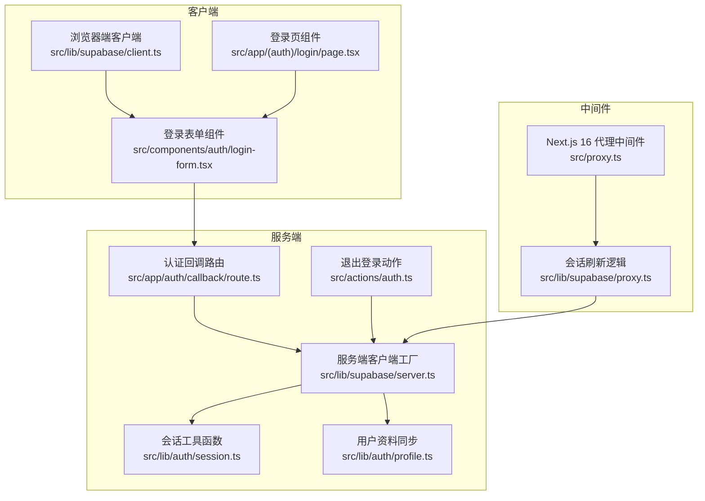
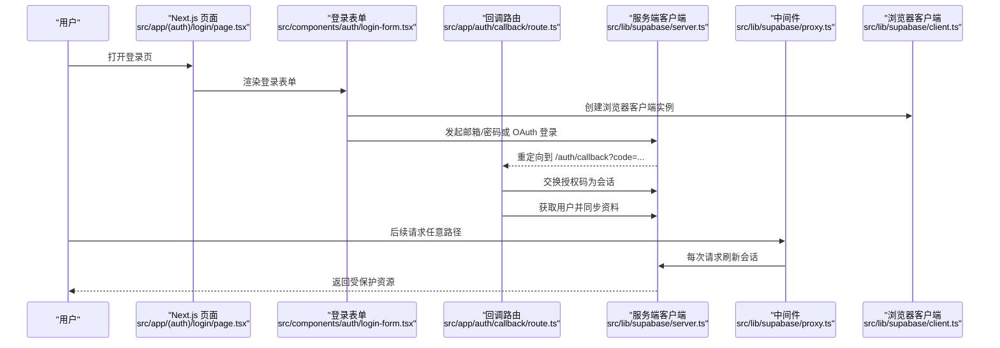
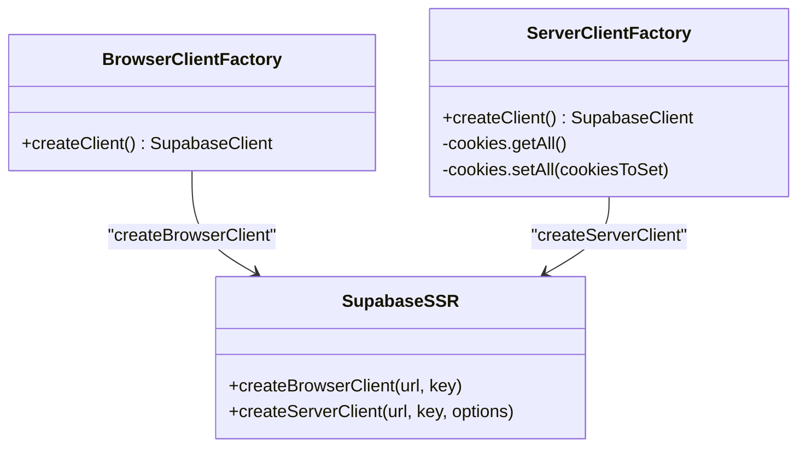
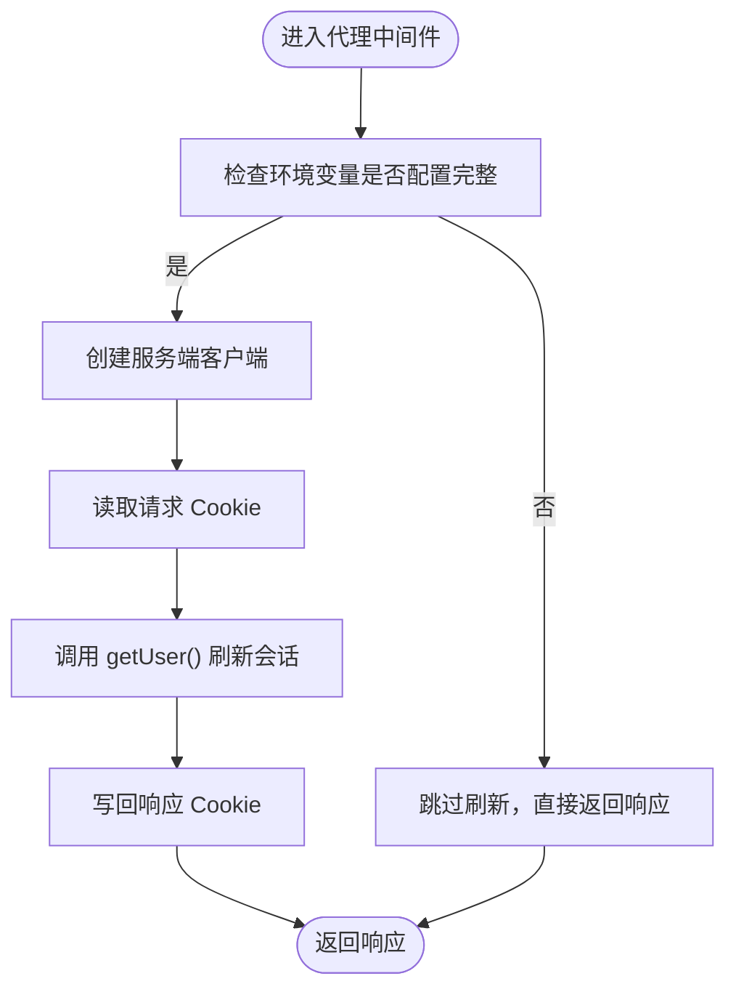
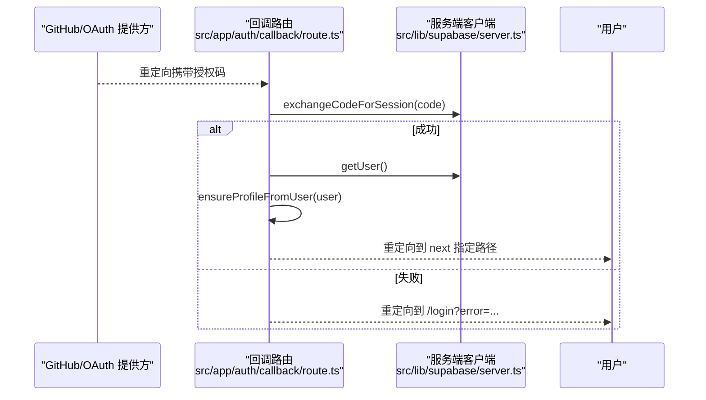
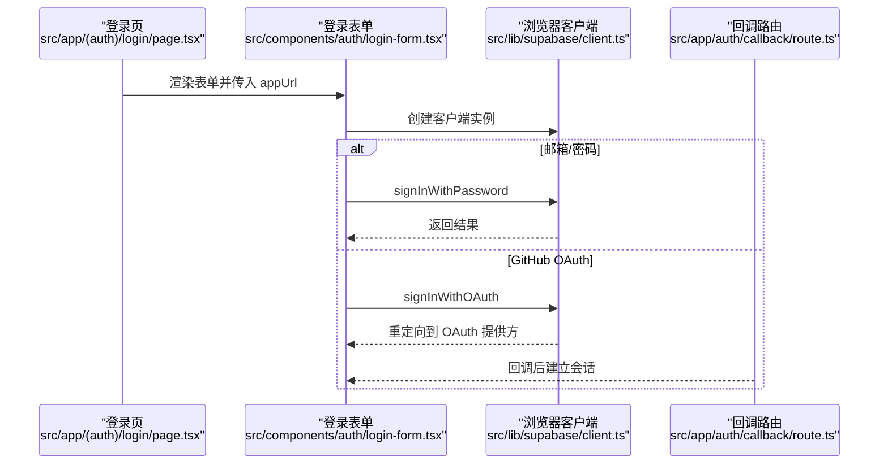
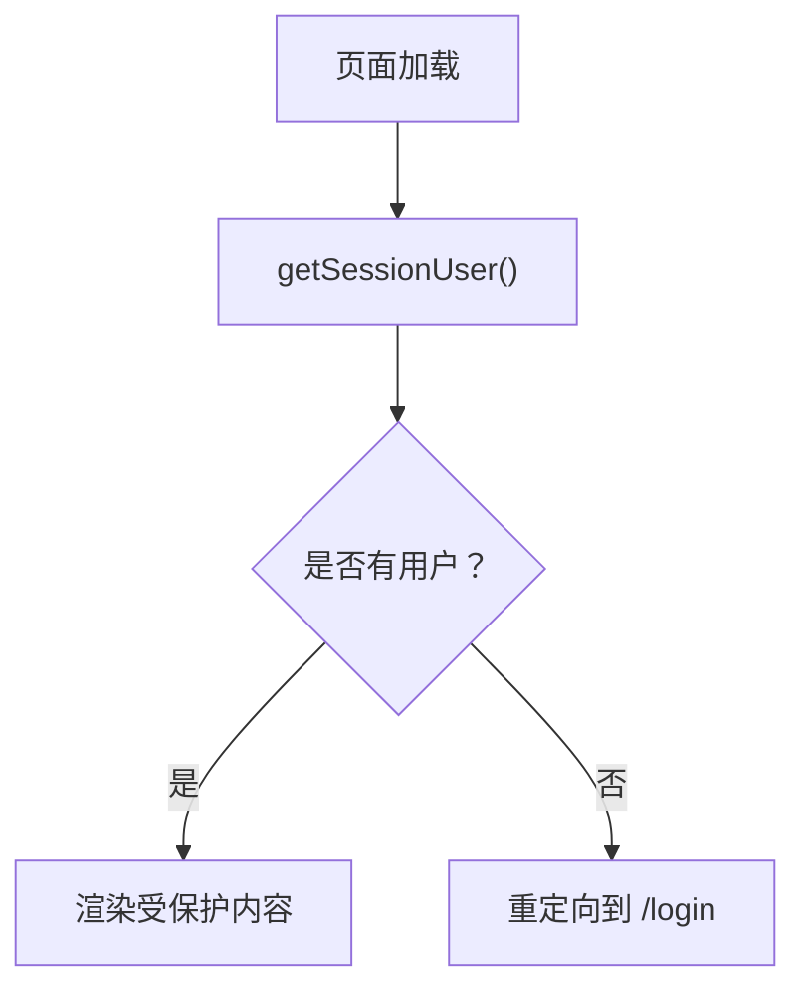
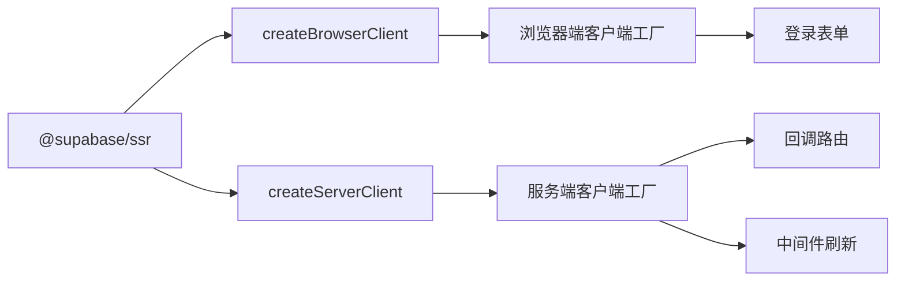

# Supabase Auth 集成

<cite>
**本文引用的文件**
- [src/lib/supabase/client.ts](file://src/lib/supabase/client.ts)
- [src/lib/supabase/server.ts](file://src/lib/supabase/server.ts)
- [src/lib/supabase/proxy.ts](file://src/lib/supabase/proxy.ts)
- [src/app/auth/callback/route.ts](file://src/app/auth/callback/route.ts)
- [src/actions/auth.ts](file://src/actions/auth.ts)
- [src/components/auth/login-form.tsx](file://src/components/auth/login-form.tsx)
- [src/app/(auth)/login/page.tsx](file://src/app/(auth)/login/page.tsx)
- [src/lib/auth/session.ts](file://src/lib/auth/session.ts)
- [src/lib/auth/profile.ts](file://src/lib/auth/profile.ts)
- [src/proxy.ts](file://src/proxy.ts)
- [package.json](file://package.json)
</cite>

## 目录
1. [简介](#简介)
2. [项目结构](#项目结构)
3. [核心组件](#核心组件)
4. [架构总览](#架构总览)
5. [详细组件分析](#详细组件分析)
6. [依赖关系分析](#依赖关系分析)
7. [性能考虑](#性能考虑)
8. [故障排除指南](#故障排除指南)
9. [结论](#结论)
10. [附录](#附录)

## 简介
本文件系统性梳理本项目中的 Supabase Auth 集成方案，覆盖客户端与服务端的初始化与配置差异、会话管理与中间件刷新机制、认证事件与状态更新流程、以及最佳实践与性能优化建议。内容面向不同技术背景的读者，既提供高层概览也包含代码级细节与图示。

## 项目结构
围绕 Supabase Auth 的关键目录与文件如下：
- 客户端与服务端 Supabase 客户端工厂：src/lib/supabase/client.ts、src/lib/supabase/server.ts
- Next.js 16 中间件（代理）会话刷新：src/proxy.ts、src/lib/supabase/proxy.ts
- 认证回调路由：src/app/auth/callback/route.ts
- 登录页面与表单：src/app/(auth)/login/page.tsx、src/components/auth/login-form.tsx
- 会话与权限工具：src/lib/auth/session.ts
- 用户资料同步：src/lib/auth/profile.ts
- 退出登录动作：src/actions/auth.ts
- 依赖声明：package.json

**图表来源**
- [src/lib/supabase/client.ts:1-9](file://src/lib/supabase/client.ts#L1-L9)
- [src/lib/supabase/server.ts:1-29](file://src/lib/supabase/server.ts#L1-L29)
- [src/lib/supabase/proxy.ts:1-52](file://src/lib/supabase/proxy.ts#L1-L52)
- [src/app/auth/callback/route.ts:1-49](file://src/app/auth/callback/route.ts#L1-L49)
- [src/app/(auth)/login/page.tsx:1-31](file://src/app/(auth)/login/page.tsx#L1-L31)
- [src/components/auth/login-form.tsx:1-243](file://src/components/auth/login-form.tsx#L1-L243)
- [src/lib/auth/session.ts:1-19](file://src/lib/auth/session.ts#L1-L19)
- [src/lib/auth/profile.ts:1-30](file://src/lib/auth/profile.ts#L1-L30)
- [src/actions/auth.ts:1-13](file://src/actions/auth.ts#L1-L13)
- [src/proxy.ts:1-23](file://src/proxy.ts#L1-L23)

**章节来源**
- [src/lib/supabase/client.ts:1-9](file://src/lib/supabase/client.ts#L1-L9)
- [src/lib/supabase/server.ts:1-29](file://src/lib/supabase/server.ts#L1-L29)
- [src/lib/supabase/proxy.ts:1-52](file://src/lib/supabase/proxy.ts#L1-L52)
- [src/app/auth/callback/route.ts:1-49](file://src/app/auth/callback/route.ts#L1-L49)
- [src/app/(auth)/login/page.tsx:1-31](file://src/app/(auth)/login/page.tsx#L1-L31)
- [src/components/auth/login-form.tsx:1-243](file://src/components/auth/login-form.tsx#L1-L243)
- [src/lib/auth/session.ts:1-19](file://src/lib/auth/session.ts#L1-L19)
- [src/lib/auth/profile.ts:1-30](file://src/lib/auth/profile.ts#L1-L30)
- [src/actions/auth.ts:1-13](file://src/actions/auth.ts#L1-L13)
- [src/proxy.ts:1-23](file://src/proxy.ts#L1-L23)

## 核心组件
- 浏览器端客户端工厂：封装 createBrowserClient，读取 NEXT_PUBLIC 前缀的公开环境变量，供客户端组件直接使用。
- 服务端客户端工厂：封装 createServerClient，注入 cookies 接口以在服务端读写会话 Cookie，并处理 setAll 的异常场景。
- 会话刷新中间件：在每次请求时调用 getUser() 触发访问令牌刷新，确保会话持久有效。
- 认证回调路由：接收 OAuth 授权码，交换为会话并重定向到目标路径。
- 登录表单与页面：支持邮箱/密码与 GitHub OAuth 登录，处理错误与信息提示。
- 会话工具：getUser 与 requireUser，用于页面级权限控制。
- 用户资料同步：从用户元数据创建或更新业务档案。
- 退出登录动作：服务端动作，调用 signOut 并重定向至登录页。

**章节来源**
- [src/lib/supabase/client.ts:1-9](file://src/lib/supabase/client.ts#L1-L9)
- [src/lib/supabase/server.ts:1-29](file://src/lib/supabase/server.ts#L1-L29)
- [src/lib/supabase/proxy.ts:1-52](file://src/lib/supabase/proxy.ts#L1-L52)
- [src/app/auth/callback/route.ts:1-49](file://src/app/auth/callback/route.ts#L1-L49)
- [src/components/auth/login-form.tsx:1-243](file://src/components/auth/login-form.tsx#L1-L243)
- [src/app/(auth)/login/page.tsx:1-31](file://src/app/(auth)/login/page.tsx#L1-L31)
- [src/lib/auth/session.ts:1-19](file://src/lib/auth/session.ts#L1-L19)
- [src/lib/auth/profile.ts:1-30](file://src/lib/auth/profile.ts#L1-L30)
- [src/actions/auth.ts:1-13](file://src/actions/auth.ts#L1-L13)

## 架构总览
下图展示从用户访问到会话建立与刷新的整体流程，涵盖客户端、服务端与中间件三部分：

**图表来源**
- [src/app/(auth)/login/page.tsx:1-31](file://src/app/(auth)/login/page.tsx#L1-L31)
- [src/components/auth/login-form.tsx:1-243](file://src/components/auth/login-form.tsx#L1-L243)
- [src/app/auth/callback/route.ts:1-49](file://src/app/auth/callback/route.ts#L1-L49)
- [src/lib/supabase/server.ts:1-29](file://src/lib/supabase/server.ts#L1-L29)
- [src/lib/supabase/proxy.ts:1-52](file://src/lib/supabase/proxy.ts#L1-L52)
- [src/lib/supabase/client.ts:1-9](file://src/lib/supabase/client.ts#L1-L9)

## 详细组件分析

### 客户端与服务端客户端工厂
- 浏览器端客户端工厂
  - 使用 createBrowserClient，读取 NEXT_PUBLIC_SUPABASE_URL 与 NEXT_PUBLIC_SUPABASE_ANON_KEY。
  - 适用于客户端组件与客户端动作，不包含 Cookie 交互。
- 服务端客户端工厂
  - 使用 createServerClient，注入 cookies 接口，getAll/setAll 用于读写会话 Cookie。
  - setAll 包含异常捕获，兼容 Server Component 的 set 行为。
- 两者均通过环境变量驱动，避免硬编码密钥。

**图表来源**
- [src/lib/supabase/client.ts:1-9](file://src/lib/supabase/client.ts#L1-L9)
- [src/lib/supabase/server.ts:1-29](file://src/lib/supabase/server.ts#L1-L29)

**章节来源**
- [src/lib/supabase/client.ts:1-9](file://src/lib/supabase/client.ts#L1-L9)
- [src/lib/supabase/server.ts:1-29](file://src/lib/supabase/server.ts#L1-L29)

### 会话刷新中间件（Next.js 16 代理）
- 功能要点
  - 在每次请求上调用 getUser()，触发访问令牌刷新。
  - 通过 cookies.getAll/setAll 将会话 Cookie 写入响应。
  - 环境变量校验：仅当配置完整且非占位值时才执行刷新。
- 性能与可靠性
  - 每次请求都会进行一次 getUser()，确保会话长期有效。
  - 环境未配置时跳过刷新，避免运行时错误。

**图表来源**
- [src/lib/supabase/proxy.ts:1-52](file://src/lib/supabase/proxy.ts#L1-L52)
- [src/proxy.ts:1-23](file://src/proxy.ts#L1-L23)

**章节来源**
- [src/lib/supabase/proxy.ts:1-52](file://src/lib/supabase/proxy.ts#L1-L52)
- [src/proxy.ts:1-23](file://src/proxy.ts#L1-L23)

### 认证回调与会话建立
- 回调路由职责
  - 从查询参数提取授权码，调用 exchangeCodeForSession 建立会话。
  - 失败时重定向到登录页并携带错误信息。
  - 成功后获取用户并同步业务资料。
- 与中间件的关系
  - 回调完成后，后续请求由中间件持续刷新会话。

**图表来源**
- [src/app/auth/callback/route.ts:1-49](file://src/app/auth/callback/route.ts#L1-L49)
- [src/lib/supabase/server.ts:1-29](file://src/lib/supabase/server.ts#L1-L29)
- [src/lib/auth/profile.ts:1-30](file://src/lib/auth/profile.ts#L1-L30)

**章节来源**
- [src/app/auth/callback/route.ts:1-49](file://src/app/auth/callback/route.ts#L1-L49)
- [src/lib/auth/profile.ts:1-30](file://src/lib/auth/profile.ts#L1-L30)

### 登录流程与错误处理
- 支持两种登录方式
  - 邮箱/密码：调用 signInWithPassword，成功后跳转到笔记页并刷新。
  - GitHub OAuth：调用 signInWithOAuth，重定向到 OAuth 提供方，回调后完成会话建立。
- 错误与提示
  - 表单层捕获错误并显示可读信息。
  - 登录页根据查询参数显示回调错误。
- 无障碍与可用性
  - 支持键盘切换登录/注册模式，聚焦管理与可读性提示。

**图表来源**
- [src/app/(auth)/login/page.tsx:1-31](file://src/app/(auth)/login/page.tsx#L1-L31)
- [src/components/auth/login-form.tsx:1-243](file://src/components/auth/login-form.tsx#L1-L243)
- [src/lib/supabase/client.ts:1-9](file://src/lib/supabase/client.ts#L1-L9)
- [src/app/auth/callback/route.ts:1-49](file://src/app/auth/callback/route.ts#L1-L49)

**章节来源**
- [src/app/(auth)/login/page.tsx:1-31](file://src/app/(auth)/login/page.tsx#L1-L31)
- [src/components/auth/login-form.tsx:1-243](file://src/components/auth/login-form.tsx#L1-L243)
- [src/lib/supabase/client.ts:1-9](file://src/lib/supabase/client.ts#L1-L9)
- [src/app/auth/callback/route.ts:1-49](file://src/app/auth/callback/route.ts#L1-L49)

### 会话管理与权限控制
- 会话工具
  - getSessionUser：获取当前用户，用于页面渲染前判断。
  - requireUser：无用户则重定向到登录页，作为页面守卫。
- 退出登录
  - 服务端动作 signOut，清理会话，刷新布局并重定向到登录页。

**图表来源**
- [src/lib/auth/session.ts:1-19](file://src/lib/auth/session.ts#L1-L19)
- [src/actions/auth.ts:1-13](file://src/actions/auth.ts#L1-L13)

**章节来源**
- [src/lib/auth/session.ts:1-19](file://src/lib/auth/session.ts#L1-L19)
- [src/actions/auth.ts:1-13](file://src/actions/auth.ts#L1-L13)

### 用户资料同步
- 从用户元数据提取用户名与头像，使用 upsert 在数据库中创建或更新业务档案。
- 在回调路由成功建立会话后调用，保证用户信息一致性。

**章节来源**
- [src/lib/auth/profile.ts:1-30](file://src/lib/auth/profile.ts#L1-L30)
- [src/app/auth/callback/route.ts:1-49](file://src/app/auth/callback/route.ts#L1-L49)

## 依赖关系分析
- 依赖项
  - @supabase/ssr：提供 createBrowserClient 与 createServerClient。
  - @supabase/supabase-js：底层 SDK，用于类型与能力扩展。
  - next：Next.js 16 的代理中间件与路由。
- 关键耦合点
  - 浏览器端与服务端客户端均依赖相同的环境变量。
  - 中间件与回调路由共享服务端客户端，确保会话一致。
  - 登录表单通过浏览器客户端发起认证请求，回调路由通过服务端客户端完成会话建立。

**图表来源**
- [package.json:22-60](file://package.json#L22-L60)
- [src/lib/supabase/client.ts:1-9](file://src/lib/supabase/client.ts#L1-L9)
- [src/lib/supabase/server.ts:1-29](file://src/lib/supabase/server.ts#L1-L29)
- [src/lib/supabase/proxy.ts:1-52](file://src/lib/supabase/proxy.ts#L1-L52)
- [src/app/auth/callback/route.ts:1-49](file://src/app/auth/callback/route.ts#L1-L49)

**章节来源**
- [package.json:22-60](file://package.json#L22-L60)

## 性能考虑
- 会话刷新策略
  - 中间件每次请求调用 getUser()，确保令牌有效期内自动续期，减少前端复杂度。
- Cookie 读写
  - 服务端客户端通过 getAll/setAll 统一管理 Cookie，避免分散逻辑。
- 依赖最小化
  - 仅在环境变量完整时启用刷新，避免无效调用。
- 前端交互
  - 登录表单在提交期间禁用按钮并显示加载态，提升用户体验。

[本节为通用性能建议，无需特定文件引用]

## 故障排除指南
- 症状：登录后仍提示未登录或频繁掉线
  - 检查中间件是否正确配置与生效（路径匹配规则）。
  - 确认环境变量 NEXT_PUBLIC_SUPABASE_URL 与 NEXT_PUBLIC_SUPABASE_ANON_KEY 已正确设置且非占位值。
  - 验证回调路由是否成功交换授权码并建立会话。
- 症状：OAuth 登录失败并返回错误
  - 查看回调路由返回的错误信息，确认授权码存在且未过期。
  - 检查 OAuth 提供方的回调地址配置与安全设置。
- 症状：退出登录后仍显示已登录状态
  - 确认服务端动作已调用 signOut 并重定向。
  - 检查会话 Cookie 是否被清除或过期。
- 症状：本地开发时会话不刷新
  - 确认中间件已启用且未被环境变量校验短路。
  - 检查浏览器 Cookie 设置与跨域策略。

**章节来源**
- [src/lib/supabase/proxy.ts:1-52](file://src/lib/supabase/proxy.ts#L1-L52)
- [src/app/auth/callback/route.ts:1-49](file://src/app/auth/callback/route.ts#L1-L49)
- [src/actions/auth.ts:1-13](file://src/actions/auth.ts#L1-L13)

## 结论
本项目采用“浏览器端客户端 + 服务端客户端 + 中间件刷新”的组合方案，实现了稳定、可维护的 Supabase Auth 集成。通过明确的职责分离与一致的环境变量驱动，系统在功能完整性与可运维性之间取得良好平衡。建议在生产环境中持续关注会话刷新策略与 Cookie 策略的一致性，并结合业务需求优化回调与资料同步流程。

[本节为总结性内容，无需特定文件引用]

## 附录
- 最佳实践清单
  - 明确区分浏览器端与服务端客户端，避免在客户端读取私有密钥。
  - 在中间件中统一刷新会话，确保访问令牌有效。
  - 回调路由中严格校验授权码并处理错误，必要时引导用户重新登录。
  - 使用 requireUser 作为页面守卫，避免在无用户状态下渲染敏感内容。
  - 在回调完成后同步用户资料，保持业务数据与 Supabase 用户信息一致。
- 性能优化建议
  - 减少不必要的 getUser() 调用，优先利用中间件的全局刷新。
  - 合理设置 Cookie 的过期时间与作用域，降低网络传输负担。
  - 对登录表单等高频交互组件，使用加载态与防重复提交策略提升体验。

[本节为通用建议，无需特定文件引用]