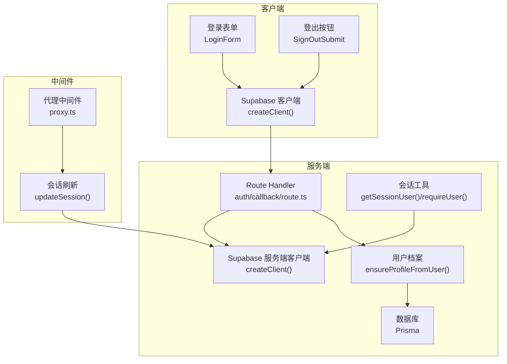
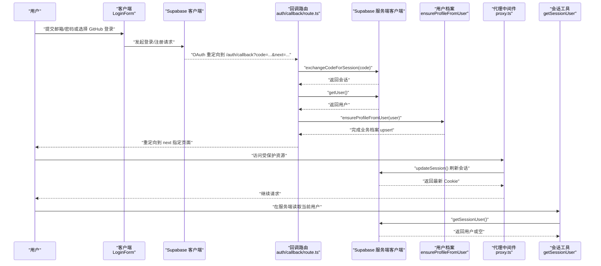
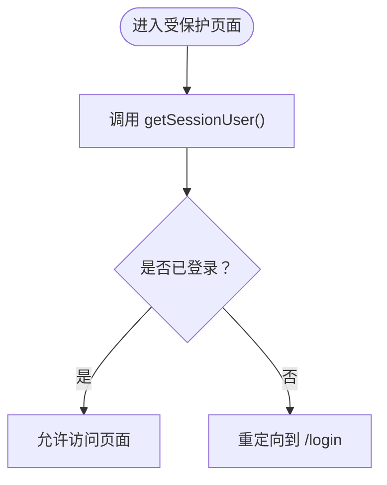
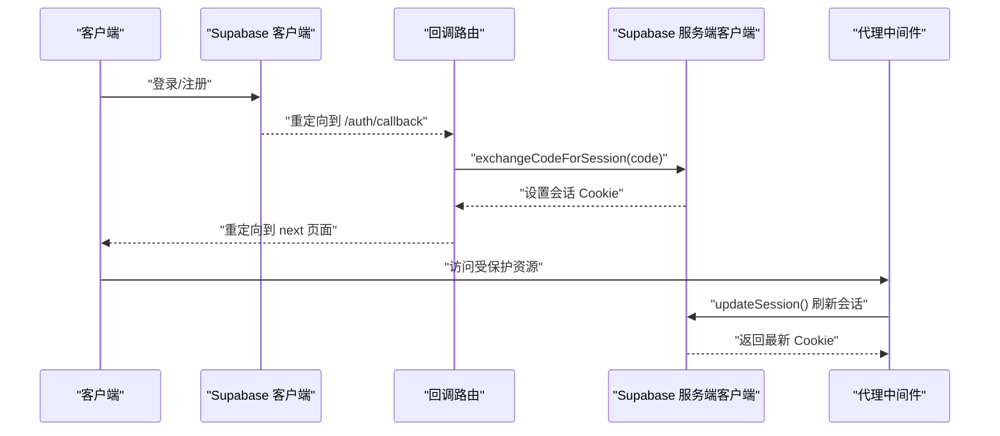
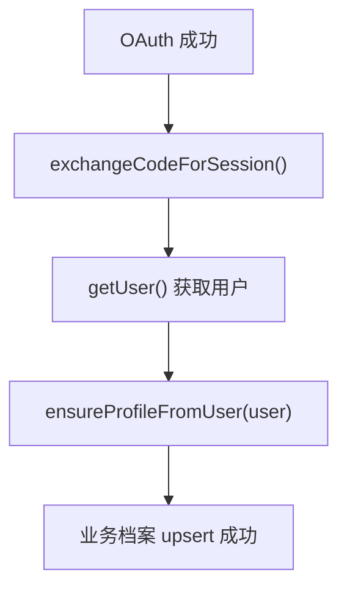
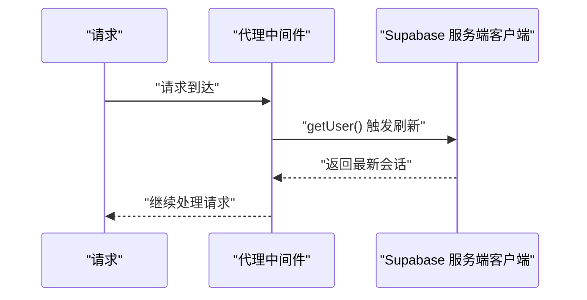
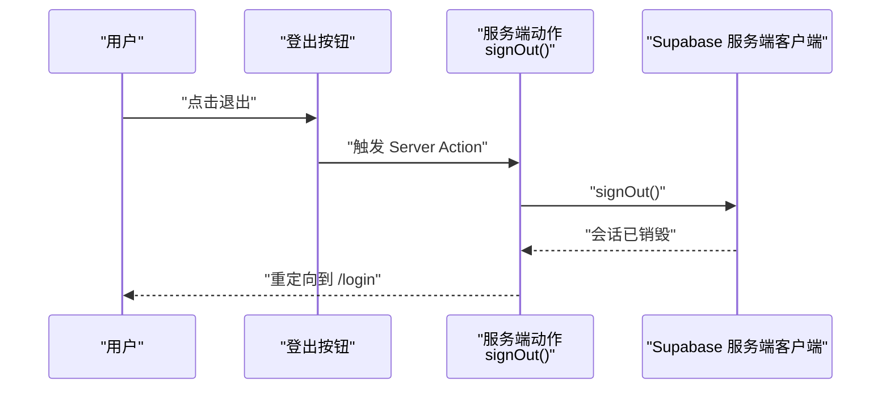
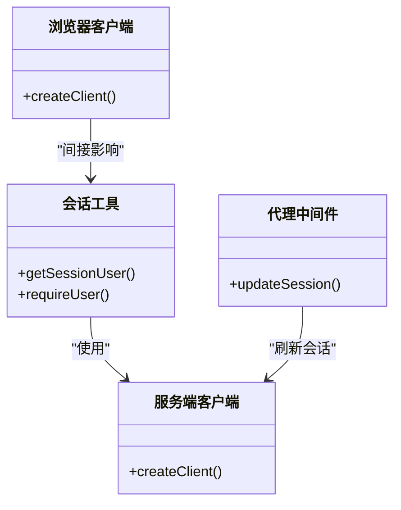
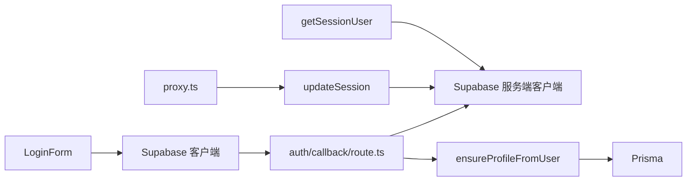

# 会话管理

<cite>
**本文引用的文件**
- [src/actions/auth.ts](file://src/actions/auth.ts)
- [src/app/auth/callback/route.ts](file://src/app/auth/callback/route.ts)
- [src/components/auth/sign-out-submit.tsx](file://src/components/auth/sign-out-submit.tsx)
- [src/components/auth/login-form.tsx](file://src/components/auth/login-form.tsx)
- [src/lib/auth/profile.ts](file://src/lib/auth/profile.ts)
- [src/lib/auth/session.ts](file://src/lib/auth/session.ts)
- [src/lib/supabase/client.ts](file://src/lib/supabase/client.ts)
- [src/lib/supabase/server.ts](file://src/lib/supabase/server.ts)
- [src/lib/supabase/proxy.ts](file://src/lib/supabase/proxy.ts)
- [src/lib/db/index.ts](file://src/lib/db/index.ts)
- [src/proxy.ts](file://src/proxy.ts)
- [src/app/(auth)/login/page.tsx](file://src/app/(auth)/login/page.tsx)
- [src/app/layout.tsx](file://src/app/layout.tsx)
</cite>

## 目录
1. [简介](#简介)
2. [项目结构](#项目结构)
3. [核心组件](#核心组件)
4. [架构总览](#架构总览)
5. [详细组件分析](#详细组件分析)
6. [依赖关系分析](#依赖关系分析)
7. [性能考虑](#性能考虑)
8. [故障排查指南](#故障排查指南)
9. [结论](#结论)
10. [附录](#附录)

## 简介
本文件系统性梳理本项目的会话管理实现，覆盖以下主题：
- 会话状态维护：用户信息的获取、存储与更新
- 会话持久化：Cookies 管理、会话恢复与服务端刷新
- 会话过期与刷新：自动续期与手动刷新流程
- 登出流程：本地清理、服务端销毁与重定向
- 客户端与服务端状态同步：传播与一致性保障
- 安全最佳实践：CSRF 与会话劫持防范
- 调试方法与性能优化建议

## 项目结构
围绕会话管理的关键文件分布如下：
- 客户端会话工具：浏览器侧 Supabase 客户端封装
- 服务端会话工具：基于 Next.js headers 的 Cookie 读写封装
- 中间件会话刷新：Next.js 16 代理中间件统一刷新会话
- 登录与回调：邮箱/密码登录、OAuth 回调交换会话并确保用户档案
- 登出动作：服务端销毁会话并重定向
- 用户档案：将 Supabase 用户元数据映射到业务档案

**图表来源**
- [src/components/auth/login-form.tsx:1-243](file://src/components/auth/login-form.tsx#L1-L243)
- [src/components/auth/sign-out-submit.tsx:1-31](file://src/components/auth/sign-out-submit.tsx#L1-L31)
- [src/lib/supabase/client.ts:1-9](file://src/lib/supabase/client.ts#L1-L9)
- [src/app/auth/callback/route.ts:1-49](file://src/app/auth/callback/route.ts#L1-L49)
- [src/lib/auth/session.ts:1-19](file://src/lib/auth/session.ts#L1-L19)
- [src/lib/supabase/server.ts:1-29](file://src/lib/supabase/server.ts#L1-L29)
- [src/lib/auth/profile.ts:1-30](file://src/lib/auth/profile.ts#L1-L30)
- [src/lib/db/index.ts:1-16](file://src/lib/db/index.ts#L1-L16)
- [src/proxy.ts:1-23](file://src/proxy.ts#L1-L23)
- [src/lib/supabase/proxy.ts:1-51](file://src/lib/supabase/proxy.ts#L1-L51)

**章节来源**
- [src/app/(auth)/login/page.tsx](file://src/app/(auth)/login/page.tsx#L1-L31)
- [src/app/layout.tsx:1-54](file://src/app/layout.tsx#L1-L54)

## 核心组件
- Supabase 浏览器客户端封装：用于在客户端发起登录、注册、登出等操作，并携带/更新会话 Cookie。
- Supabase 服务端客户端封装：在服务端读取/设置 Cookie，完成会话查询与刷新。
- 会话工具函数：在服务端获取当前用户或强制要求已登录。
- OAuth 回调处理器：接收授权码，交换会话，拉取用户并确保业务档案存在。
- 代理中间件：在每个请求上刷新会话，避免 access_token 过期导致的鉴权失败。
- 登出动作：服务端销毁会话，清理缓存并重定向至登录页。
- 用户档案：将 Supabase 用户元数据写入业务档案表，便于后续读取。

**章节来源**
- [src/lib/supabase/client.ts:1-9](file://src/lib/supabase/client.ts#L1-L9)
- [src/lib/supabase/server.ts:1-29](file://src/lib/supabase/server.ts#L1-L29)
- [src/lib/auth/session.ts:1-19](file://src/lib/auth/session.ts#L1-L19)
- [src/app/auth/callback/route.ts:1-49](file://src/app/auth/callback/route.ts#L1-L49)
- [src/lib/supabase/proxy.ts:1-51](file://src/lib/supabase/proxy.ts#L1-L51)
- [src/proxy.ts:1-23](file://src/proxy.ts#L1-L23)
- [src/actions/auth.ts:1-13](file://src/actions/auth.ts#L1-L13)
- [src/lib/auth/profile.ts:1-30](file://src/lib/auth/profile.ts#L1-L30)

## 架构总览
下图展示从登录到会话持久化、中间件刷新、以及登出的完整流程。

**图表来源**
- [src/components/auth/login-form.tsx:65-112](file://src/components/auth/login-form.tsx#L65-L112)
- [src/app/auth/callback/route.ts:6-47](file://src/app/auth/callback/route.ts#L6-L47)
- [src/lib/auth/profile.ts:5-28](file://src/lib/auth/profile.ts#L5-L28)
- [src/lib/supabase/proxy.ts:15-50](file://src/lib/supabase/proxy.ts#L15-L50)
- [src/lib/auth/session.ts:4-9](file://src/lib/auth/session.ts#L4-L9)
- [src/proxy.ts:8-9](file://src/proxy.ts#L8-L9)

## 详细组件分析

### 会话状态维护与用户信息获取
- 在服务端通过会话工具函数获取当前用户，若无用户则重定向至登录页。
- 登录页在服务端调用会话工具，若已登录则直接重定向至笔记页。
- 用户信息来自 Supabase 会话，OAuth 回调成功后会写入业务档案，便于后续读取。

**图表来源**
- [src/lib/auth/session.ts:4-18](file://src/lib/auth/session.ts#L4-L18)
- [src/app/(auth)/login/page.tsx](file://src/app/(auth)/login/page.tsx#L13-L16)

**章节来源**
- [src/lib/auth/session.ts:1-19](file://src/lib/auth/session.ts#L1-L19)
- [src/app/(auth)/login/page.tsx](file://src/app/(auth)/login/page.tsx#L1-L31)

### 会话持久化与 Cookies 管理
- 浏览器端：通过 Supabase 浏览器客户端发起登录/注册/登出，自动维护会话 Cookie。
- 服务端端：Supabase 服务端客户端从 Next.js headers 的 CookieStore 读取/写入，确保 SSR 场景下的会话一致。
- OAuth 回调：在服务端交换授权码并设置会话 Cookie，随后重定向到 next 指定页面。
- 代理中间件：每次请求刷新会话，确保 access_token 未过期，必要时更新 Cookie。

**图表来源**
- [src/lib/supabase/client.ts:3-8](file://src/lib/supabase/client.ts#L3-L8)
- [src/lib/supabase/server.ts:4-28](file://src/lib/supabase/server.ts#L4-L28)
- [src/app/auth/callback/route.ts:15-31](file://src/app/auth/callback/route.ts#L15-L31)
- [src/lib/supabase/proxy.ts:15-48](file://src/lib/supabase/proxy.ts#L15-L48)
- [src/proxy.ts:8-9](file://src/proxy.ts#L8-L9)

**章节来源**
- [src/lib/supabase/client.ts:1-9](file://src/lib/supabase/client.ts#L1-L9)
- [src/lib/supabase/server.ts:1-29](file://src/lib/supabase/server.ts#L1-L29)
- [src/app/auth/callback/route.ts:1-49](file://src/app/auth/callback/route.ts#L1-L49)
- [src/lib/supabase/proxy.ts:1-51](file://src/lib/supabase/proxy.ts#L1-L51)
- [src/proxy.ts:1-23](file://src/proxy.ts#L1-L23)

### 会话恢复机制
- OAuth 回调成功后，调用用户档案确保函数，将用户元数据写入业务档案，保证后续读取的一致性。
- 代理中间件在每次请求上调用 getUser() 触发 token 刷新，避免因过期导致的鉴权失败。

**图表来源**
- [src/app/auth/callback/route.ts:33-45](file://src/app/auth/callback/route.ts#L33-L45)
- [src/lib/auth/profile.ts:5-28](file://src/lib/auth/profile.ts#L5-L28)

**章节来源**
- [src/app/auth/callback/route.ts:1-49](file://src/app/auth/callback/route.ts#L1-L49)
- [src/lib/auth/profile.ts:1-30](file://src/lib/auth/profile.ts#L1-L30)

### 会话过期与刷新处理
- 自动续期：代理中间件在每个请求上调用 getUser()，触发 Supabase 内部刷新 access_token 并更新 Cookie。
- 手动刷新：登录表单在邮箱登录成功后执行页面导航与刷新，确保客户端状态与服务端会话一致。

**图表来源**
- [src/lib/supabase/proxy.ts:47-48](file://src/lib/supabase/proxy.ts#L47-L48)
- [src/proxy.ts:8-9](file://src/proxy.ts#L8-L9)

**章节来源**
- [src/lib/supabase/proxy.ts:1-51](file://src/lib/supabase/proxy.ts#L1-L51)
- [src/proxy.ts:1-23](file://src/proxy.ts#L1-L23)
- [src/components/auth/login-form.tsx:77-78](file://src/components/auth/login-form.tsx#L77-L78)

### 登出功能实现
- 登出动作：服务端调用 Supabase 会话销毁，清理缓存并重定向至登录页。
- 登出按钮：客户端提交表单，配合禁用状态反馈，防止重复提交。

**图表来源**
- [src/components/auth/sign-out-submit.tsx:8-29](file://src/components/auth/sign-out-submit.tsx#L8-L29)
- [src/actions/auth.ts:7-12](file://src/actions/auth.ts#L7-L12)

**章节来源**
- [src/actions/auth.ts:1-13](file://src/actions/auth.ts#L1-L13)
- [src/components/auth/sign-out-submit.tsx:1-31](file://src/components/auth/sign-out-submit.tsx#L1-L31)

### 客户端与服务端状态同步
- 客户端：通过 Supabase 浏览器客户端进行登录/登出，自动维护 Cookie。
- 服务端：通过 Supabase 服务端客户端读取/设置 Cookie，结合会话工具与中间件刷新，确保状态一致。
- 登录页：在服务端检查会话，避免已登录用户重复登录。

**图表来源**
- [src/lib/auth/session.ts:1-19](file://src/lib/auth/session.ts#L1-L19)
- [src/lib/supabase/server.ts:1-29](file://src/lib/supabase/server.ts#L1-L29)
- [src/lib/supabase/client.ts:1-9](file://src/lib/supabase/client.ts#L1-L9)
- [src/lib/supabase/proxy.ts:1-51](file://src/lib/supabase/proxy.ts#L1-L51)

**章节来源**
- [src/lib/auth/session.ts:1-19](file://src/lib/auth/session.ts#L1-L19)
- [src/lib/supabase/server.ts:1-29](file://src/lib/supabase/server.ts#L1-L29)
- [src/lib/supabase/client.ts:1-9](file://src/lib/supabase/client.ts#L1-L9)
- [src/lib/supabase/proxy.ts:1-51](file://src/lib/supabase/proxy.ts#L1-L51)

## 依赖关系分析
- 登录流程依赖 Supabase 浏览器客户端与 OAuth 回调路由。
- OAuth 回调依赖 Supabase 服务端客户端与用户档案写入。
- 代理中间件依赖 Supabase 服务端客户端以刷新会话。
- 会话工具依赖 Supabase 服务端客户端。
- 用户档案依赖 Prisma 数据库。

**图表来源**
- [src/components/auth/login-form.tsx:1-243](file://src/components/auth/login-form.tsx#L1-L243)
- [src/app/auth/callback/route.ts:1-49](file://src/app/auth/callback/route.ts#L1-L49)
- [src/lib/supabase/client.ts:1-9](file://src/lib/supabase/client.ts#L1-L9)
- [src/lib/supabase/server.ts:1-29](file://src/lib/supabase/server.ts#L1-L29)
- [src/lib/auth/profile.ts:1-30](file://src/lib/auth/profile.ts#L1-L30)
- [src/lib/db/index.ts:1-16](file://src/lib/db/index.ts#L1-L16)
- [src/proxy.ts:1-23](file://src/proxy.ts#L1-L23)
- [src/lib/supabase/proxy.ts:1-51](file://src/lib/supabase/proxy.ts#L1-L51)
- [src/lib/auth/session.ts:1-19](file://src/lib/auth/session.ts#L1-L19)

**章节来源**
- [src/lib/db/index.ts:1-16](file://src/lib/db/index.ts#L1-L16)

## 性能考虑
- 代理中间件在每个请求上调用 getUser() 刷新会话，确保令牌有效性，但可能增加服务端开销。建议：
  - 合理设置 Supabase 令牌有效期与刷新策略。
  - 对静态资源与公开接口减少不必要的中间件匹配。
  - 在开发环境开启日志以便观察刷新频率，生产环境关闭冗余日志。
- 登录成功后的页面刷新仅用于客户端状态同步，避免重复请求与闪烁。
- 用户档案 upsert 操作应尽量避免频繁变更，减少数据库写入压力。

[本节为通用指导，不直接分析具体文件]

## 故障排查指南
- 登录后仍提示未登录
  - 检查代理中间件是否正确刷新会话。
  - 确认 Supabase 环境变量配置正确且未处于占位状态。
  - 查看回调路由是否成功交换授权码并设置会话 Cookie。
- OAuth 回调报错或重定向失败
  - 检查回调路由中的错误处理与重定向目标。
  - 确保 next 参数有效且与前端约定一致。
- 登出无效或状态未清除
  - 确认服务端动作已调用会话销毁。
  - 检查客户端提交按钮的禁用状态，避免重复提交。
- 会话过期频繁
  - 检查代理中间件是否正常工作。
  - 调整 Supabase 令牌有效期与刷新策略。

**章节来源**
- [src/lib/supabase/proxy.ts:15-50](file://src/lib/supabase/proxy.ts#L15-L50)
- [src/app/auth/callback/route.ts:11-13](file://src/app/auth/callback/route.ts#L11-L13)
- [src/actions/auth.ts:7-12](file://src/actions/auth.ts#L7-L12)
- [src/components/auth/sign-out-submit.tsx:8-19](file://src/components/auth/sign-out-submit.tsx#L8-L19)

## 结论
本项目采用 Supabase 提供的 SSR 会话能力，结合代理中间件实现自动续期，辅以服务端会话工具与用户档案写入，形成完整的会话生命周期管理。登录、回调、登出与中间件刷新共同构成稳定可靠的会话体系。建议在生产环境中关注令牌有效期与中间件匹配范围，持续优化性能与安全性。

[本节为总结，不直接分析具体文件]

## 附录

### 安全最佳实践
- CSRF 保护
  - 使用 Next.js 表单与 Server Action，结合 Suspense 与状态管理，避免跨站请求伪造。
  - 在关键操作（如登出）使用表单提交与服务端动作，减少客户端可篡改面。
- 会话劫持防范
  - 启用 HTTPS 与安全 Cookie 属性（Secure、SameSite、HttpOnly）。
  - 定期轮换密钥与限制令牌有效期。
  - 在代理中间件中严格校验与刷新会话，避免泄露。
- 用户隐私
  - 仅在业务需要时读取与存储用户元数据，遵循最小化原则。

[本节为通用指导，不直接分析具体文件]