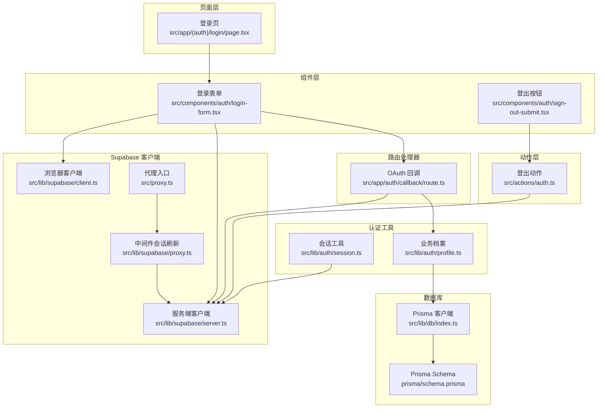
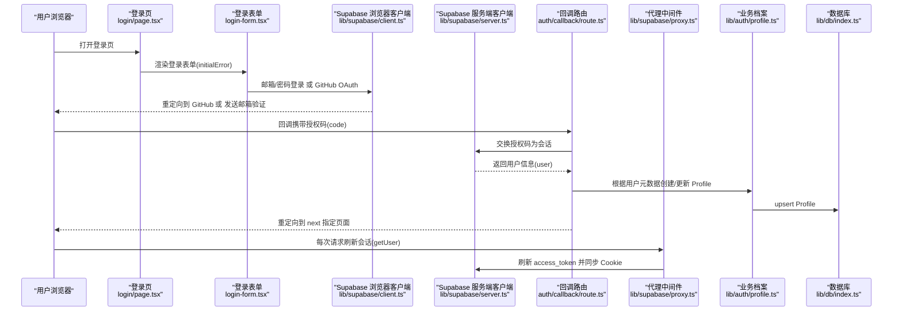
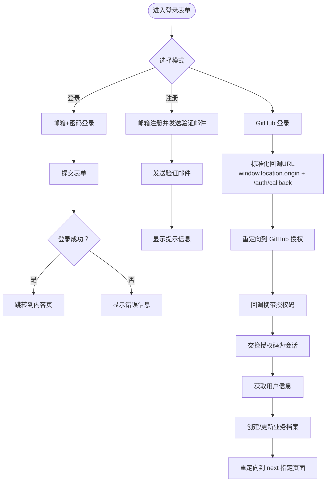
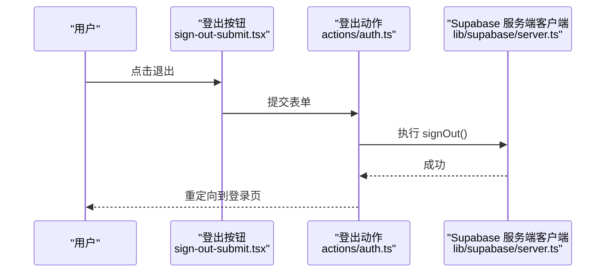
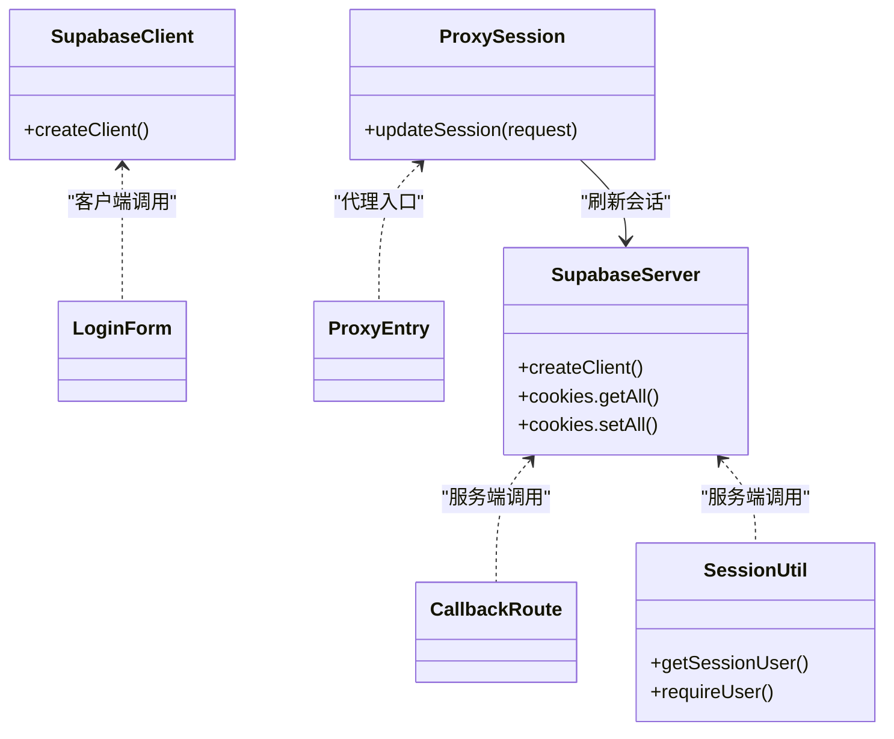
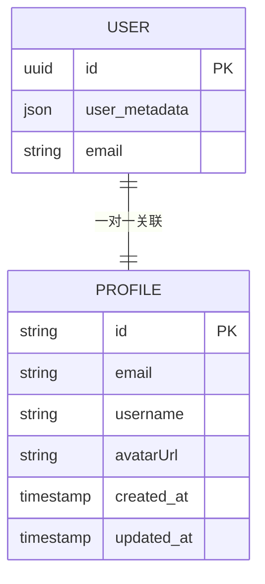
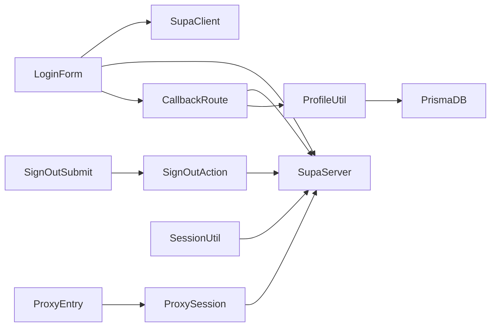

# 用户认证系统

<cite>
**本文引用的文件**
- [src/app/(auth)/login/page.tsx](file://src/app/(auth)/login/page.tsx)
- [src/components/auth/login-form.tsx](file://src/components/auth/login-form.tsx)
- [src/components/auth/sign-out-submit.tsx](file://src/components/auth/sign-out-submit.tsx)
- [src/actions/auth.ts](file://src/actions/auth.ts)
- [src/app/auth/callback/route.ts](file://src/app/auth/callback/route.ts)
- [src/lib/supabase/client.ts](file://src/lib/supabase/client.ts)
- [src/lib/supabase/server.ts](file://src/lib/supabase/server.ts)
- [src/lib/supabase/proxy.ts](file://src/lib/supabase/proxy.ts)
- [src/lib/auth/session.ts](file://src/lib/auth/session.ts)
- [src/lib/auth/profile.ts](file://src/lib/auth/profile.ts)
- [src/proxy.ts](file://src/proxy.ts)
- [src/lib/db/index.ts](file://src/lib/db/index.ts)
- [prisma/schema.prisma](file://prisma/schema.prisma)
- [README.md](file://README.md)
</cite>

## 更新摘要
**所做更改**
- 更新了URL处理机制的描述，反映登录表单重定向URL从完整URL简化为标准化的`/auth/callback`端点
- 改进了OAuth回调处理的URL参数处理逻辑说明
- 增强了客户端运行时URL生成的安全性和一致性说明
- 更新了认证流程的一致性和可维护性相关描述

## 目录
1. [简介](#简介)
2. [项目结构](#项目结构)
3. [核心组件](#核心组件)
4. [架构总览](#架构总览)
5. [详细组件分析](#详细组件分析)
6. [依赖关系分析](#依赖关系分析)
7. [性能考量](#性能考量)
8. [故障排查指南](#故障排查指南)
9. [结论](#结论)
10. [附录](#附录)

## 简介
本文件面向 Smart-Todo 的用户认证系统，系统基于 Supabase Auth 实现，支持邮箱密码与 GitHub OAuth 两种登录方式，并通过 Next.js 16 的代理中间件（proxy）实现服务端会话刷新与 Cookie 同步，确保访问令牌过期后的自动续期。认证状态在客户端与服务端之间保持一致，配合 Prisma 数据库完成用户业务档案的初始化与更新。

**更新** 认证系统现已采用简化的URL处理机制，登录表单中的重定向URL从包含完整next参数的复杂URL简化为标准化的`/auth/callback`端点，提升了认证流程的一致性和可维护性。

## 项目结构
认证相关代码主要分布在以下模块：
- 页面层：登录页负责检测已登录用户并渲染登录表单
- 组件层：登录表单提供邮箱/密码与 GitHub 登录入口；登出按钮使用 React Hook Form 状态
- 动作层：服务端动作封装登出逻辑
- 路由处理器：OAuth 回调处理授权码换会话、用户信息获取与业务档案同步
- 客户端/服务端 Supabase 客户端：分别用于浏览器与服务端的会话读写
- 中间件：每次请求刷新 Supabase 会话，保证 access_token 始终有效
- 业务档案：根据 Supabase 用户元数据创建或更新本地 Profile

**图表来源**
- [src/app/(auth)/login/page.tsx:1-25](file://src/app/(auth)/login/page.tsx#L1-L25)
- [src/components/auth/login-form.tsx:1-242](file://src/components/auth/login-form.tsx#L1-L242)
- [src/components/auth/sign-out-submit.tsx:1-31](file://src/components/auth/sign-out-submit.tsx#L1-L31)
- [src/actions/auth.ts:1-13](file://src/actions/auth.ts#L1-L13)
- [src/app/auth/callback/route.ts:1-49](file://src/app/auth/callback/route.ts#L1-L49)
- [src/lib/supabase/client.ts:1-9](file://src/lib/supabase/client.ts#L1-L9)
- [src/lib/supabase/server.ts:1-29](file://src/lib/supabase/server.ts#L1-L29)
- [src/lib/supabase/proxy.ts:1-52](file://src/lib/supabase/proxy.ts#L1-L52)
- [src/proxy.ts:1-24](file://src/proxy.ts#L1-L24)
- [src/lib/auth/session.ts:1-19](file://src/lib/auth/session.ts#L1-L19)
- [src/lib/auth/profile.ts:1-30](file://src/lib/auth/profile.ts#L1-L30)
- [src/lib/db/index.ts:1-16](file://src/lib/db/index.ts#L1-L16)
- [prisma/schema.prisma:1-117](file://prisma/schema.prisma#L1-L117)

## 核心组件
- 登录页：检测当前会话用户，若已登录则重定向至内容页；否则渲染登录表单并传递应用 URL 与初始错误参数
- 登录表单：支持邮箱/密码登录与 GitHub OAuth；切换登录/注册模式；处理加载态与错误提示
- 登出按钮：基于 React Hook Form 状态禁用提交按钮并显示加载动画
- 登出动作：服务端执行 signOut 并清理缓存路径，随后重定向至登录页
- OAuth 回调：接收授权码，换取会话，获取用户信息，必要时创建业务档案，再重定向到目标路径
- Supabase 客户端：浏览器端与服务端分别封装 createClient，服务端通过 cookies 读写同步会话
- 中间件：每次请求刷新会话，触发 access_token 自动续期
- 会话工具：获取当前用户与强制登录校验
- 业务档案：根据用户元数据 upsert Profile 记录

**更新** URL处理机制已重构为简化的标准化端点，登录表单中的重定向URL现在统一使用`/auth/callback`，消除了复杂的next参数处理，提高了系统的安全性和一致性。

## 架构总览
下图展示从用户访问到会话建立与业务档案同步的关键交互：

**图表来源**
- [src/app/(auth)/login/page.tsx:1-25](file://src/app/(auth)/login/page.tsx#L1-L25)
- [src/components/auth/login-form.tsx:1-242](file://src/components/auth/login-form.tsx#L1-L242)
- [src/lib/supabase/client.ts:1-9](file://src/lib/supabase/client.ts#L1-L9)
- [src/lib/supabase/server.ts:1-29](file://src/lib/supabase/server.ts#L1-L29)
- [src/app/auth/callback/route.ts:1-49](file://src/app/auth/callback/route.ts#L1-L49)
- [src/lib/supabase/proxy.ts:1-52](file://src/lib/supabase/proxy.ts#L1-L52)
- [src/lib/auth/profile.ts:1-30](file://src/lib/auth/profile.ts#L1-L30)
- [src/lib/db/index.ts:1-16](file://src/lib/db/index.ts#L1-L16)

## 详细组件分析

### 登录页（登录流程入口）
- 职责：检测当前会话用户，若已登录则直接重定向；否则渲染登录表单并注入初始错误
- 关键点：从 headers 获取主机与协议，构造完整 appUrl；从 searchParams 读取错误参数

**更新** 登录页现在仅处理错误参数传递，URL生成逻辑已完全移至客户端组件，简化了服务端逻辑。

**章节来源**
- [src/app/(auth)/login/page.tsx:1-25](file://src/app/(auth)/login/page.tsx#L1-L25)

### 登录表单（邮箱/密码与 GitHub 登录）
- 职责：切换登录/注册模式；提交邮箱/密码；发起 GitHub OAuth；处理错误与提示
- 关键点：
  - 邮箱登录：调用浏览器端 Supabase 客户端进行登录，成功后导航至内容页
  - 注册：传入标准化回调地址`/auth/callback`，等待邮箱验证后登录
  - GitHub 登录：传入标准化回调地址`/auth/callback`，重定向至 GitHub 完成授权
  - 键盘可访问性：支持 Home/End 切换模式，左右箭头在标签间切换
  - 加载态与无障碍：使用 aria-* 属性与禁用状态反馈
  - **URL处理**：使用 `window.location.origin` 动态生成标准化回调地址，支持多环境部署

**更新** URL处理机制已重构为简化的标准化端点，登录表单中的重定向URL现在统一使用`/auth/callback`，消除了复杂的next参数处理，提高了系统的安全性和一致性。

**图表来源**
- [src/components/auth/login-form.tsx:1-242](file://src/components/auth/login-form.tsx#L1-L242)
- [src/app/auth/callback/route.ts:1-49](file://src/app/auth/callback/route.ts#L1-L49)
- [src/lib/auth/profile.ts:1-30](file://src/lib/auth/profile.ts#L1-L30)

**章节来源**
- [src/components/auth/login-form.tsx:1-242](file://src/components/auth/login-form.tsx#L1-L242)

### 登出组件与动作
- 登出按钮：基于 useFormStatus 禁用提交并显示加载动画
- 登出动作：服务端调用 Supabase 服务端客户端登出，清理缓存路径，重定向至登录页

**图表来源**
- [src/components/auth/sign-out-submit.tsx:1-31](file://src/components/auth/sign-out-submit.tsx#L1-L31)
- [src/actions/auth.ts:1-13](file://src/actions/auth.ts#L1-L13)
- [src/lib/supabase/server.ts:1-29](file://src/lib/supabase/server.ts#L1-L29)

**章节来源**
- [src/components/auth/sign-out-submit.tsx:1-31](file://src/components/auth/sign-out-submit.tsx#L1-L31)
- [src/actions/auth.ts:1-13](file://src/actions/auth.ts#L1-L13)

### OAuth 回调处理（授权码换会话）
- 职责：从回调参数提取授权码，调用服务端 Supabase 客户端交换会话；获取用户信息；创建/更新业务档案；重定向到 next 指定页面
- 关键点：cookies 读写同步；错误参数透传到登录页；next 默认跳转内容页

**更新** 回调路由现在从URL查询参数中提取 `next` 参数，默认值为 `/notes`，实现了更灵活的重定向控制。标准化的回调端点确保了所有OAuth流程的一致性。

**章节来源**
- [src/app/auth/callback/route.ts:1-49](file://src/app/auth/callback/route.ts#L1-L49)
- [src/lib/auth/profile.ts:1-30](file://src/lib/auth/profile.ts#L1-L30)

### Supabase 客户端与会话同步
- 浏览器端客户端：封装 createBrowserClient，供客户端组件调用
- 服务端客户端：封装 createServerClient，通过 cookies.getAll/setAll 与 Next.js cookies 同步
- 中间件：每次请求调用 getUser() 触发 access_token 刷新与 Cookie 同步

**图表来源**
- [src/lib/supabase/client.ts:1-9](file://src/lib/supabase/client.ts#L1-L9)
- [src/lib/supabase/server.ts:1-29](file://src/lib/supabase/server.ts#L1-L29)
- [src/lib/supabase/proxy.ts:1-52](file://src/lib/supabase/proxy.ts#L1-L52)
- [src/lib/auth/session.ts:1-19](file://src/lib/auth/session.ts#L1-L19)
- [src/proxy.ts:1-24](file://src/proxy.ts#L1-L24)

**章节来源**
- [src/lib/supabase/client.ts:1-9](file://src/lib/supabase/client.ts#L1-L9)
- [src/lib/supabase/server.ts:1-29](file://src/lib/supabase/server.ts#L1-L29)
- [src/lib/supabase/proxy.ts:1-52](file://src/lib/supabase/proxy.ts#L1-L52)
- [src/proxy.ts:1-24](file://src/proxy.ts#L1-L24)
- [src/lib/auth/session.ts:1-19](file://src/lib/auth/session.ts#L1-L19)

### 业务档案（Profile）设计与同步
- 设计：Profile 与 Supabase auth.users 一对一，字段包含 id、email、username、avatarUrl 等
- 同步：OAuth 回调后根据用户元数据 upsert Profile，确保后续业务逻辑可用

**图表来源**
- [prisma/schema.prisma:15-30](file://prisma/schema.prisma#L15-L30)
- [src/lib/auth/profile.ts:1-30](file://src/lib/auth/profile.ts#L1-L30)

**章节来源**
- [prisma/schema.prisma:1-117](file://prisma/schema.prisma#L1-L117)
- [src/lib/auth/profile.ts:1-30](file://src/lib/auth/profile.ts#L1-L30)
- [src/lib/db/index.ts:1-16](file://src/lib/db/index.ts#L1-L16)

## 依赖关系分析
- 组件耦合：登录表单依赖 Supabase 客户端与回调路由；登出按钮依赖登出动作
- 会话一致性：中间件确保每次请求都会刷新会话，避免 access_token 过期导致的鉴权失败
- 数据一致性：业务档案通过 upsert 保证用户元数据变化时能及时更新

**图表来源**
- [src/components/auth/login-form.tsx:1-242](file://src/components/auth/login-form.tsx#L1-L242)
- [src/lib/supabase/client.ts:1-9](file://src/lib/supabase/client.ts#L1-L9)
- [src/lib/supabase/server.ts:1-29](file://src/lib/supabase/server.ts#L1-L29)
- [src/app/auth/callback/route.ts:1-49](file://src/app/auth/callback/route.ts#L1-L49)
- [src/components/auth/sign-out-submit.tsx:1-31](file://src/components/auth/sign-out-submit.tsx#L1-L31)
- [src/actions/auth.ts:1-13](file://src/actions/auth.ts#L1-L13)
- [src/lib/auth/profile.ts:1-30](file://src/lib/auth/profile.ts#L1-L30)
- [src/lib/db/index.ts:1-16](file://src/lib/db/index.ts#L1-L16)
- [src/proxy.ts:1-24](file://src/proxy.ts#L1-L24)
- [src/lib/supabase/proxy.ts:1-52](file://src/lib/supabase/proxy.ts#L1-L52)
- [src/lib/auth/session.ts:1-19](file://src/lib/auth/session.ts#L1-L19)

**章节来源**
- [src/components/auth/login-form.tsx:1-242](file://src/components/auth/login-form.tsx#L1-L242)
- [src/app/auth/callback/route.ts:1-49](file://src/app/auth/callback/route.ts#L1-L49)
- [src/lib/supabase/server.ts:1-29](file://src/lib/supabase/server.ts#L1-L29)
- [src/lib/supabase/proxy.ts:1-52](file://src/lib/supabase/proxy.ts#L1-L52)
- [src/lib/auth/session.ts:1-19](file://src/lib/auth/session.ts#L1-L19)
- [src/lib/auth/profile.ts:1-30](file://src/lib/auth/profile.ts#L1-L30)
- [src/lib/db/index.ts:1-16](file://src/lib/db/index.ts#L1-L16)
- [src/proxy.ts:1-24](file://src/proxy.ts#L1-L24)

## 性能考量
- 中间件刷新频率：每次请求都会调用 getUser() 触发 token 刷新，建议在生产环境确保网络稳定以减少额外往返
- 缓存策略：服务端动作执行后使用 revalidatePath 清理布局缓存，避免陈旧数据
- 会话持久化：通过 cookies 同步，结合中间件自动续期，降低频繁重新登录的概率
- **URL生成优化**：客户端运行时URL生成减少了服务端计算开销，提高了响应速度
- **标准化端点优势**：简化的`/auth/callback`端点减少了URL解析复杂度，提升了认证流程的性能

**更新** 新的URL生成机制在客户端完成，减少了服务端的字符串拼接操作，提升了整体性能。标准化的回调端点进一步优化了URL处理效率。

## 故障排查指南
- 授权码缺失：回调路由检查授权码参数，缺失时重定向到登录页并附带错误信息
- 会话刷新失败：确认环境变量配置正确且非占位值；中间件必须在每次请求上调用 getUser()
- 登录/注册失败：检查 Supabase 控制台的邮箱验证与 OAuth 配置；查看前端错误提示与网络面板
- 业务档案未创建：确认回调路由在获取用户后调用了业务档案 upsert；检查 Prisma 模型映射
- **URL相关问题**：检查 `window.location.origin` 是否正确返回；确认回调地址格式是否符合预期
- **标准化端点问题**：确认Supabase OAuth配置中的回调URL指向`/auth/callback`端点；检查代理中间件配置

**更新** 新增了标准化端点相关的排查指导，重点关注回调URL配置和代理中间件的兼容性问题。

**章节来源**
- [src/app/auth/callback/route.ts:1-49](file://src/app/auth/callback/route.ts#L1-L49)
- [src/lib/supabase/proxy.ts:1-52](file://src/lib/supabase/proxy.ts#L1-L52)
- [src/lib/auth/profile.ts:1-30](file://src/lib/auth/profile.ts#L1-L30)

## 结论
Smart-Todo 的认证系统以 Supabase Auth 为核心，结合浏览器与服务端 Supabase 客户端、代理中间件与业务档案 upsert，实现了完整的登录/注册、OAuth 回调、会话刷新与状态同步。该架构具备良好的可扩展性，便于后续增加更多认证方式与权限控制策略。

**更新** 最新的URL处理机制重构进一步增强了系统的健壮性和可维护性，简化的标准化端点方案提供了更好的环境适应能力和安全性，为系统的长期发展奠定了坚实基础。

## 附录
- 安全最佳实践
  - 严格校验回调地址与授权码来源
  - 在生产环境启用 HTTPS 与安全的 Cookie 属性
  - 定期轮换密钥并监控异常登录行为
  - 对邮箱验证与 OAuth 元数据进行白名单校验
  - **URL安全性**：确保 `window.location.origin` 返回正确的源地址，防止开放重定向攻击
  - **标准化端点安全**：使用固定的`/auth/callback`端点，减少URL注入攻击面
- 常见问题
  - access_token 过期：依赖中间件自动刷新；如仍失败，检查网络与 Supabase 配置
  - 业务档案缺失：确认回调路由已调用 upsert；检查用户元数据是否存在
  - GitHub 登录失败：核对 GitHub OAuth 应用配置与回调地址
  - **URL生成问题**：检查浏览器环境下的 `window.location.origin` 可用性；确认跨域设置正确
  - **标准化端点问题**：检查Supabase OAuth配置中的回调URL是否正确指向`/auth/callback`端点
- 配置参考
  - 开发环境回调URL：`http://localhost:3005/auth/callback`
  - 生产环境回调URL：`https://你的域名/auth/callback`
  - 端口范围配置：支持3000-3005端口范围内的回调URL配置

**章节来源**
- [README.md:92-100](file://README.md#L92-L100)
- [src/components/auth/login-form.tsx:84](file://src/components/auth/login-form.tsx#L84)
- [src/components/auth/login-form.tsx:104](file://src/components/auth/login-form.tsx#L104)