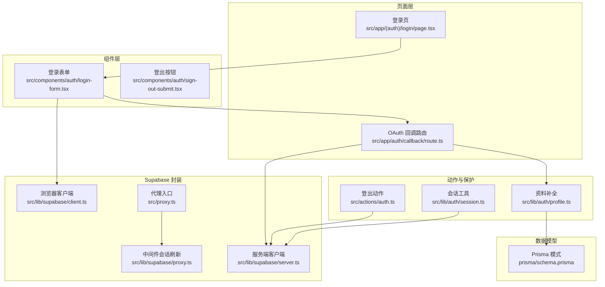
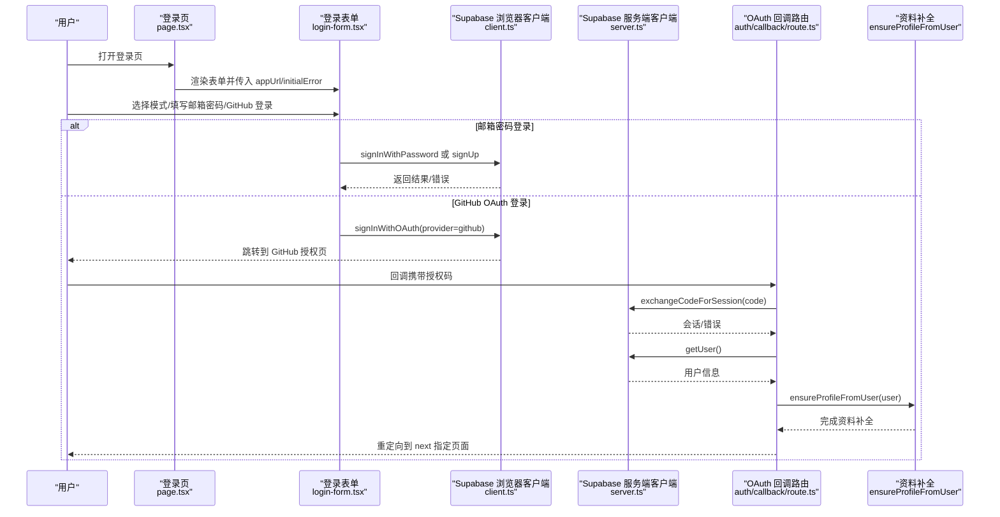
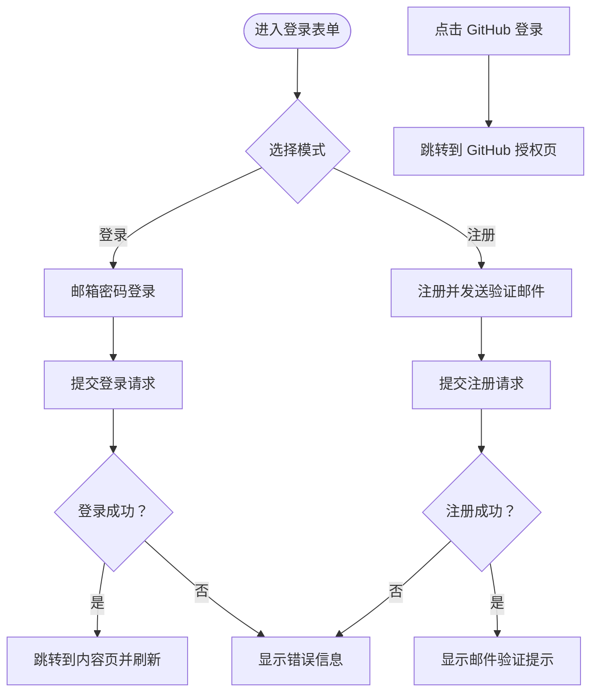
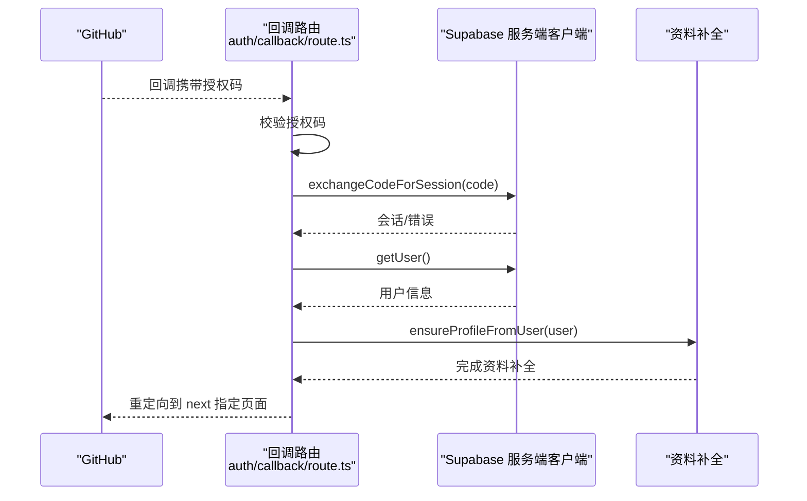
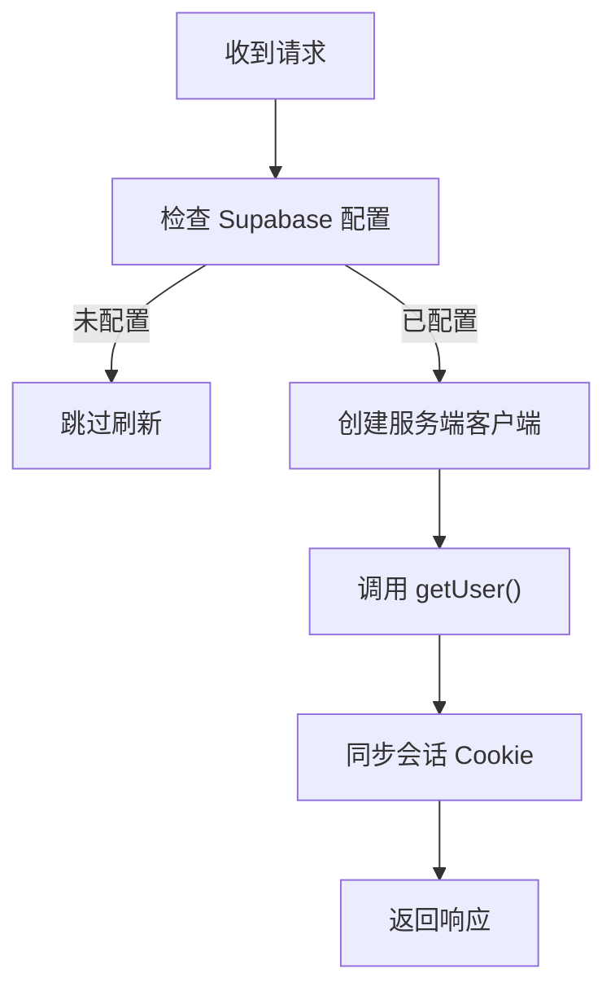
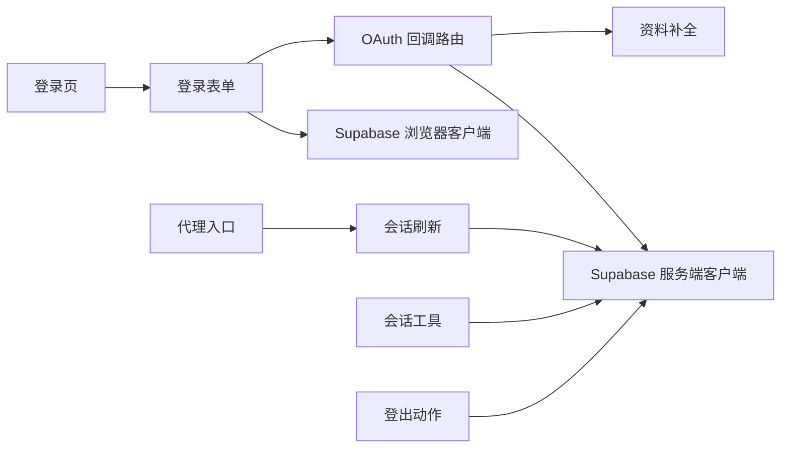

# 登录注册流程

<cite>
**本文引用的文件**
- [src/app/(auth)/login/page.tsx](file://src/app/(auth)/login/page.tsx)
- [src/components/auth/login-form.tsx](file://src/components/auth/login-form.tsx)
- [src/app/auth/callback/route.ts](file://src/app/auth/callback/route.ts)
- [src/actions/auth.ts](file://src/actions/auth.ts)
- [src/lib/auth/session.ts](file://src/lib/auth/session.ts)
- [src/lib/auth/profile.ts](file://src/lib/auth/profile.ts)
- [src/lib/supabase/client.ts](file://src/lib/supabase/client.ts)
- [src/lib/supabase/server.ts](file://src/lib/supabase/server.ts)
- [src/lib/supabase/proxy.ts](file://src/lib/supabase/proxy.ts)
- [src/proxy.ts](file://src/proxy.ts)
- [prisma/schema.prisma](file://prisma/schema.prisma)
- [src/components/auth/sign-out-submit.tsx](file://src/components/auth/sign-out-submit.tsx)
</cite>

## 目录
1. [简介](#简介)
2. [项目结构](#项目结构)
3. [核心组件](#核心组件)
4. [架构总览](#架构总览)
5. [详细组件分析](#详细组件分析)
6. [依赖关系分析](#依赖关系分析)
7. [性能考量](#性能考量)
8. [故障排查指南](#故障排查指南)
9. [结论](#结论)
10. [附录](#附录)

## 简介
本文件系统性梳理 Smart Note 应用的登录与注册流程，覆盖以下方面：
- 登录表单实现：表单验证、用户输入处理、提交流程与交互反馈
- GitHub OAuth 集成：OAuth 配置、回调处理、用户信息获取与资料补全
- 邮箱密码登录：密码验证、账户创建、邮件确认流程
- 登录状态检查与重定向：已登录用户处理、未登录用户保护
- 失败错误处理与用户体验优化
- 安全考虑与最佳实践
- 调试技巧与常见问题解决方案

## 项目结构
登录与认证相关的关键文件组织如下：
- 页面层：登录页负责渲染登录表单并进行基础重定向
- 组件层：登录表单负责用户输入、模式切换、提交与错误提示
- 动作层：登出动作负责服务端登出与路径刷新
- 会话与保护：会话读取、强制登录、中间件会话刷新
- Supabase 封装：浏览器端与服务端客户端封装
- 回调路由：处理 OAuth 回调、交换会话、确保用户资料
- 数据模型：用户业务资料与关联实体

图表来源
- [src/app/(auth)/login/page.tsx:1-31](file://src/app/(auth)/login/page.tsx#L1-L31)
- [src/components/auth/login-form.tsx:1-243](file://src/components/auth/login-form.tsx#L1-L243)
- [src/app/auth/callback/route.ts:1-49](file://src/app/auth/callback/route.ts#L1-L49)
- [src/actions/auth.ts:1-13](file://src/actions/auth.ts#L1-L13)
- [src/lib/auth/session.ts:1-19](file://src/lib/auth/session.ts#L1-L19)
- [src/lib/auth/profile.ts:1-30](file://src/lib/auth/profile.ts#L1-L30)
- [src/lib/supabase/client.ts:1-9](file://src/lib/supabase/client.ts#L1-L9)
- [src/lib/supabase/server.ts:1-29](file://src/lib/supabase/server.ts#L1-L29)
- [src/lib/supabase/proxy.ts:1-51](file://src/lib/supabase/proxy.ts#L1-L51)
- [src/proxy.ts:1-24](file://src/proxy.ts#L1-L24)
- [prisma/schema.prisma:1-117](file://prisma/schema.prisma#L1-L117)

章节来源
- [src/app/(auth)/login/page.tsx:1-31](file://src/app/(auth)/login/page.tsx#L1-L31)
- [src/components/auth/login-form.tsx:1-243](file://src/components/auth/login-form.tsx#L1-L243)
- [src/app/auth/callback/route.ts:1-49](file://src/app/auth/callback/route.ts#L1-L49)
- [src/actions/auth.ts:1-13](file://src/actions/auth.ts#L1-L13)
- [src/lib/auth/session.ts:1-19](file://src/lib/auth/session.ts#L1-L19)
- [src/lib/auth/profile.ts:1-30](file://src/lib/auth/profile.ts#L1-L30)
- [src/lib/supabase/client.ts:1-9](file://src/lib/supabase/client.ts#L1-L9)
- [src/lib/supabase/server.ts:1-29](file://src/lib/supabase/server.ts#L1-L29)
- [src/lib/supabase/proxy.ts:1-51](file://src/lib/supabase/proxy.ts#L1-L51)
- [src/proxy.ts:1-24](file://src/proxy.ts#L1-L24)
- [prisma/schema.prisma:1-117](file://prisma/schema.prisma#L1-L117)

## 核心组件
- 登录页：负责检测当前会话，若已登录则重定向至内容页；否则渲染登录表单并传递初始错误与应用地址
- 登录表单：支持“登录/注册”双模式，提供邮箱密码登录、GitHub OAuth 登录、表单校验与错误提示
- OAuth 回调路由：接收授权码，交换会话，获取用户并确保业务资料存在，再按 next 参数重定向
- 会话工具：提供获取当前用户与强制登录的辅助方法
- Supabase 客户端：分别封装浏览器端与服务端访问 Supabase 的客户端
- 中间件会话刷新：在每次请求时刷新 Supabase 会话，保证 access_token 有效
- 登出动作：服务端登出并重定向回登录页
- 资料补全：根据 Supabase 用户元数据创建或更新业务资料

章节来源
- [src/app/(auth)/login/page.tsx:1-31](file://src/app/(auth)/login/page.tsx#L1-L31)
- [src/components/auth/login-form.tsx:1-243](file://src/components/auth/login-form.tsx#L1-L243)
- [src/app/auth/callback/route.ts:1-49](file://src/app/auth/callback/route.ts#L1-L49)
- [src/lib/auth/session.ts:1-19](file://src/lib/auth/session.ts#L1-L19)
- [src/lib/supabase/client.ts:1-9](file://src/lib/supabase/client.ts#L1-L9)
- [src/lib/supabase/server.ts:1-29](file://src/lib/supabase/server.ts#L1-L29)
- [src/lib/supabase/proxy.ts:1-51](file://src/lib/supabase/proxy.ts#L1-L51)
- [src/actions/auth.ts:1-13](file://src/actions/auth.ts#L1-L13)
- [src/lib/auth/profile.ts:1-30](file://src/lib/auth/profile.ts#L1-L30)

## 架构总览
下图展示登录与注册流程的整体架构，包括浏览器端与服务端交互、Supabase 会话管理、回调处理与业务资料补全。

图表来源
- [src/app/(auth)/login/page.tsx:1-31](file://src/app/(auth)/login/page.tsx#L1-L31)
- [src/components/auth/login-form.tsx:1-243](file://src/components/auth/login-form.tsx#L1-L243)
- [src/lib/supabase/client.ts:1-9](file://src/lib/supabase/client.ts#L1-L9)
- [src/lib/supabase/server.ts:1-29](file://src/lib/supabase/server.ts#L1-L29)
- [src/app/auth/callback/route.ts:1-49](file://src/app/auth/callback/route.ts#L1-L49)
- [src/lib/auth/profile.ts:1-30](file://src/lib/auth/profile.ts#L1-L30)

## 详细组件分析

### 登录页（页面级控制流）
- 入口职责：读取会话，若已登录则直接重定向至内容页；否则渲染登录表单并注入初始错误与应用地址
- 地址构造：优先从代理头解析 host/proto，兼容本地开发与生产部署
- 错误透传：通过查询参数携带错误信息，供表单组件显示

章节来源
- [src/app/(auth)/login/page.tsx:1-31](file://src/app/(auth)/login/page.tsx#L1-L31)

### 登录表单（前端交互与提交）
- 模式切换：支持“登录/注册”双模式，键盘可导航（左右 Home/End）
- 输入处理：邮箱与密码输入框，密码最小长度约束；自动填充策略区分登录/注册场景
- 提交流程：
  - 邮箱登录：调用 Supabase 密码登录；成功后跳转并刷新
  - 注册：调用 Supabase 注册并设置邮箱验证回调地址；成功提示邮件验证
- OAuth 登录：调用 Supabase OAuth 登录，设置回调地址
- 反馈与加载：错误与信息提示区域，提交期间禁用按钮与设置忙状态

图表来源
- [src/components/auth/login-form.tsx:1-243](file://src/components/auth/login-form.tsx#L1-L243)

章节来源
- [src/components/auth/login-form.tsx:1-243](file://src/components/auth/login-form.tsx#L1-L243)

### OAuth 回调处理（服务端）
- 参数校验：必须包含授权码；缺失则重定向到登录页并附带错误
- 会话交换：使用 Supabase 服务端客户端交换授权码为会话
- 用户获取：获取当前用户信息
- 资料补全：根据用户元数据创建或更新业务资料
- 重定向：根据 next 参数或默认值重定向

图表来源
- [src/app/auth/callback/route.ts:1-49](file://src/app/auth/callback/route.ts#L1-L49)
- [src/lib/auth/profile.ts:1-30](file://src/lib/auth/profile.ts#L1-L30)

章节来源
- [src/app/auth/callback/route.ts:1-49](file://src/app/auth/callback/route.ts#L1-L49)
- [src/lib/auth/profile.ts:1-30](file://src/lib/auth/profile.ts#L1-L30)

### 会话检查与保护
- 获取当前用户：通过 Supabase 服务端客户端读取用户
- 强制登录：若无用户则重定向至登录页
- 中间件刷新：在每次请求上调用 getUser() 刷新会话，避免 access_token 过期导致的鉴权失败

图表来源
- [src/lib/supabase/proxy.ts:1-51](file://src/lib/supabase/proxy.ts#L1-L51)
- [src/proxy.ts:1-24](file://src/proxy.ts#L1-L24)

章节来源
- [src/lib/auth/session.ts:1-19](file://src/lib/auth/session.ts#L1-L19)
- [src/lib/supabase/proxy.ts:1-51](file://src/lib/supabase/proxy.ts#L1-L51)
- [src/proxy.ts:1-24](file://src/proxy.ts#L1-L24)

### 登出动作（服务端）
- 调用 Supabase 服务端客户端执行登出
- 刷新根路径布局缓存
- 重定向回登录页

章节来源
- [src/actions/auth.ts:1-13](file://src/actions/auth.ts#L1-L13)
- [src/components/auth/sign-out-submit.tsx:1-31](file://src/components/auth/sign-out-submit.tsx#L1-L31)

### Supabase 客户端封装
- 浏览器端：封装 NEXT_PUBLIC_SUPABASE_URL 与 NEXT_PUBLIC_SUPABASE_ANON_KEY
- 服务端：基于 Next.js cookies 读写，适配服务端组件与路由处理器

章节来源
- [src/lib/supabase/client.ts:1-9](file://src/lib/supabase/client.ts#L1-L9)
- [src/lib/supabase/server.ts:1-29](file://src/lib/supabase/server.ts#L1-L29)

### 数据模型与资料补全
- 业务资料模型：Profile 与用户一一对应，包含邮箱、用户名、头像等字段
- 资料补全策略：优先从用户元数据提取名称与头像，不存在则留空；通过 upsert 创建或更新

章节来源
- [prisma/schema.prisma:15-30](file://prisma/schema.prisma#L15-L30)
- [src/lib/auth/profile.ts:1-30](file://src/lib/auth/profile.ts#L1-L30)

## 依赖关系分析
- 登录页依赖会话工具以决定是否重定向
- 登录表单依赖 Supabase 浏览器客户端进行登录/注册/OAuth
- OAuth 回调路由依赖 Supabase 服务端客户端与资料补全逻辑
- 中间件依赖 Supabase 代理刷新会话
- 登出动作依赖 Supabase 服务端客户端

图表来源
- [src/app/(auth)/login/page.tsx:1-31](file://src/app/(auth)/login/page.tsx#L1-L31)
- [src/components/auth/login-form.tsx:1-243](file://src/components/auth/login-form.tsx#L1-L243)
- [src/app/auth/callback/route.ts:1-49](file://src/app/auth/callback/route.ts#L1-L49)
- [src/lib/supabase/client.ts:1-9](file://src/lib/supabase/client.ts#L1-L9)
- [src/lib/supabase/server.ts:1-29](file://src/lib/supabase/server.ts#L1-L29)
- [src/lib/supabase/proxy.ts:1-51](file://src/lib/supabase/proxy.ts#L1-L51)
- [src/proxy.ts:1-24](file://src/proxy.ts#L1-L24)
- [src/lib/auth/session.ts:1-19](file://src/lib/auth/session.ts#L1-L19)
- [src/actions/auth.ts:1-13](file://src/actions/auth.ts#L1-L13)

章节来源
- [src/app/(auth)/login/page.tsx:1-31](file://src/app/(auth)/login/page.tsx#L1-L31)
- [src/components/auth/login-form.tsx:1-243](file://src/components/auth/login-form.tsx#L1-L243)
- [src/app/auth/callback/route.ts:1-49](file://src/app/auth/callback/route.ts#L1-L49)
- [src/lib/supabase/client.ts:1-9](file://src/lib/supabase/client.ts#L1-L9)
- [src/lib/supabase/server.ts:1-29](file://src/lib/supabase/server.ts#L1-L29)
- [src/lib/supabase/proxy.ts:1-51](file://src/lib/supabase/proxy.ts#L1-L51)
- [src/proxy.ts:1-24](file://src/proxy.ts#L1-L24)
- [src/lib/auth/session.ts:1-19](file://src/lib/auth/session.ts#L1-L19)
- [src/actions/auth.ts:1-13](file://src/actions/auth.ts#L1-L13)

## 性能考量
- 会话刷新：中间件在每次请求上调用 getUser() 刷新会话，避免频繁过期导致的重试与失败
- 表单提交：提交期间禁用按钮与设置忙状态，减少重复提交与无效网络请求
- 路由重定向：登录成功后立即跳转并刷新，避免不必要的二次渲染
- 缓存与路径：登出后刷新根路径布局缓存，确保导航与权限状态一致

## 故障排查指南
- OAuth 回调缺少授权码
  - 现象：登录页显示错误提示
  - 原因：回调 URL 未携带授权码
  - 处理：检查 Supabase OAuth 配置与回调地址
  - 参考
    - [src/app/auth/callback/route.ts:11-13](file://src/app/auth/callback/route.ts#L11-L13)
- 会话交换失败
  - 现象：登录页显示错误提示
  - 原因：授权码无效或过期
  - 处理：重新发起登录流程；检查 Supabase 服务端密钥与网络连通性
  - 参考
    - [src/app/auth/callback/route.ts:33-38](file://src/app/auth/callback/route.ts#L33-L38)
- 会话过期导致鉴权失败
  - 现象：页面出现未登录重定向或接口 401
  - 原因：access_token 过期
  - 处理：确认中间件已启用并正确刷新会话
  - 参考
    - [src/lib/supabase/proxy.ts:47-48](file://src/lib/supabase/proxy.ts#L47-L48)
    - [src/proxy.ts:8-10](file://src/proxy.ts#L8-L10)
- 登录页未正确重定向
  - 现象：已登录仍停留在登录页
  - 原因：会话读取异常或中间件未生效
  - 处理：检查会话工具与中间件配置
  - 参考
    - [src/app/(auth)/login/page.tsx:13-16](file://src/app/(auth)/login/page.tsx#L13-L16)
    - [src/lib/auth/session.ts:4-10](file://src/lib/auth/session.ts#L4-L10)
- 注册后未收到邮件
  - 现象：注册成功但未收到验证邮件
  - 原因：Supabase 邮件配置未启用或被拦截
  - 处理：检查 Supabase Auth 邮件模板与 SMTP 设置
  - 参考
    - [src/components/auth/login-form.tsx:85-92](file://src/components/auth/login-form.tsx#L85-L92)

章节来源
- [src/app/auth/callback/route.ts:11-13](file://src/app/auth/callback/route.ts#L11-L13)
- [src/app/auth/callback/route.ts:33-38](file://src/app/auth/callback/route.ts#L33-L38)
- [src/lib/supabase/proxy.ts:47-48](file://src/lib/supabase/proxy.ts#L47-L48)
- [src/proxy.ts:8-10](file://src/proxy.ts#L8-L10)
- [src/app/(auth)/login/page.tsx:13-16](file://src/app/(auth)/login/page.tsx#L13-L16)
- [src/lib/auth/session.ts:4-10](file://src/lib/auth/session.ts#L4-L10)
- [src/components/auth/login-form.tsx:85-92](file://src/components/auth/login-form.tsx#L85-L92)

## 结论
该登录体系以 Supabase 为核心，结合浏览器端与服务端客户端、中间件会话刷新、OAuth 回调与资料补全，实现了完整的登录注册流程。表单层提供良好的用户体验与错误反馈，服务端层保障会话安全与一致性。建议在生产环境中进一步完善邮件配置、日志监控与安全审计，持续优化会话刷新策略与错误提示文案。

## 附录
- 安全最佳实践
  - 使用 HTTPS 与安全 Cookie
  - 限制密码复杂度与最小长度
  - 启用邮箱验证与二次验证（如需）
  - 定期轮换 Supabase 密钥
  - 监控异常登录与重放攻击
- 调试技巧
  - 查看 Supabase 控制台日志与事件
  - 使用浏览器开发者工具 Network 面板观察会话与回调
  - 在中间件中添加日志输出定位会话刷新问题
  - 使用 Next.js 开发模式下的 Prisma 日志辅助排查资料补全问题