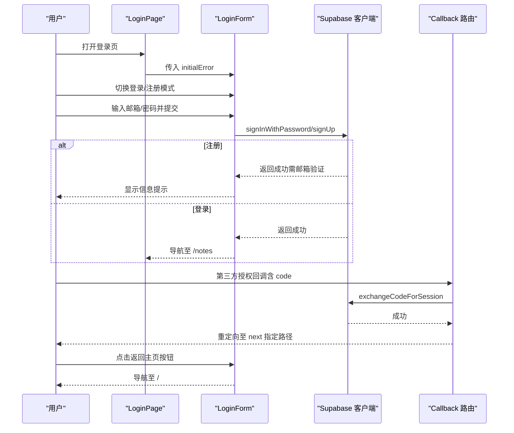
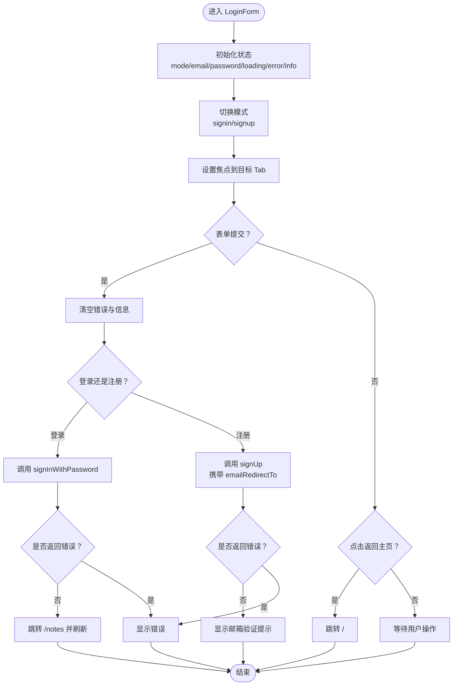
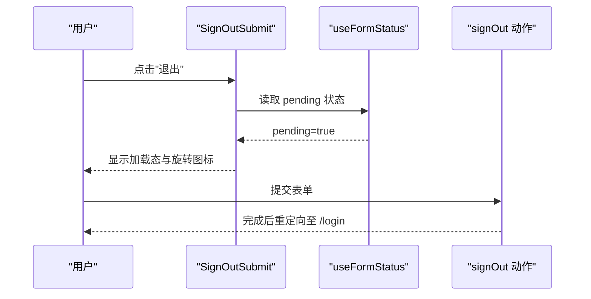
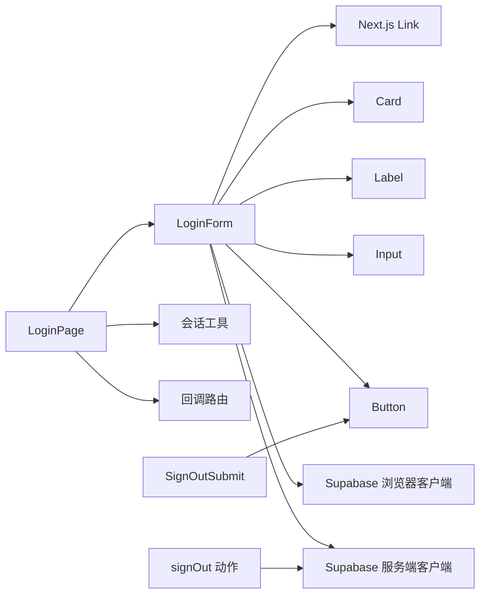

# 认证组件

<cite>
**本文引用的文件**
- [src/components/auth/login-form.tsx](file://src/components/auth/login-form.tsx)
- [src/app/(auth)/login/page.tsx](file://src/app/(auth)/login/page.tsx)
- [src/actions/auth.ts](file://src/actions/auth.ts)
- [src/components/auth/sign-out-submit.tsx](file://src/components/auth/sign-out-submit.tsx)
- [src/lib/supabase/client.ts](file://src/lib/supabase/client.ts)
- [src/lib/supabase/server.ts](file://src/lib/supabase/server.ts)
- [src/lib/auth/session.ts](file://src/lib/auth/session.ts)
- [src/app/auth/callback/route.ts](file://src/app/auth/callback/route.ts)
- [src/components/ui/button.tsx](file://src/components/ui/button.tsx)
- [src/components/ui/input.tsx](file://src/components/ui/input.tsx)
- [src/components/ui/label.tsx](file://src/components/ui/label.tsx)
- [src/components/ui/card.tsx](file://src/components/ui/card.tsx)
- [src/app/layout.tsx](file://src/app/layout.tsx)
- [src/app/globals.css](file://src/app/globals.css)
</cite>

## 更新摘要
**变更内容**
- 更新了LoginForm组件的URL处理机制，移除appUrl参数传递
- 新增运行时获取window.location.origin的实现
- 简化了LoginForm组件接口，提升代码可维护性
- **新增** 登录表单底部添加返回主页导航按钮，增强用户导航体验和界面一致性
- 更新了认证流程图和组件交互说明

## 目录
1. [简介](#简介)
2. [项目结构](#项目结构)
3. [核心组件](#核心组件)
4. [架构总览](#架构总览)
5. [组件详解](#组件详解)
6. [依赖关系分析](#依赖关系分析)
7. [性能与可访问性](#性能与可访问性)
8. [故障排查指南](#故障排查指南)
9. [结论](#结论)
10. [附录：最佳实践与扩展建议](#附录最佳实践与扩展建议)

## 简介
本文件聚焦于认证子系统的两个关键组件：登录表单组件（Login）与登出提交组件（SignOutSubmit）。我们将从表单字段设计、验证规则、用户交互、状态管理、错误提示、样式与主题适配、无障碍支持、到与 Supabase 的集成流程进行系统化说明，并给出测试与调试的实用技巧。

**更新** 认证URL处理机制已重构，移除了appUrl参数传递，改为运行时获取window.location.origin，提升了代码的灵活性和可维护性。**新增** 登录表单底部添加返回主页导航按钮，增强了用户导航体验和界面一致性。

## 项目结构
认证相关的核心文件分布如下：
- 页面层：登录页面负责判断用户状态并向组件传递初始错误信息
- 组件层：登录表单组件提供邮箱/密码与第三方登录入口；登出提交组件提供"退出"按钮
- 动作层：服务端动作封装登出逻辑
- 客户端与服务端 Supabase 客户端：分别用于浏览器与服务器环境
- 会话工具：获取当前用户信息与强制登录
- 回调路由：处理 OAuth 授权码换取 Session 的重定向流程
- UI 基础组件：按钮、输入框、标签、卡片等

```mermaid
graph TB
subgraph "页面层"
LoginPage["LoginPage<br/>src/app/(auth)/login/page.tsx"]
</subgraph>
subgraph "组件层"
LoginForm["LoginForm<br/>src/components/auth/login-form.tsx"]
SignOutSubmit["SignOutSubmit<br/>src/components/auth/sign-out-submit.tsx"]
</subgraph>
subgraph "动作层"
AuthAction["signOut 动作<br/>src/actions/auth.ts"]
</subgraph>
subgraph "认证基础设施"
SessionUtil["会话工具<br/>src/lib/auth/session.ts"]
CallbackRoute["OAuth 回调路由<br/>src/app/auth/callback/route.ts"]
</subgraph>
subgraph "Supabase 客户端"
SupaClient["浏览器客户端<br/>src/lib/supabase/client.ts"]
SupaServer["服务端客户端<br/>src/lib/supabase/server.ts"]
</subgraph>
subgraph "UI 基础组件"
Btn["Button<br/>src/components/ui/button.tsx"]
Input["Input<br/>src/components/ui/input.tsx"]
Label["Label<br/>src/components/ui/label.tsx"]
Card["Card<br/>src/components/ui/card.tsx"]
</subgraph>
LoginPage --> LoginForm
LoginForm --> SupaClient
LoginForm --> SupaServer
LoginForm --> Btn
LoginForm --> Input
LoginForm --> Label
LoginForm --> Card
LoginPage --> SessionUtil
LoginPage --> CallbackRoute
AuthAction --> SupaServer
SignOutSubmit --> Btn
```

**图表来源**
- [src/app/(auth)/login/page.tsx:1-25](file://src/app/(auth)/login/page.tsx#L1-L25)
- [src/components/auth/login-form.tsx:1-243](file://src/components/auth/login-form.tsx#L1-L243)
- [src/components/auth/sign-out-submit.tsx:1-31](file://src/components/auth/sign-out-submit.tsx#L1-L31)
- [src/actions/auth.ts:1-13](file://src/actions/auth.ts#L1-L13)
- [src/lib/auth/session.ts:1-19](file://src/lib/auth/session.ts#L1-L19)
- [src/app/auth/callback/route.ts:1-49](file://src/app/auth/callback/route.ts#L1-L49)
- [src/lib/supabase/client.ts:1-9](file://src/lib/supabase/client.ts#L1-L9)
- [src/lib/supabase/server.ts:1-29](file://src/lib/supabase/server.ts#L1-L29)
- [src/components/ui/button.tsx:1-59](file://src/components/ui/button.tsx#L1-L59)
- [src/components/ui/input.tsx:1-21](file://src/components/ui/input.tsx#L1-L21)
- [src/components/ui/label.tsx:1-21](file://src/components/ui/label.tsx#L1-L21)
- [src/components/ui/card.tsx:1-104](file://src/components/ui/card.tsx#L1-L104)

**章节来源**
- [src/app/(auth)/login/page.tsx:1-25](file://src/app/(auth)/login/page.tsx#L1-L25)
- [src/components/auth/login-form.tsx:1-243](file://src/components/auth/login-form.tsx#L1-L243)
- [src/components/auth/sign-out-submit.tsx:1-31](file://src/components/auth/sign-out-submit.tsx#L1-L31)
- [src/actions/auth.ts:1-13](file://src/actions/auth.ts#L1-L13)
- [src/lib/auth/session.ts:1-19](file://src/lib/auth/session.ts#L1-L19)
- [src/app/auth/callback/route.ts:1-49](file://src/app/auth/callback/route.ts#L1-L49)
- [src/lib/supabase/client.ts:1-9](file://src/lib/supabase/client.ts#L1-L9)
- [src/lib/supabase/server.ts:1-29](file://src/lib/supabase/server.ts#L1-L29)
- [src/components/ui/button.tsx:1-59](file://src/components/ui/button.tsx#L1-L59)
- [src/components/ui/input.tsx:1-21](file://src/components/ui/input.tsx#L1-L21)
- [src/components/ui/label.tsx:1-21](file://src/components/ui/label.tsx#L1-L21)
- [src/components/ui/card.tsx:1-104](file://src/components/ui/card.tsx#L1-L104)

## 核心组件
- 登录表单组件（LoginForm）
  - 支持"登录/注册"双模式切换，键盘导航与焦点管理
  - 提供邮箱/密码表单与第三方 GitHub 登录
  - 内置加载态、错误与信息提示
  - 通过 Supabase 客户端执行认证操作
  - **更新** 运行时获取回调URL，无需外部传入appUrl参数
  - **新增** 底部返回主页导航按钮，提供直观的页面导航
- 登出提交组件（SignOutSubmit）
  - 基于 React Hooks 的 useFormStatus 实时反映提交状态
  - 提供加载态与无障碍属性，确保可访问性

**章节来源**
- [src/components/auth/login-form.tsx:23-243](file://src/components/auth/login-form.tsx#L23-L243)
- [src/components/auth/sign-out-submit.tsx:8-31](file://src/components/auth/sign-out-submit.tsx#L8-L31)

## 架构总览
登录与登出的整体流程如下：



**图表来源**
- [src/app/(auth)/login/page.tsx:7-24](file://src/app/(auth)/login/page.tsx#L7-L24)
- [src/components/auth/login-form.tsx:64-111](file://src/components/auth/login-form.tsx#L64-L111)
- [src/app/auth/callback/route.ts:6-48](file://src/app/auth/callback/route.ts#L6-L48)

## 组件详解

### 登录表单组件（LoginForm）
- 组件职责
  - 渲染登录/注册双面板，支持键盘切换与焦点管理
  - 处理邮箱/密码表单提交，区分登录与注册分支
  - 处理第三方 GitHub 登录，携带回调地址
  - 展示错误与信息提示，控制加载态
  - **新增** 提供返回主页导航按钮，增强用户体验
- 表单字段与验证
  - 邮箱：必填，HTML5 类型为 email
  - 密码：必填，最小长度为 6；登录场景使用 current-password 自动填充，注册场景使用 new-password
- 用户交互
  - Tab 列表支持左右箭头、Home、End 键在登录/注册之间切换
  - 提交按钮禁用加载态，表单面板标注 aria-busy
  - **新增** 返回主页按钮支持键盘导航和屏幕阅读器读取
- 状态管理
  - 内部状态：mode、email、password、loading、error、info
  - 提交前清空错误与信息，避免状态污染
- 错误与信息展示
  - 错误区域 role="alert"，aria-live="assertive"
  - 信息区域 role="status"，aria-live="polite"
- 与 Supabase 集成
  - 浏览器端使用 createClient() 执行认证
  - **更新** 注册时携带 emailRedirectTo 指向回调路由，使用 window.location.origin 动态获取当前域名
- 可访问性
  - 使用语义化标签（Label、Input、Button）
  - 表单控件具备 aria-invalid 等状态类名
  - 错误与信息区域具备无障碍读取属性
  - **新增** 返回主页按钮使用语义化的链接标签，支持屏幕阅读器读取
- 样式与主题
  - 基于 Card/Label/Input/Button 等基础组件，遵循 Tailwind 类名约定
  - 支持暗色主题与禁用态样式
  - **新增** 返回主页按钮采用幽灵按钮样式（ghost variant），与整体设计风格保持一致

**更新** URL处理机制重构，移除了appUrl参数传递，改为运行时获取window.location.origin，提升了代码的灵活性和可维护性。

**新增** 返回主页导航按钮功能，位于登录表单底部，使用箭头左图标和"返回首页"文字，提供直观的页面导航体验。



**图表来源**
- [src/components/auth/login-form.tsx:29-111](file://src/components/auth/login-form.tsx#L29-L111)
- [src/components/auth/login-form.tsx:234-239](file://src/components/auth/login-form.tsx#L234-L239)

**章节来源**
- [src/components/auth/login-form.tsx:23-243](file://src/components/auth/login-form.tsx#L23-L243)
- [src/components/ui/button.tsx:1-59](file://src/components/ui/button.tsx#L1-L59)
- [src/components/ui/input.tsx:1-21](file://src/components/ui/input.tsx#L1-L21)
- [src/components/ui/label.tsx:1-21](file://src/components/ui/label.tsx#L1-L21)
- [src/components/ui/card.tsx:1-104](file://src/components/ui/card.tsx#L1-L104)

### 登出提交组件（SignOutSubmit）
- 组件职责
  - 渲染一个提交按钮，用于触发服务端登出动作
  - 基于 useFormStatus 获取提交状态，动态更新按钮文本与禁用态
- 交互与可访问性
  - disabled 与 aria-busy 同步，加载时显示旋转图标与文案
  - 保持按钮的 outline 与 focus-visible 样式，便于键盘用户操作
- 与服务端动作配合
  - 该按钮通常包裹在表单中，触发表单提交后由服务端动作执行登出



**图表来源**
- [src/components/auth/sign-out-submit.tsx:8-31](file://src/components/auth/sign-out-submit.tsx#L8-L31)
- [src/actions/auth.ts:7-12](file://src/actions/auth.ts#L7-L12)

**章节来源**
- [src/components/auth/sign-out-submit.tsx:8-31](file://src/components/auth/sign-out-submit.tsx#L8-L31)
- [src/actions/auth.ts:7-12](file://src/actions/auth.ts#L7-L12)

### 页面与会话集成（LoginPage 与会话工具）
- LoginPage
  - 通过 getSessionUser 判断是否已登录，已登录则重定向至 /notes
  - **更新** 直接将查询参数中的 error 作为 initialError 传入 LoginForm
  - 不再需要构造 appUrl 参数
- 会话工具
  - getSessionUser：获取当前用户
  - requireUser：未登录则重定向至 /login

**更新** 页面层简化了参数传递，直接使用查询参数中的错误信息，无需额外的URL构造逻辑。

**章节来源**
- [src/app/(auth)/login/page.tsx:7-24](file://src/app/(auth)/login/page.tsx#L7-L24)
- [src/lib/auth/session.ts:4-18](file://src/lib/auth/session.ts#L4-L18)

### Supabase 客户端与回调路由
- 浏览器端客户端
  - createClient：基于 NEXT_PUBLIC_SUPABASE_URL 与 NEXT_PUBLIC_SUPABASE_ANON_KEY 创建
- 服务端客户端
  - createClient：注入 cookies 存取，用于服务端读写认证状态
- 回调路由
  - 从查询参数提取 code 与 next
  - 使用 exchangeCodeForSession 换取 Session
  - 成功后确保用户资料存在并重定向至 next

**章节来源**
- [src/lib/supabase/client.ts:3-8](file://src/lib/supabase/client.ts#L3-L8)
- [src/lib/supabase/server.ts:4-28](file://src/lib/supabase/server.ts#L4-L28)
- [src/app/auth/callback/route.ts:6-48](file://src/app/auth/callback/route.ts#L6-L48)

## 依赖关系分析
- 组件耦合
  - LoginForm 依赖 UI 基础组件与 Supabase 客户端，内部状态驱动渲染
  - SignOutSubmit 仅依赖 UI Button 与 React Hooks 状态
  - **新增** LoginForm 依赖 Next.js Link 组件实现导航功能
- 外部依赖
  - Supabase SSR 客户端用于浏览器与服务端认证
  - Next.js 路由与重定向能力
  - Lucide React 图标库（ArrowLeft）
- 潜在循环依赖
  - 当前文件间无直接循环导入，结构清晰



**图表来源**
- [src/components/auth/login-form.tsx:29-111](file://src/components/auth/login-form.tsx#L29-L111)
- [src/app/(auth)/login/page.tsx:7-24](file://src/app/(auth)/login/page.tsx#L7-L24)
- [src/components/auth/sign-out-submit.tsx:8-31](file://src/components/auth/sign-out-submit.tsx#L8-L31)
- [src/actions/auth.ts:7-12](file://src/actions/auth.ts#L7-L12)
- [src/lib/supabase/client.ts:3-8](file://src/lib/supabase/client.ts#L3-L8)
- [src/lib/supabase/server.ts:4-28](file://src/lib/supabase/server.ts#L4-L28)

**章节来源**
- [src/components/auth/login-form.tsx:29-111](file://src/components/auth/login-form.tsx#L29-L111)
- [src/app/(auth)/login/page.tsx:7-24](file://src/app/(auth)/login/page.tsx#L7-L24)
- [src/components/auth/sign-out-submit.tsx:8-31](file://src/components/auth/sign-out-submit.tsx#L8-L31)
- [src/actions/auth.ts:7-12](file://src/actions/auth.ts#L7-L12)
- [src/lib/supabase/client.ts:3-8](file://src/lib/supabase/client.ts#L3-L8)
- [src/lib/supabase/server.ts:4-28](file://src/lib/supabase/server.ts#L4-L28)

## 性能与可访问性
- 性能
  - 登录表单使用受控组件与局部状态，避免不必要的重渲染
  - 加载态通过 aria-busy 与禁用态同步，减少无效交互
  - **更新** 运行时获取URL减少了不必要的参数传递和字符串拼接
  - **新增** 返回主页按钮使用轻量级的 Link 组件，避免不必要的 JavaScript 依赖
- 可访问性
  - 错误与信息区域使用 role 与 aria-live，确保读屏器及时播报
  - 表单控件具备 aria-invalid 样式，突出错误状态
  - Tab 列表支持键盘导航，焦点管理明确
  - **新增** 返回主页按钮使用语义化的链接标签，支持屏幕阅读器读取
  - **新增** 按钮具有适当的对比度和焦点可见性
- 响应式与主题
  - 基础 UI 组件已内置响应式与暗色主题适配
  - 可通过 Tailwind 类名进一步微调尺寸与间距
  - **新增** 返回主页按钮在不同主题下保持一致的视觉效果

## 故障排查指南
- 登录失败
  - 检查 Supabase 配置变量是否正确
  - 查看 LoginForm 中的错误区域是否显示具体错误消息
  - **更新** 确认 window.location.origin 能正确获取当前域名
- 注册后无法登录
  - 确认邮箱验证邮件是否到达
  - 检查回调路由是否正确接收 code 并完成 session 换取
- 第三方登录异常
  - 确认回调地址与 Supabase Provider 配置一致
  - 检查回调路由对缺失 code 的重定向逻辑
  - **更新** 验证 window.location.origin 生成的回调URL格式正确
- 登出无效
  - 确认服务端动作已执行 signOut 并重定向
  - 检查 cookies 读写是否被中间件或缓存策略影响
- **新增** 返回主页按钮失效
  - 检查 Link 组件的 href 属性是否正确设置为 "/"
  - 确认按钮变体（variant）和尺寸（size）配置正确
  - 验证图标组件（ArrowLeft）是否正常渲染

**章节来源**
- [src/components/auth/login-form.tsx:122-139](file://src/components/auth/login-form.tsx#L122-L139)
- [src/app/auth/callback/route.ts:11-13](file://src/app/auth/callback/route.ts#L11-L13)
- [src/actions/auth.ts:7-12](file://src/actions/auth.ts#L7-L12)
- [src/components/auth/login-form.tsx:234-239](file://src/components/auth/login-form.tsx#L234-L239)

## 结论
本认证组件以 LoginForm 为核心，结合 SignOutSubmit 与服务端动作，形成完整的登录/登出闭环。组件通过清晰的状态管理、可访问性设计与与 Supabase 的紧密集成，提供了稳定可靠的用户体验。

**更新** 最新的URL处理机制重构提升了代码的灵活性和可维护性，移除了不必要的参数传递，使组件更加简洁高效。**新增** 返回主页导航按钮功能显著增强了用户导航体验，提供了直观的页面返回路径。

建议在生产环境中完善错误日志与监控，并持续优化加载态与提示文案。同时，可以考虑为返回主页按钮添加更多的交互反馈，如悬停效果或动画过渡。

## 附录：最佳实践与扩展建议
- 最佳实践
  - 在提交前统一清空错误与信息，避免状态污染
  - 对敏感操作（如登出）使用 useFormStatus 明确加载态
  - 使用 aria-live 区域播报动态信息，提升可访问性
  - 严格校验与最小化暴露错误细节，保护用户隐私
  - **更新** 利用运行时URL获取机制，确保跨环境兼容性
  - **新增** 为所有导航按钮提供清晰的视觉反馈和无障碍支持
- 扩展建议
  - 添加邮箱/密码强度校验与实时反馈
  - 支持更多第三方登录提供商（Google、Microsoft 等）
  - 增加图形验证码或二次验证模块
  - 将错误文案本地化，支持多语言
  - **新增** 考虑添加"忘记密码"功能或"快速访问"常用账户
  - **新增** 实现自动登录功能，保存用户的登录偏好
- 测试与调试
  - 单元测试：针对状态切换、错误展示与提交流程
  - 集成测试：模拟 Supabase 回调与会话状态
  - 可访问性测试：使用读屏器与键盘导航验证
  - 日志与监控：记录关键事件（登录/登出、错误类型），便于追踪
  - **更新** URL处理测试：验证不同环境下的window.location.origin获取结果
  - **新增** 导航按钮测试：验证返回主页按钮的点击行为和无障碍属性
  - **新增** 响应式测试：确保按钮在不同屏幕尺寸下的可用性