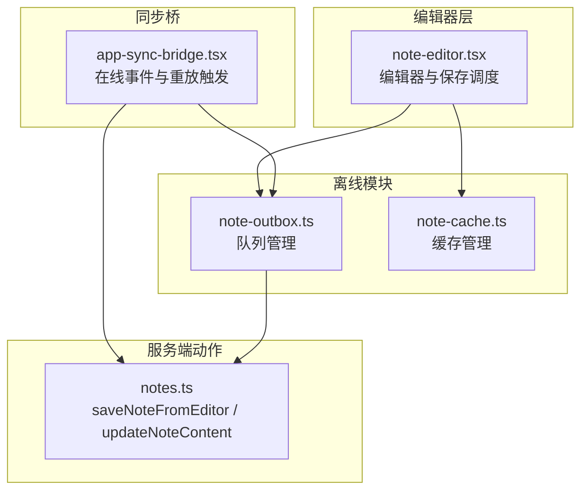
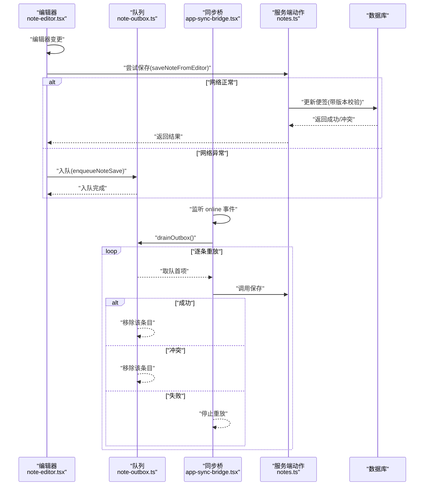
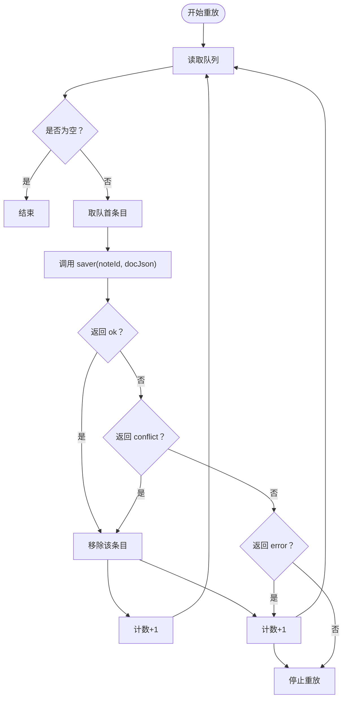
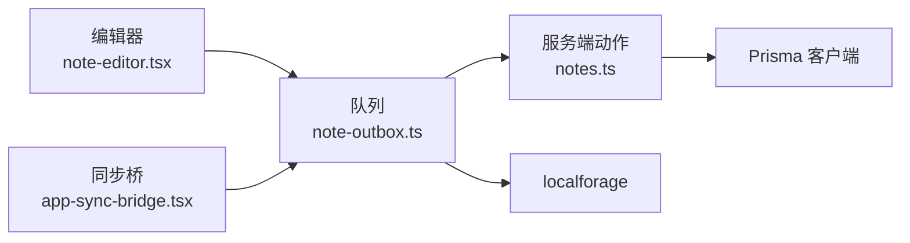

# IndexedDB 队列管理

<cite>
**本文引用的文件**
- [note-outbox.ts](file://src/lib/offline/note-outbox.ts)
- [note-cache.ts](file://src/lib/offline/note-cache.ts)
- [app-sync-bridge.tsx](file://src/components/app/app-sync-bridge.tsx)
- [note-editor.tsx](file://src/components/editor/note-editor.tsx)
- [notes.ts](file://src/actions/notes.ts)
- [package.json](file://package.json)
</cite>

## 目录
1. [简介](#简介)
2. [项目结构](#项目结构)
3. [核心组件](#核心组件)
4. [架构总览](#架构总览)
5. [详细组件分析](#详细组件分析)
6. [依赖关系分析](#依赖关系分析)
7. [性能考虑](#性能考虑)
8. [故障排查指南](#故障排查指南)
9. [结论](#结论)

## 简介
本文件针对 Smart-Todo 中基于 IndexedDB 的离线队列管理组件进行系统性技术文档整理，重点围绕以下方面展开：
- localforage 的配置与使用：数据库实例创建、storeName 配置、键值存储策略
- OutboxEntry 数据结构设计：字段语义与类型约束
- 队列操作核心函数：去重入队、顺序重放、查询与删除
- 队列持久化实现：异步存储、错误处理、数据序列化
- 性能优化建议：容量控制、索引策略、内存管理
- 监控与调试方法：日志、状态提示与常见问题定位

## 项目结构
该队列管理位于离线模块中，配合编辑器与同步桥共同完成“离线保存 -> 在线重放”的闭环。

图表来源
- [note-outbox.ts:1-87](file://src/lib/offline/note-outbox.ts#L1-L87)
- [note-cache.ts:1-25](file://src/lib/offline/note-cache.ts#L1-L25)
- [note-editor.tsx:1-200](file://src/components/editor/note-editor.tsx#L1-L200)
- [app-sync-bridge.tsx:1-118](file://src/components/app/app-sync-bridge.tsx#L1-L118)
- [notes.ts:140-152](file://src/actions/notes.ts#L140-L152)

章节来源
- [note-outbox.ts:1-87](file://src/lib/offline/note-outbox.ts#L1-L87)
- [note-cache.ts:1-25](file://src/lib/offline/note-cache.ts#L1-L25)
- [note-editor.tsx:1-200](file://src/components/editor/note-editor.tsx#L1-L200)
- [app-sync-bridge.tsx:1-118](file://src/components/app/app-sync-bridge.tsx#L1-L118)
- [notes.ts:140-152](file://src/actions/notes.ts#L140-L152)

## 核心组件
- 队列管理模块：负责 OutboxEntry 的入队、查询、删除与顺序重放
- 缓存管理模块：负责便签内容与同步版本的本地缓存
- 同步桥：在联网时触发队列重放，并通过服务端动作执行保存
- 编辑器：在断网时将变更入队，避免丢失

章节来源
- [note-outbox.ts:1-87](file://src/lib/offline/note-outbox.ts#L1-L87)
- [note-cache.ts:1-25](file://src/lib/offline/note-cache.ts#L1-L25)
- [app-sync-bridge.tsx:1-118](file://src/components/app/app-sync-bridge.tsx#L1-L118)
- [note-editor.tsx:1-200](file://src/components/editor/note-editor.tsx#L1-L200)

## 架构总览
下图展示从编辑器到队列再到服务端的完整流程，以及在线重放路径。

图表来源
- [note-editor.tsx:138-189](file://src/components/editor/note-editor.tsx#L138-L189)
- [note-outbox.ts:26-41](file://src/lib/offline/note-outbox.ts#L26-L41)
- [note-outbox.ts:48-86](file://src/lib/offline/note-outbox.ts#L48-L86)
- [app-sync-bridge.tsx:93-114](file://src/components/app/app-sync-bridge.tsx#L93-L114)
- [notes.ts:140-152](file://src/actions/notes.ts#L140-L152)

## 详细组件分析

### localforage 配置与使用
- 实例命名：数据库名称统一为 smart-note，确保同名空间下的隔离
- 存储域：队列使用 storeName 为 note_outbox，缓存使用 note_cache，避免键冲突
- 键空间：
  - 队列：使用单一键 pending_saves 存储 OutboxEntry 数组
  - 缓存：使用键前缀 note:{id} 存储每个便签的缓存对象
- 数据序列化：localforage 自动处理 JSON 序列化/反序列化，无需手动转换

章节来源
- [note-outbox.ts:3-6](file://src/lib/offline/note-outbox.ts#L3-L6)
- [note-outbox.ts:8](file://src/lib/offline/note-outbox.ts#L8)
- [note-cache.ts:3-6](file://src/lib/offline/note-cache.ts#L3-L6)
- [note-cache.ts:14-16](file://src/lib/offline/note-cache.ts#L14-L16)

### OutboxEntry 数据结构设计
- 字段说明
  - noteId: 便签标识符，字符串
  - docJson: Tiptap JSON 文档，unknown 类型，允许任意 JSON 结构
  - enqueuedAt: 入队时间戳，毫秒级时间
- 设计要点
  - 使用 unknown 保证对任意 Tiptap 文档的兼容
  - enqueuedAt 便于后续按时间排序或清理
  - 去重策略以 noteId 为主键，同一 noteId 最终仅保留一次

章节来源
- [note-outbox.ts:10-15](file://src/lib/offline/note-outbox.ts#L10-L15)

### 队列操作核心函数
- 入队：enqueueNoteSave
  - 读取现有队列
  - 过滤掉相同 noteId 的旧条目
  - 追加新条目（含当前时间戳）
  - 写回队列
- 查询：listOutbox
  - 返回当前队列数组
- 删除：removeOutboxEntry
  - 读取队列
  - 过滤目标 noteId
  - 写回
- 顺序重放：drainOutbox
  - 循环读取队首条目
  - 调用外部 saver 执行保存
  - 成功或冲突则移除该条目
  - 失败则停止重放，保留现场以便后续诊断

图表来源
- [note-outbox.ts:48-86](file://src/lib/offline/note-outbox.ts#L48-L86)

章节来源
- [note-outbox.ts:17-24](file://src/lib/offline/note-outbox.ts#L17-L24)
- [note-outbox.ts:26-32](file://src/lib/offline/note-outbox.ts#L26-L32)
- [note-outbox.ts:34-41](file://src/lib/offline/note-outbox.ts#L34-L41)
- [note-outbox.ts:48-86](file://src/lib/offline/note-outbox.ts#L48-L86)

### 队列持久化实现
- 异步存储：所有读写均通过 Promise 封装，避免阻塞主线程
- 错误处理：
  - 读写失败时，队列读取会回退为空数组，保证健壮性
  - 重放过程中捕获异常并停止，防止连锁失败
- 数据序列化：由 localforage 自动处理，开发者无需关心序列化细节

章节来源
- [note-outbox.ts:17-24](file://src/lib/offline/note-outbox.ts#L17-L24)
- [note-outbox.ts:48-86](file://src/lib/offline/note-outbox.ts#L48-L86)

### 与编辑器和同步桥的集成
- 编辑器行为：
  - 正常保存：调用服务端动作，成功后写入本地缓存
  - 断网保存：捕获网络异常，将变更入队
- 同步桥行为：
  - 监听 online 事件，触发队列重放
  - 成功/冲突条目会被移除，失败则停止重放
  - 根据重放结果给出用户反馈

章节来源
- [note-editor.tsx:138-189](file://src/components/editor/note-editor.tsx#L138-L189)
- [app-sync-bridge.tsx:93-114](file://src/components/app/app-sync-bridge.tsx#L93-L114)

### 服务端动作与版本控制
- 服务端保存：saveNoteFromEditor -> updateNoteContent
- 版本控制：支持 expectedSyncVersion 的乐观并发控制
- 离线重放：drainOutbox 支持 skipExpectedVersion 跳过版本校验，采用最后写入获胜策略

章节来源
- [notes.ts:140-152](file://src/actions/notes.ts#L140-L152)
- [notes.ts:59-70](file://src/actions/notes.ts#L59-L70)
- [note-outbox.ts:48-51](file://src/lib/offline/note-outbox.ts#L48-L51)

## 依赖关系分析
- 依赖库：localforage 作为 IndexedDB 的高级封装
- 模块耦合：
  - 队列模块与编辑器模块通过入队接口解耦
  - 队列模块与同步桥通过重放接口解耦
  - 队列模块与服务端通过 saver 回调解耦
- 外部依赖点：浏览器 IndexedDB、Next.js SSR/CSR 环境

图表来源
- [note-editor.tsx:41-42](file://src/components/editor/note-editor.tsx#L41-L42)
- [app-sync-bridge.tsx:7-8](file://src/components/app/app-sync-bridge.tsx#L7-L8)
- [note-outbox.ts:1](file://src/lib/offline/note-outbox.ts#L1)
- [notes.ts:6](file://src/actions/notes.ts#L6)

章节来源
- [package.json:46](file://package.json#L46)
- [note-editor.tsx:41-42](file://src/components/editor/note-editor.tsx#L41-L42)
- [app-sync-bridge.tsx:7-8](file://src/components/app/app-sync-bridge.tsx#L7-L8)
- [notes.ts:6](file://src/actions/notes.ts#L6)

## 性能考虑
- 存储容量限制
  - 当前实现将整个队列数组存储在一个键下，建议在业务增长后拆分为多键或分页存储，避免单键过大导致读写延迟
- 索引策略
  - 队列当前未建立显式索引；如需按 noteId 快速检索，可在 future 版本引入辅助索引或二级结构
- 内存管理
  - 队列读取始终返回数组副本，避免外部修改影响内部状态
  - 建议在队列较大时，采用分批重放策略，避免长时间占用主线程
- 序列化与压缩
  - 对于大型 Tiptap 文档，可考虑在入队前进行压缩或分片存储，减少 IndexedDB 写入开销
- 并发与一致性
  - 入队时以 noteId 去重，保证同一便签只保留最后一次内容，避免重复提交
  - 重放时按序执行，避免并发写入导致的竞态

## 故障排查指南
- 常见问题
  - 队列无法读取：检查浏览器 IndexedDB 是否可用，确认 localforage 初始化是否成功
  - 重放失败：检查 saver 回调返回值，确认 error 分支是否被触发
  - 冲突处理：当返回 conflict 时，应提示用户刷新页面以获取最新内容
- 调试方法
  - 在 drainOutbox 中增加日志输出，记录每次重放的 noteId、返回值与异常
  - 在编辑器中捕获网络异常时，打印入队的 docJson 结构，便于复现
  - 使用浏览器开发者工具的 Application/IndexedDB 面板查看 pending_saves 键的内容
- 用户提示
  - 成功重放：toast 提示已同步条数
  - 失败重放：toast 提示仍有条目未能上传，建议稍后重试或检查冲突

章节来源
- [app-sync-bridge.tsx:93-114](file://src/components/app/app-sync-bridge.tsx#L93-L114)
- [note-outbox.ts:48-86](file://src/lib/offline/note-outbox.ts#L48-L86)
- [note-editor.tsx:138-189](file://src/components/editor/note-editor.tsx#L138-L189)

## 结论
该 IndexedDB 队列管理组件以 localforage 为基础，提供了简洁可靠的离线保存能力。通过明确的数据结构、严格的去重策略与顺序重放机制，实现了在网络不稳定场景下的高可用性。建议在未来版本中引入容量控制、分批重放与更细粒度的索引策略，以进一步提升性能与可维护性。