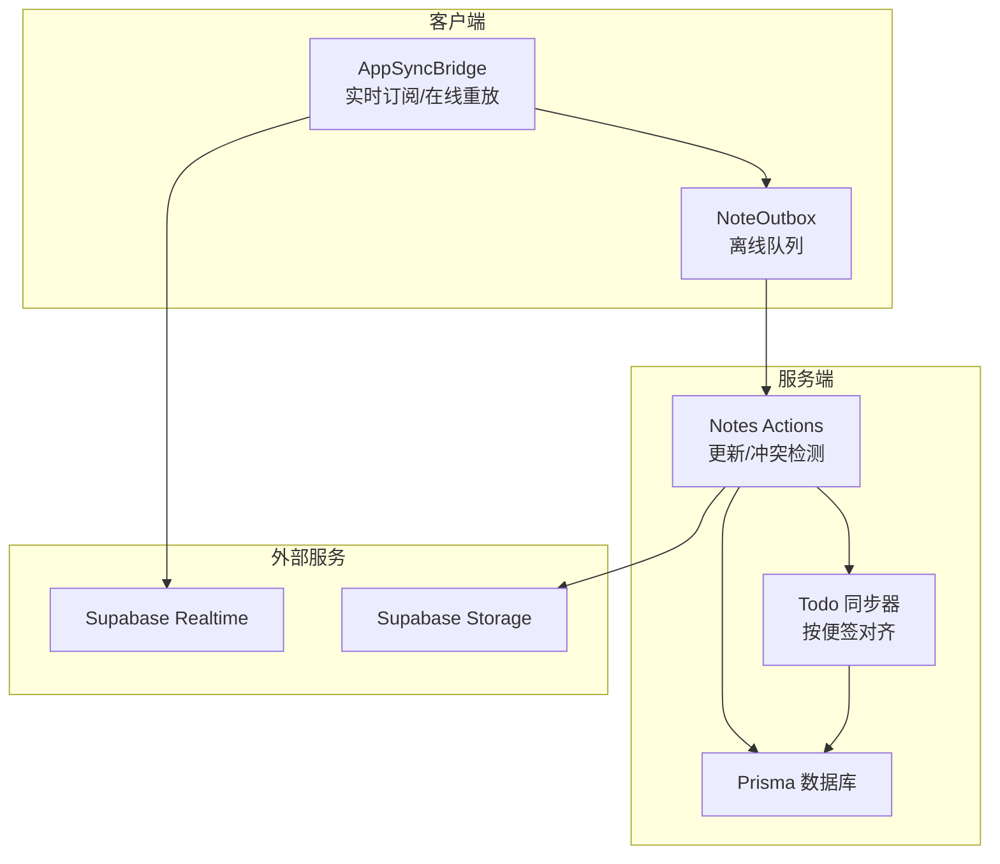
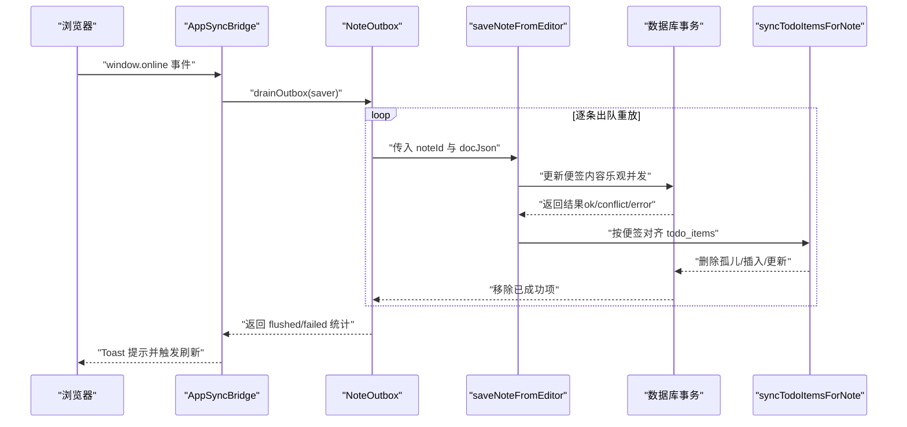
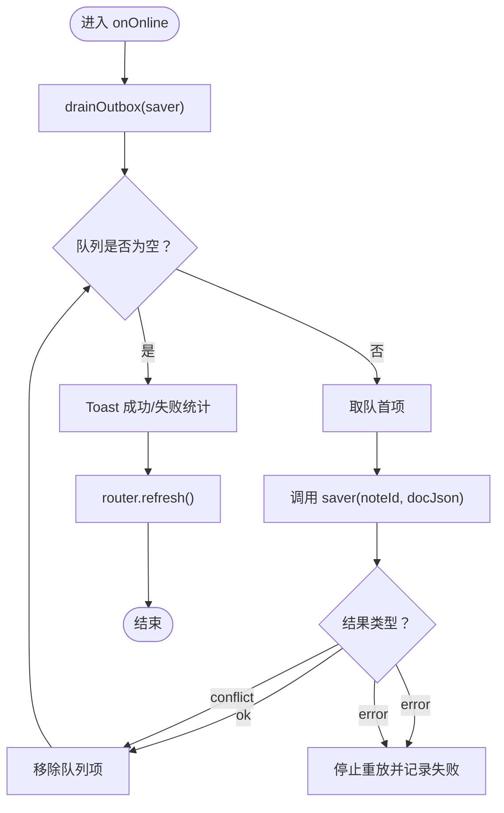
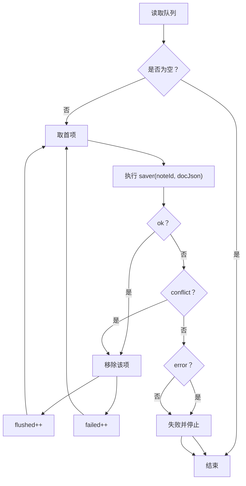
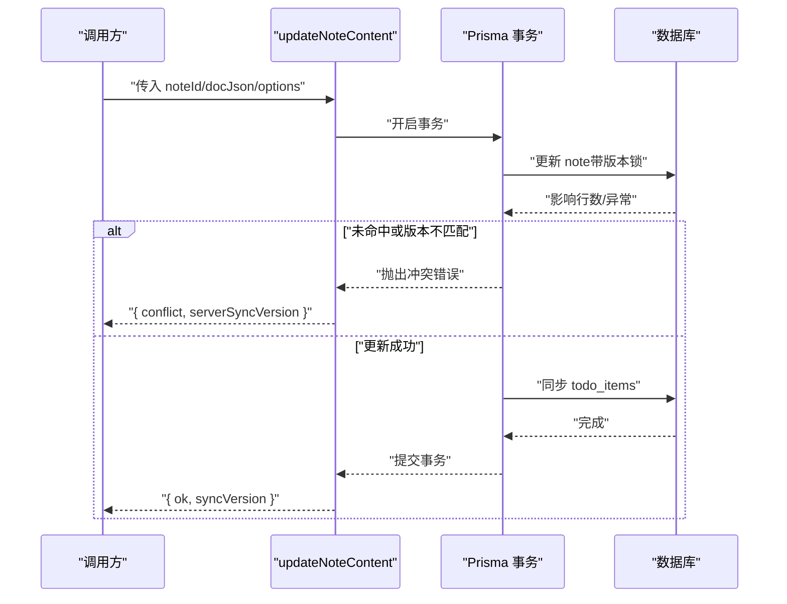
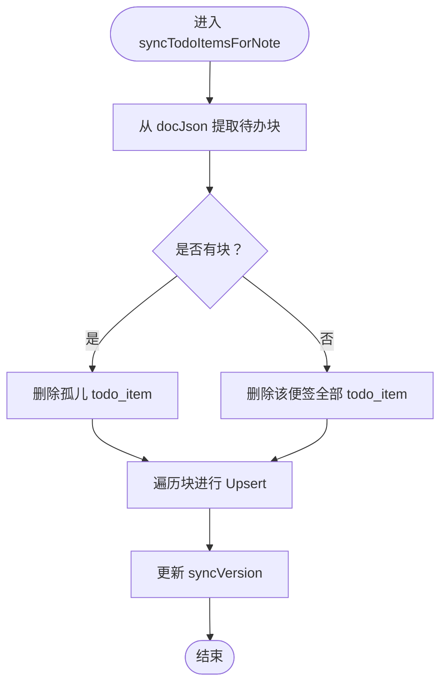
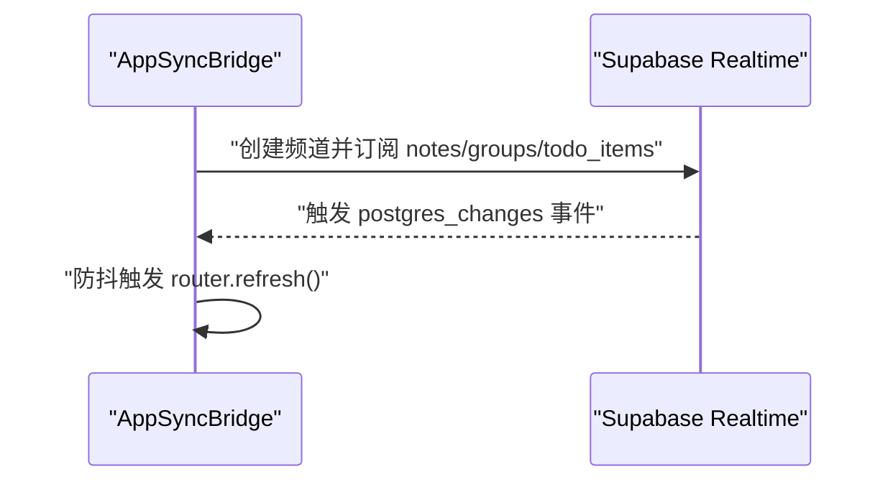
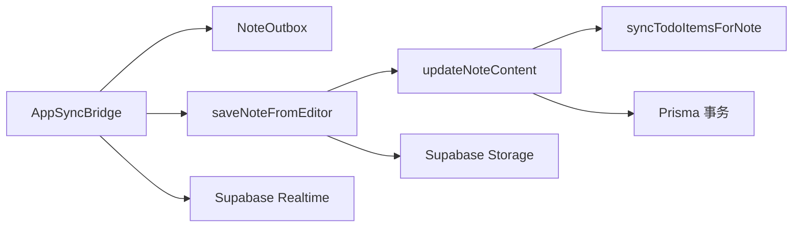

# 批量同步流程

<cite>
**本文引用的文件**
- [src/components/app/app-sync-bridge.tsx](file://src/components/app/app-sync-bridge.tsx)
- [src/lib/offline/note-outbox.ts](file://src/lib/offline/note-outbox.ts)
- [src/actions/notes.ts](file://src/actions/notes.ts)
- [src/lib/todo/sync-todo-items-for-note.ts](file://src/lib/todo/sync-todo-items-for-note.ts)
- [src/lib/supabase/client.ts](file://src/lib/supabase/client.ts)
- [src/lib/supabase/server.ts](file://src/lib/supabase/server.ts)
- [supabase/migrations/20260513140000_realtime_publication.sql](file://supabase/migrations/20260513140000_realtime_publication.sql)
- [src/actions/upload.ts](file://src/actions/upload.ts)
- [src/lib/db/index.ts](file://src/lib/db/index.ts)
</cite>

## 目录
1. [简介](#简介)
2. [项目结构](#项目结构)
3. [核心组件](#核心组件)
4. [架构总览](#架构总览)
5. [详细组件分析](#详细组件分析)
6. [依赖关系分析](#依赖关系分析)
7. [性能考量](#性能考量)
8. [故障排查指南](#故障排查指南)
9. [结论](#结论)
10. [附录](#附录)

## 简介
本文件聚焦 Smart-Todo 的“批量同步流程”，系统性阐述网络恢复后的数据同步机制与实现细节，涵盖连接检测、队列扫描、数据重放、顺序处理与并发控制、资源管理、一致性保障（版本控制、冲突检测与合并）、状态跟踪与错误记录、性能优化策略、配置项建议、监控与调试方法，以及失败处理策略。目标是帮助开发者快速理解并维护该同步子系统。

## 项目结构
围绕“批量同步”的关键文件分布如下：
- 客户端桥接与实时订阅：src/components/app/app-sync-bridge.tsx
- 离线队列与批量重放：src/lib/offline/note-outbox.ts
- 服务端动作与并发控制：src/actions/notes.ts
- 便签内待办项对齐：src/lib/todo/sync-todo-items-for-note.ts
- Supabase 客户端封装：src/lib/supabase/client.ts、src/lib/supabase/server.ts
- 实时发布配置：supabase/migrations/20260513140000_realtime_publication.sql
- 图片上传动作：src/actions/upload.ts
- 数据库访问入口：src/lib/db/index.ts

图表来源
- [src/components/app/app-sync-bridge.tsx:37-114](file://src/components/app/app-sync-bridge.tsx#L37-L114)
- [src/lib/offline/note-outbox.ts:48-86](file://src/lib/offline/note-outbox.ts#L48-L86)
- [src/actions/notes.ts:59-138](file://src/actions/notes.ts#L59-L138)
- [src/lib/todo/sync-todo-items-for-note.ts:4-59](file://src/lib/todo/sync-todo-items-for-note.ts#L4-L59)
- [src/lib/supabase/client.ts:1-9](file://src/lib/supabase/client.ts#L1-L9)
- [src/actions/upload.ts:6-37](file://src/actions/upload.ts#L6-L37)
- [src/lib/db/index.ts:1-16](file://src/lib/db/index.ts#L1-L16)

章节来源
- [src/components/app/app-sync-bridge.tsx:16-118](file://src/components/app/app-sync-bridge.tsx#L16-L118)
- [src/lib/offline/note-outbox.ts:1-86](file://src/lib/offline/note-outbox.ts#L1-L86)
- [src/actions/notes.ts:1-230](file://src/actions/notes.ts#L1-L230)
- [src/lib/todo/sync-todo-items-for-note.ts:1-59](file://src/lib/todo/sync-todo-items-for-note.ts#L1-L59)
- [src/lib/supabase/client.ts:1-9](file://src/lib/supabase/client.ts#L1-L9)
- [src/lib/supabase/server.ts:1-29](file://src/lib/supabase/server.ts#L1-L29)
- [supabase/migrations/20260513140000_realtime_publication.sql:1-6](file://supabase/migrations/20260513140000_realtime_publication.sql#L1-L6)
- [src/actions/upload.ts:1-38](file://src/actions/upload.ts#L1-L38)
- [src/lib/db/index.ts:1-16](file://src/lib/db/index.ts#L1-L16)

## 核心组件
- AppSyncBridge：负责 Supabase 实时订阅与网络恢复后的批量重放。通过防抖刷新页面，确保 UI 与服务端状态一致；在联机时调用离线队列重放逻辑，并给出成功/失败提示。
- NoteOutbox：基于 localforage 的持久化队列，支持入队、列出、移除与顺序重放。重放策略采用“先进先出”，遇到冲突或错误时进行分类处理与统计。
- Notes 动作层：提供更新便签内容的服务端动作，内置乐观并发控制（基于 syncVersion），在冲突时返回服务器最新版本号，便于上层做进一步处理。
- Todo 同步器：在事务内根据便签正文 JSON 全量对齐 todo_items，删除孤儿、Upsert 新条目，保持与便签内容一致。
- Supabase 客户端封装：分别提供浏览器端与服务端的客户端工厂，确保在不同运行环境正确传递认证上下文。
- 实时发布配置：将业务表纳入 Supabase Realtime 发布，使客户端可通过 postgres_changes 订阅变更事件。

章节来源
- [src/components/app/app-sync-bridge.tsx:16-118](file://src/components/app/app-sync-bridge.tsx#L16-L118)
- [src/lib/offline/note-outbox.ts:1-86](file://src/lib/offline/note-outbox.ts#L1-L86)
- [src/actions/notes.ts:59-138](file://src/actions/notes.ts#L59-L138)
- [src/lib/todo/sync-todo-items-for-note.ts:4-59](file://src/lib/todo/sync-todo-items-for-note.ts#L4-L59)
- [src/lib/supabase/client.ts:1-9](file://src/lib/supabase/client.ts#L1-L9)
- [src/lib/supabase/server.ts:1-29](file://src/lib/supabase/server.ts#L1-L29)
- [supabase/migrations/20260513140000_realtime_publication.sql:1-6](file://supabase/migrations/20260513140000_realtime_publication.sql#L1-L6)

## 架构总览
下图展示从网络恢复到数据最终落库的完整链路，包括实时订阅、离线队列重放、服务端并发控制与待办项对齐。

图表来源
- [src/components/app/app-sync-bridge.tsx:93-114](file://src/components/app/app-sync-bridge.tsx#L93-L114)
- [src/lib/offline/note-outbox.ts:48-86](file://src/lib/offline/note-outbox.ts#L48-L86)
- [src/actions/notes.ts:140-152](file://src/actions/notes.ts#L140-L152)
- [src/lib/todo/sync-todo-items-for-note.ts:4-59](file://src/lib/todo/sync-todo-items-for-note.ts#L4-L59)

## 详细组件分析

### 组件一：AppSyncBridge（网络恢复与批量重放）
- 连接检测：监听 window.online 事件，在线时触发批量重放。
- 队列扫描：调用 drainOutbox，按队列首项顺序重放，直到队列清空或遇到错误。
- 数据重放：通过 saver 回调将 noteId 与 docJson 传给服务端动作 saveNoteFromEditor，后者再调用 updateNoteContent 执行数据库更新。
- 结果反馈：统计成功（flushed）与失败（failed）数量，成功后提示并刷新路由，失败时提示冲突或上传失败。

图表来源
- [src/components/app/app-sync-bridge.tsx:93-114](file://src/components/app/app-sync-bridge.tsx#L93-L114)
- [src/lib/offline/note-outbox.ts:48-86](file://src/lib/offline/note-outbox.ts#L48-L86)

章节来源
- [src/components/app/app-sync-bridge.tsx:93-114](file://src/components/app/app-sync-bridge.tsx#L93-L114)

### 组件二：NoteOutbox（离线队列与批量重放）
- 数据结构：队列项包含 noteId、Tiptap 文档 JSON、入队时间戳。
- 入队策略：同一 noteId 仅保留最后一次内容，避免冗余。
- 重放策略：顺序处理，遇到成功或冲突即移除该项；遇到错误则中断并记录失败。
- 统计输出：返回 flushed 与 failed 数量，便于上层展示与后续重试。

图表来源
- [src/lib/offline/note-outbox.ts:48-86](file://src/lib/offline/note-outbox.ts#L48-L86)

章节来源
- [src/lib/offline/note-outbox.ts:17-86](file://src/lib/offline/note-outbox.ts#L17-L86)

### 组件三：Notes 动作层（并发控制与冲突检测）
- 乐观并发：通过 expectedSyncVersion 与数据库字段 syncVersion 进行 CAS 更新，避免覆盖他人修改。
- 冲突检测：当更新未命中行或版本不匹配时，抛出特定错误并在上层转换为冲突响应，返回服务器最新版本号。
- 事务边界：在 Prisma 事务中执行更新与待办项对齐，保证一致性。
- 返回值：统一为 NoteContentSaveResult，包含 ok、conflict、error 三种形态。

图表来源
- [src/actions/notes.ts:59-138](file://src/actions/notes.ts#L59-L138)
- [src/lib/todo/sync-todo-items-for-note.ts:4-59](file://src/lib/todo/sync-todo-items-for-note.ts#L4-L59)

章节来源
- [src/actions/notes.ts:59-138](file://src/actions/notes.ts#L59-L138)

### 组件四：Todo 同步器（全量对齐）
- 输入：便签内容 JSON、所属用户与便签 ID、当前便签 syncVersion。
- 处理：提取所有待办块 ID，删除孤儿项，对剩余块进行 Upsert，同时更新 syncVersion。
- 事务内执行：确保与便签更新在同一事务中，避免中间态。

图表来源
- [src/lib/todo/sync-todo-items-for-note.ts:4-59](file://src/lib/todo/sync-todo-items-for-note.ts#L4-L59)

章节来源
- [src/lib/todo/sync-todo-items-for-note.ts:4-59](file://src/lib/todo/sync-todo-items-for-note.ts#L4-L59)

### 组件五：Supabase 实时订阅与客户端封装
- 实时订阅：AppSyncBridge 为每个用户创建独立频道，订阅 notes/groups/todo_items 的 postgres_changes 事件，收到变更后触发防抖刷新。
- 客户端封装：提供 createClient 工厂，分别在浏览器端与服务端注入正确的认证上下文（cookies）。
- 发布配置：迁移脚本将业务表加入 supabase_realtime 发布，确保客户端可订阅。

图表来源
- [src/components/app/app-sync-bridge.tsx:37-83](file://src/components/app/app-sync-bridge.tsx#L37-L83)
- [src/lib/supabase/client.ts:1-9](file://src/lib/supabase/client.ts#L1-L9)
- [src/lib/supabase/server.ts:1-29](file://src/lib/supabase/server.ts#L1-L29)
- [supabase/migrations/20260513140000_realtime_publication.sql:1-6](file://supabase/migrations/20260513140000_realtime_publication.sql#L1-L6)

章节来源
- [src/components/app/app-sync-bridge.tsx:37-83](file://src/components/app/app-sync-bridge.tsx#L37-L83)
- [src/lib/supabase/client.ts:1-9](file://src/lib/supabase/client.ts#L1-L9)
- [src/lib/supabase/server.ts:1-29](file://src/lib/supabase/server.ts#L1-L29)
- [supabase/migrations/20260513140000_realtime_publication.sql:1-6](file://supabase/migrations/20260513140000_realtime_publication.sql#L1-L6)

### 组件六：图片上传动作（与同步相关）
- 文件校验：大小限制、类型推断。
- 上传路径：基于用户 ID 生成唯一路径，避免冲突。
- 存储与回源：上传至 storage 并返回公开链接，供便签内容引用。

章节来源
- [src/actions/upload.ts:6-37](file://src/actions/upload.ts#L6-L37)

## 依赖关系分析
- 组件耦合
  - AppSyncBridge 依赖 NoteOutbox 与 Notes 动作；通过 saver 回调解耦具体保存逻辑。
  - Notes 动作依赖 Prisma 事务与 Todo 同步器，保证便签与待办的一致性。
  - 实时订阅依赖 Supabase Realtime 发布配置，确保客户端能收到变更事件。
- 外部依赖
  - localforage：持久化离线队列。
  - Supabase：实时订阅与存储。
  - Prisma：数据库访问与事务。

图表来源
- [src/components/app/app-sync-bridge.tsx:93-114](file://src/components/app/app-sync-bridge.tsx#L93-L114)
- [src/lib/offline/note-outbox.ts:48-86](file://src/lib/offline/note-outbox.ts#L48-L86)
- [src/actions/notes.ts:140-152](file://src/actions/notes.ts#L140-L152)
- [src/lib/todo/sync-todo-items-for-note.ts:4-59](file://src/lib/todo/sync-todo-items-for-note.ts#L4-L59)
- [src/lib/db/index.ts:1-16](file://src/lib/db/index.ts#L1-L16)

章节来源
- [src/components/app/app-sync-bridge.tsx:93-114](file://src/components/app/app-sync-bridge.tsx#L93-L114)
- [src/lib/offline/note-outbox.ts:48-86](file://src/lib/offline/note-outbox.ts#L48-L86)
- [src/actions/notes.ts:140-152](file://src/actions/notes.ts#L140-L152)
- [src/lib/todo/sync-todo-items-for-note.ts:4-59](file://src/lib/todo/sync-todo-items-for-note.ts#L4-L59)
- [src/lib/db/index.ts:1-16](file://src/lib/db/index.ts#L1-L16)

## 性能考量
- 批量大小控制
  - 当前实现为顺序逐条重放，适合小到中等规模的离线增量；若队列较大，可考虑分批处理（例如每次最多处理 N 条），并在 UI 上显示进度。
- 内存使用优化
  - 队列项仅包含必要字段（noteId、docJson、enqueuedAt），避免携带冗余数据；重放完成后立即移除，降低内存占用。
- 网络带宽管理
  - 重放过程中如遇错误，建议引入指数退避与最大重试次数，避免频繁重试造成带宽浪费。
- 并发控制
  - 当前为串行重放，避免并发写导致的复杂冲突；若未来需要提升吞吐，可在 saver 层引入轻量并发池，并确保每条记录的幂等性与版本校验。
- 事务边界
  - 将便签更新与待办项对齐置于同一事务，减少往返与锁竞争，提高整体吞吐。

[本节为通用性能建议，不直接分析具体文件]

## 故障排查指南
- 实时订阅无响应
  - 检查 Supabase Realtime 是否启用，确认业务表已加入 supabase_realtime 发布。
  - 查看客户端日志是否存在 CHANNEL_ERROR。
- 离线重放失败
  - 查看 drainOutbox 返回的 failed 数量与 saver 报错类型；若为 conflict，需引导用户解决冲突或等待同步。
- 并发冲突频繁
  - 检查客户端是否正确传递 expectedSyncVersion；服务端返回 conflict 时，上层应提示用户重新拉取最新数据。
- 图片上传失败
  - 检查文件大小与类型限制，确认存储桶权限与路径生成逻辑。

章节来源
- [supabase/migrations/20260513140000_realtime_publication.sql:1-6](file://supabase/migrations/20260513140000_realtime_publication.sql#L1-L6)
- [src/components/app/app-sync-bridge.tsx:79-83](file://src/components/app/app-sync-bridge.tsx#L79-L83)
- [src/lib/offline/note-outbox.ts:48-86](file://src/lib/offline/note-outbox.ts#L48-L86)
- [src/actions/notes.ts:121-133](file://src/actions/notes.ts#L121-L133)
- [src/actions/upload.ts:12-14](file://src/actions/upload.ts#L12-L14)

## 结论
Smart-Todo 的批量同步流程以“离线队列 + 服务端乐观并发 + 实时订阅”为核心，实现了在网络恢复后自动重放、冲突检测与合并、以及 UI 的即时刷新。通过严格的事务边界与版本控制，保证了数据一致性；通过统计与提示，提升了可观测性与用户体验。未来可在批量大小、并发池与退避策略等方面进一步优化吞吐与稳定性。

[本节为总结性内容，不直接分析具体文件]

## 附录

### 同步状态跟踪与管理
- 进度显示：在重放过程中可扩展为分批处理并上报进度（已完成/总数）。
- 完成标记：flushed 与 failed 统计用于决定是否提示成功与失败。
- 错误记录：将 saver 返回的 error 或异常信息记录到日志或错误面板。

章节来源
- [src/lib/offline/note-outbox.ts:48-86](file://src/lib/offline/note-outbox.ts#L48-L86)
- [src/components/app/app-sync-bridge.tsx:98-104](file://src/components/app/app-sync-bridge.tsx#L98-L104)

### 同步失败处理策略
- 错误分类
  - conflict：返回服务器最新版本号，引导用户重新获取数据或合并。
  - error：记录错误并停止后续重放，等待修复后再次触发。
- 重试机制
  - 引入指数退避与最大重试次数，避免雪崩效应。
- 用户通知
  - 成功：提示已同步条数。
  - 失败：提示仍有若干条未能上传（可能冲突）。

章节来源
- [src/actions/notes.ts:121-133](file://src/actions/notes.ts#L121-L133)
- [src/components/app/app-sync-bridge.tsx:98-104](file://src/components/app/app-sync-bridge.tsx#L98-L104)

### 配置选项建议
- 同步频率
  - 由网络事件驱动，无需固定周期；可在 UI 上提供“立即同步”按钮。
- 批量大小
  - 默认逐条重放；可扩展为分批（例如每次最多 10 条）。
- 超时设置
  - 为 saver 调用设置合理超时，避免阻塞后续重放。
- 退避策略
  - 失败时采用指数退避（如 1s、2s、4s…），上限不超过 60s。

[本节为通用配置建议，不直接分析具体文件]