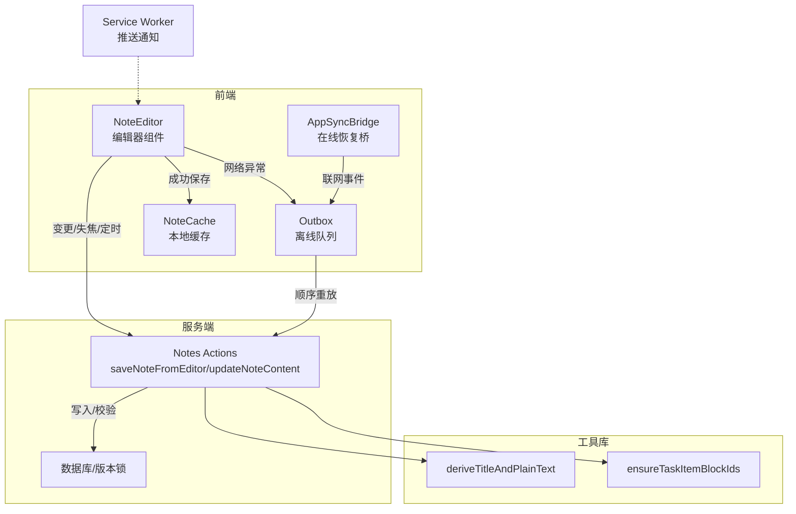
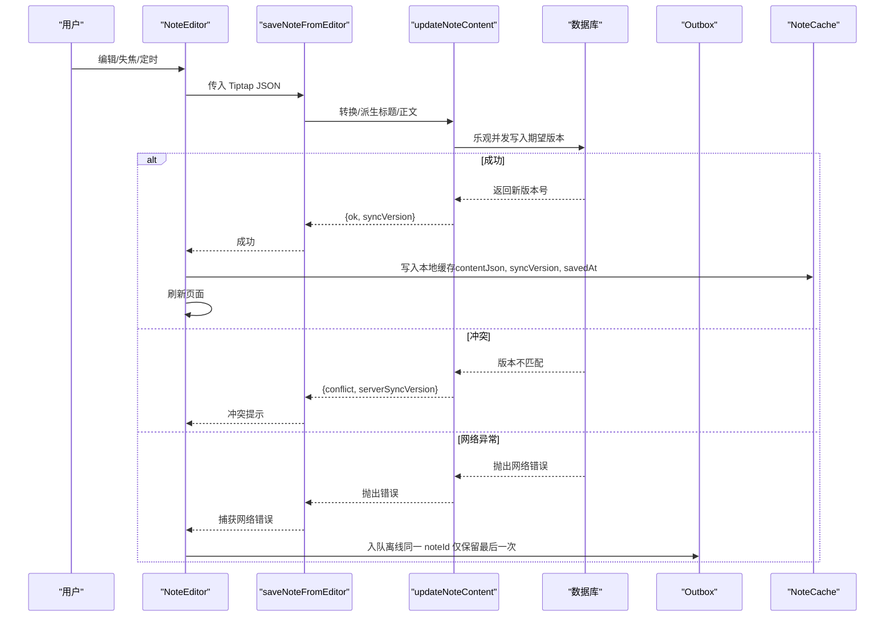
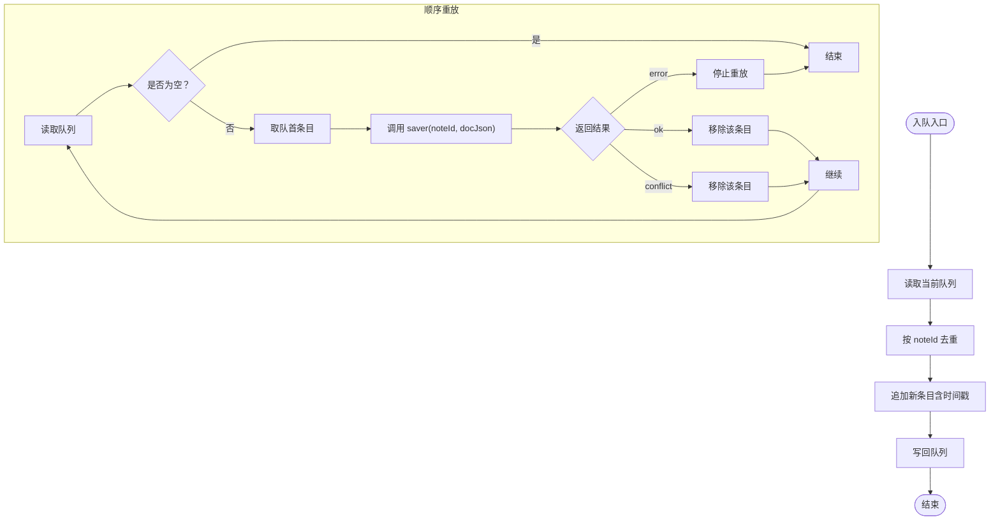
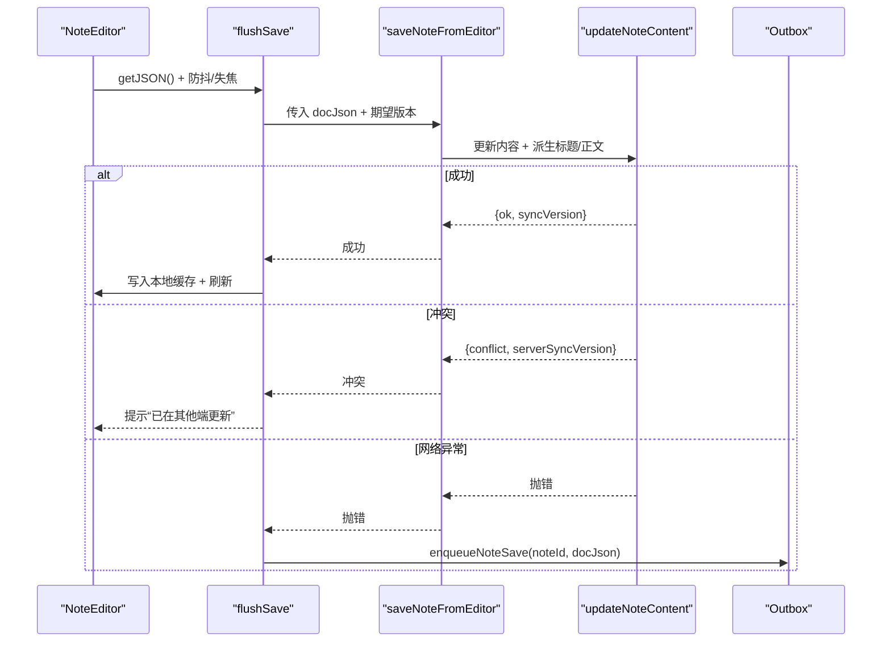
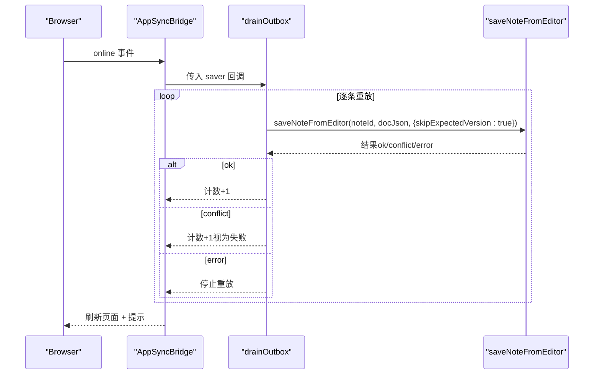
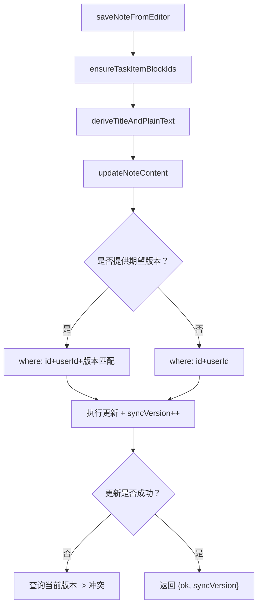
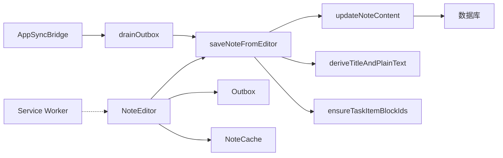

# 离线保存机制

<cite>
**本文引用的文件**
- [note-outbox.ts](file://src/lib/offline/note-outbox.ts)
- [note-cache.ts](file://src/lib/offline/note-cache.ts)
- [notes.ts](file://src/actions/notes.ts)
- [note-editor.tsx](file://src/components/editor/note-editor.tsx)
- [app-sync-bridge.tsx](file://src/components/app/app-sync-bridge.tsx)
- [content.ts](file://src/lib/tiptap/content.ts)
- [todo-doc.ts](file://src/lib/tiptap/todo-doc.ts)
- [sw.js](file://public/sw.js)
</cite>

## 目录
1. [简介](#简介)
2. [项目结构](#项目结构)
3. [核心组件](#核心组件)
4. [架构总览](#架构总览)
5. [详细组件分析](#详细组件分析)
6. [依赖关系分析](#依赖关系分析)
7. [性能考量](#性能考量)
8. [故障排查指南](#故障排查指南)
9. [结论](#结论)
10. [附录](#附录)

## 简介
本文件系统性阐述 Smart-Todo 的离线保存机制，覆盖从用户操作触发、数据拦截、队列入队、离线存储、联网恢复、冲突处理到安全与可靠性的全流程。重点解析 enqueueNoteSave 的实现原理（去重、覆盖策略、时间戳）、Tiptap JSON 文档的处理与序列化、触发条件与时机选择、以及可配置项与扩展点。

## 项目结构
围绕“离线保存”的关键代码分布在以下模块：
- 离线队列与缓存：src/lib/offline 下的 note-outbox.ts 与 note-cache.ts
- 编辑器与触发：src/components/editor/note-editor.tsx
- 应用同步桥：src/components/app/app-sync-bridge.tsx
- 服务端动作：src/actions/notes.ts
- Tiptap 工具：src/lib/tiptap/content.ts、src/lib/tiptap/todo-doc.ts
- 推送与通知：public/sw.js

图表来源
- [note-editor.tsx:138-189](file://src/components/editor/note-editor.tsx#L138-L189)
- [app-sync-bridge.tsx:93-114](file://src/components/app/app-sync-bridge.tsx#L93-L114)
- [note-outbox.ts:26-32](file://src/lib/offline/note-outbox.ts#L26-L32)
- [note-cache.ts:18-24](file://src/lib/offline/note-cache.ts#L18-L24)
- [notes.ts:141-152](file://src/actions/notes.ts#L141-L152)
- [content.ts:13-52](file://src/lib/tiptap/content.ts#L13-L52)
- [todo-doc.ts:5-21](file://src/lib/tiptap/todo-doc.ts#L5-L21)
- [sw.js:1-28](file://public/sw.js#L1-L28)

章节来源
- [note-outbox.ts:1-87](file://src/lib/offline/note-outbox.ts#L1-L87)
- [note-cache.ts:1-25](file://src/lib/offline/note-cache.ts#L1-L25)
- [notes.ts:1-230](file://src/actions/notes.ts#L1-L230)
- [note-editor.tsx:1-586](file://src/components/editor/note-editor.tsx#L1-L586)
- [app-sync-bridge.tsx:1-118](file://src/components/app/app-sync-bridge.tsx#L1-L118)
- [content.ts:1-53](file://src/lib/tiptap/content.ts#L1-L53)
- [todo-doc.ts:1-101](file://src/lib/tiptap/todo-doc.ts#L1-L101)
- [sw.js:1-28](file://public/sw.js#L1-L28)

## 核心组件
- 离线队列 Outbox
  - 存储结构：OutboxEntry 数组，包含 noteId、Tiptap JSON 文档、入队时间戳
  - 关键函数：enqueueNoteSave、drainOutbox、removeOutboxEntry、listOutbox
- 本地缓存 NoteCache
  - 存储结构：NoteCachePayload，包含 contentJson、syncVersion、savedAt
  - 关键函数：writeNoteCache、readNoteCache
- 编辑器 NoteEditor
  - 触发保存：编辑器内容变更、失焦、定时器（防抖）
  - 失败分支：网络异常时入队离线队列
  - 成功分支：写入本地缓存并刷新页面
- 同步桥 AppSyncBridge
  - 在线事件：联网后顺序重放离线队列
  - 实时刷新：订阅 Supabase Realtime，防抖刷新路由
- 服务端动作 Notes Actions
  - saveNoteFromEditor：确保任务块 ID、派生标题/正文、调用更新
  - updateNoteContent：基于期望版本号进行乐观并发控制
- Tiptap 工具
  - ensureTaskItemBlockIds：为任务项补全稳定 blockId
  - deriveTitleAndPlainText：从 JSON 派生标题与纯文本摘要

章节来源
- [note-outbox.ts:10-41](file://src/lib/offline/note-outbox.ts#L10-L41)
- [note-cache.ts:8-24](file://src/lib/offline/note-cache.ts#L8-L24)
- [note-editor.tsx:138-189](file://src/components/editor/note-editor.tsx#L138-L189)
- [app-sync-bridge.tsx:93-114](file://src/components/app/app-sync-bridge.tsx#L93-L114)
- [notes.ts:141-152](file://src/actions/notes.ts#L141-L152)
- [content.ts:13-52](file://src/lib/tiptap/content.ts#L13-L52)
- [todo-doc.ts:5-21](file://src/lib/tiptap/todo-doc.ts#L5-L21)

## 架构总览
离线保存采用“本地队列 + 本地缓存 + 在线重放”的三层架构：
- 用户在编辑器中输入，触发保存流程
- 成功则写入本地缓存并刷新
- 失败且判定为网络异常，则入队离线队列
- 联网后由同步桥顺序重放队列，逐条尝试上传
- 服务器侧通过期望版本号实现乐观并发控制，避免覆盖他人修改

图表来源
- [note-editor.tsx:138-189](file://src/components/editor/note-editor.tsx#L138-L189)
- [notes.ts:141-152](file://src/actions/notes.ts#L141-L152)
- [notes.ts:59-138](file://src/actions/notes.ts#L59-L138)
- [note-outbox.ts:26-32](file://src/lib/offline/note-outbox.ts#L26-L32)
- [note-cache.ts:18-24](file://src/lib/offline/note-cache.ts#L18-L24)

## 详细组件分析

### 组件一：离线队列 Outbox（note-outbox.ts）
- 数据结构
  - OutboxEntry：包含 noteId、docJson（Tiptap JSON）、enqueuedAt（入队时间）
- 入队策略（enqueueNoteSave）
  - 去重：过滤掉相同 noteId 的旧条目
  - 覆盖：将新的 {noteId, docJson, enqueuedAt} 追加到队尾
  - 顺序：最终写回整个数组，保证同一 noteId 最终只保留一次
- 顺序重放（drainOutbox）
  - 逐条取出队首元素，调用传入的 saver 回调
  - 成功：移除该条目
  - 冲突：移除该条目（以本地最后一次为准）
  - 失败：停止继续重放
- 列表与移除
  - listOutbox：读取全部队列
  - removeOutboxEntry：按 noteId 移除

图表来源
- [note-outbox.ts:17-41](file://src/lib/offline/note-outbox.ts#L17-L41)
- [note-outbox.ts:48-86](file://src/lib/offline/note-outbox.ts#L48-L86)

章节来源
- [note-outbox.ts:10-41](file://src/lib/offline/note-outbox.ts#L10-L41)
- [note-outbox.ts:48-86](file://src/lib/offline/note-outbox.ts#L48-L86)

### 组件二：本地缓存 NoteCache（note-cache.ts）
- 数据结构
  - NoteCachePayload：contentJson（Tiptap JSON）、syncVersion、savedAt
- 用途
  - 成功保存后写入，便于后续一致性校验与 UI 展示
  - 写入失败被忽略，不影响主流程
- 读写接口
  - writeNoteCache：按 noteId 写入
  - readNoteCache：按 noteId 读取

章节来源
- [note-cache.ts:8-24](file://src/lib/offline/note-cache.ts#L8-L24)

### 组件三：编辑器 NoteEditor（note-editor.tsx）
- 触发与节流
  - onUpdateTime：编辑器内容变更时调度保存（防抖）
  - onBlur：编辑器失焦时立即保存
- 保存流程
  - flushSave：调用 saveNoteFromEditor，携带期望版本号
  - 成功：更新本地版本号、写入本地缓存、刷新页面
  - 冲突：提示“已在其他端更新”，引导用户刷新
  - 网络异常：捕获错误，调用 enqueueNoteSave 入队离线队列
- 网络异常识别
  - isLikelyNetworkError：基于错误名称/消息判断是否网络类错误

图表来源
- [note-editor.tsx:138-189](file://src/components/editor/note-editor.tsx#L138-L189)
- [note-editor.tsx:48-59](file://src/components/editor/note-editor.tsx#L48-L59)
- [notes.ts:141-152](file://src/actions/notes.ts#L141-L152)
- [note-outbox.ts:26-32](file://src/lib/offline/note-outbox.ts#L26-L32)

章节来源
- [note-editor.tsx:138-189](file://src/components/editor/note-editor.tsx#L138-L189)
- [note-editor.tsx:48-59](file://src/components/editor/note-editor.tsx#L48-L59)

### 组件四：同步桥 AppSyncBridge（app-sync-bridge.tsx）
- 在线恢复
  - 监听 window.online 事件，调用 drainOutbox 顺序重放
  - 使用 skipExpectedVersion=true，允许离线恢复以本地最后一次为准
- 实时刷新
  - 订阅 Supabase Realtime（notes/groups/todo_items），对用户数据变更进行防抖刷新
- 联网即刻尝试
  - 若浏览器在线，进入即触发一次重放

图表来源
- [app-sync-bridge.tsx:93-114](file://src/components/app/app-sync-bridge.tsx#L93-L114)
- [notes.ts:141-152](file://src/actions/notes.ts#L141-L152)
- [note-outbox.ts:48-86](file://src/lib/offline/note-outbox.ts#L48-L86)

章节来源
- [app-sync-bridge.tsx:93-114](file://src/components/app/app-sync-bridge.tsx#L93-L114)

### 组件五：服务端动作 Notes Actions（notes.ts）
- saveNoteFromEditor
  - 确保任务项 blockId（ensureTaskItemBlockIds）
  - 派生标题与正文（deriveTitleAndPlainText）
  - 调用 updateNoteContent 执行保存
- updateNoteContent
  - 乐观并发：若提供 expectedSyncVersion，则仅当数据库版本匹配时更新
  - 版本自增：每次成功更新 syncVersion++
  - 冲突检测：若更新计数为 0，判定为冲突，返回 serverSyncVersion
  - Todo 同步：同步任务项状态与属性

图表来源
- [notes.ts:141-152](file://src/actions/notes.ts#L141-L152)
- [notes.ts:59-138](file://src/actions/notes.ts#L59-L138)
- [content.ts:13-52](file://src/lib/tiptap/content.ts#L13-L52)
- [todo-doc.ts:5-21](file://src/lib/tiptap/todo-doc.ts#L5-L21)

章节来源
- [notes.ts:141-152](file://src/actions/notes.ts#L141-L152)
- [notes.ts:59-138](file://src/actions/notes.ts#L59-L138)

### 组件六：Tiptap 工具（content.ts、todo-doc.ts）
- ensureTaskItemBlockIds
  - 为缺失 id 的 taskItem 自动生成稳定 blockId，保证与数据库 TodoItem.blockId 对齐
- deriveTitleAndPlainText
  - 遍历 JSONContent，提取纯文本与标题（首行非空文本，最长 120）

章节来源
- [content.ts:13-52](file://src/lib/tiptap/content.ts#L13-L52)
- [todo-doc.ts:5-21](file://src/lib/tiptap/todo-doc.ts#L5-L21)

## 依赖关系分析
- 组件耦合
  - NoteEditor 依赖 saveNoteFromEditor 与 Outbox（入队）
  - AppSyncBridge 依赖 drainOutbox 与 saveNoteFromEditor（重放）
  - Notes Actions 依赖 Tiptap 工具与数据库
- 数据依赖
  - Outbox 与 NoteCache 依赖 localforage（IndexedDB）
  - Realtime 依赖 Supabase 客户端
- 外部集成
  - Service Worker 用于推送通知，提升离线体验

图表来源
- [note-editor.tsx:138-189](file://src/components/editor/note-editor.tsx#L138-L189)
- [app-sync-bridge.tsx:93-114](file://src/components/app/app-sync-bridge.tsx#L93-L114)
- [note-outbox.ts:48-86](file://src/lib/offline/note-outbox.ts#L48-L86)
- [notes.ts:141-152](file://src/actions/notes.ts#L141-L152)
- [content.ts:13-52](file://src/lib/tiptap/content.ts#L13-L52)
- [todo-doc.ts:5-21](file://src/lib/tiptap/todo-doc.ts#L5-L21)
- [sw.js:1-28](file://public/sw.js#L1-L28)

章节来源
- [note-editor.tsx:138-189](file://src/components/editor/note-editor.tsx#L138-L189)
- [app-sync-bridge.tsx:93-114](file://src/components/app/app-sync-bridge.tsx#L93-L114)
- [note-outbox.ts:48-86](file://src/lib/offline/note-outbox.ts#L48-L86)
- [notes.ts:141-152](file://src/actions/notes.ts#L141-L152)
- [content.ts:13-52](file://src/lib/tiptap/content.ts#L13-L52)
- [todo-doc.ts:5-21](file://src/lib/tiptap/todo-doc.ts#L5-L21)
- [sw.js:1-28](file://public/sw.js#L1-L28)

## 性能考量
- 防抖与批处理
  - 编辑器使用固定防抖间隔，减少频繁保存请求
  - 失焦即时保存，兼顾交互响应与数据安全
- 顺序重放
  - drainOutbox 逐条重放，避免并发竞争与重复提交
- 乐观并发
  - 通过期望版本号减少不必要的冲突回退
- 本地缓存
  - 成功保存后写入本地缓存，降低重复计算与网络往返

[本节为通用性能讨论，无需特定文件来源]

## 故障排查指南
- 离线入队但未上传
  - 检查网络状态与错误日志
  - 确认 drainOutbox 是否被调用（在线事件与初始在线状态）
- 冲突提示
  - 服务器返回冲突时，编辑器会提示“已在其他端更新”，建议用户刷新
- 本地缓存不同步
  - 成功保存后会写入本地缓存；若失败会被忽略，属预期行为
- Service Worker 通知
  - 若需要推送提醒，确认 sw.js 已注册且 VAPID 配置正确

章节来源
- [note-editor.tsx:157-166](file://src/components/editor/note-editor.tsx#L157-L166)
- [app-sync-bridge.tsx:93-114](file://src/components/app/app-sync-bridge.tsx#L93-L114)
- [sw.js:1-28](file://public/sw.js#L1-L28)

## 结论
Smart-Todo 的离线保存机制以“本地队列 + 本地缓存 + 在线重放”为核心，结合 Tiptap JSON 的预处理与服务端乐观并发控制，实现了在网络不稳定场景下的高可用与一致性。enqueueNoteSave 的去重与覆盖策略确保同一便签仅保留最后一次有效内容，drainOutbox 的顺序重放与冲突处理保障了数据安全与用户体验。

[本节为总结性内容，无需特定文件来源]

## 附录

### enqueueNoteSave 实现要点
- 去重逻辑：按 noteId 过滤旧条目，避免重复提交
- 覆盖策略：以最新内容为准，替换旧队列中的同 noteId 条目
- 时间戳：记录入队时间，便于后续审计与排序（如需）
- 顺序重放：drainOutbox 严格按队列顺序执行，失败即停止，避免级联失败

章节来源
- [note-outbox.ts:26-32](file://src/lib/offline/note-outbox.ts#L26-L32)
- [note-outbox.ts:48-86](file://src/lib/offline/note-outbox.ts#L48-L86)

### 数据格式与序列化
- Tiptap JSON 文档
  - 作为 docJson 直接存储与传输，包含内容树与元信息
  - 保存前通过 ensureTaskItemBlockIds 确保任务项具备稳定 blockId
  - 通过 deriveTitleAndPlainText 派生标题与正文摘要
- 本地存储
  - Outbox 使用 IndexedDB（localforage）存储数组
  - NoteCache 使用 IndexedDB 存储对象
- 版本控制
  - 服务器侧通过 syncVersion 实现乐观并发
  - 客户端侧通过 lastSavedSyncVersion 与服务器版本比对

章节来源
- [todo-doc.ts:5-21](file://src/lib/tiptap/todo-doc.ts#L5-L21)
- [content.ts:13-52](file://src/lib/tiptap/content.ts#L13-L52)
- [notes.ts:59-138](file://src/actions/notes.ts#L59-L138)
- [note-outbox.ts:17-24](file://src/lib/offline/note-outbox.ts#L17-L24)
- [note-cache.ts:18-24](file://src/lib/offline/note-cache.ts#L18-L24)

### 触发条件与时机选择
- 用户行为
  - 编辑器内容变更（防抖）
  - 编辑器失焦（即时保存）
- 网络状态
  - 捕获网络异常时入队离线队列
  - 浏览器在线时触发一次重放
- 性能考虑
  - 防抖阈值平衡响应与吞吐
  - 顺序重放避免并发写入导致的级联失败

章节来源
- [note-editor.tsx:195-200](file://src/components/editor/note-editor.tsx#L195-L200)
- [note-editor.tsx:218-224](file://src/components/editor/note-editor.tsx#L218-L224)
- [note-editor.tsx:48-59](file://src/components/editor/note-editor.tsx#L48-L59)
- [app-sync-bridge.tsx:107-114](file://src/components/app/app-sync-bridge.tsx#L107-L114)

### 安全性与可靠性保障
- 数据完整性
  - 乐观并发：仅当版本匹配时更新，避免覆盖他人修改
  - 冲突检测：返回 serverSyncVersion，便于客户端提示与处理
- 错误恢复
  - 网络异常自动入队，联网后顺序重放
  - 冲突条目直接移除，避免阻塞后续重放
- 用户确认提示
  - 冲突时提示“已在其他端更新”，并提供刷新按钮
  - 离线入队时提示“网络不可用，内容已加入本地队列”

章节来源
- [notes.ts:72-137](file://src/actions/notes.ts#L72-L137)
- [note-editor.tsx:157-166](file://src/components/editor/note-editor.tsx#L157-L166)
- [note-editor.tsx:147-151](file://src/components/editor/note-editor.tsx#L147-L151)

### 配置选项与自定义方法
- 编辑器保存参数
  - expectedSyncVersion：期望版本号（用于乐观并发）
  - skipExpectedVersion：离线重放时跳过版本校验（默认以本地最后一次为准）
- 自定义保存策略
  - 可在 drainOutbox 的 saver 回调中注入额外校验或转换逻辑
  - 可调整防抖阈值与失焦保存策略以适配不同场景
- 本地存储扩展
  - 可在 Outbox 中增加更多字段（如重试次数、错误原因）以增强可观测性
  - 可在 NoteCache 中增加压缩策略（如对大文档进行压缩存储）

章节来源
- [notes.ts:64-69](file://src/actions/notes.ts#L64-L69)
- [notes.ts:144-147](file://src/actions/notes.ts#L144-L147)
- [note-outbox.ts:48-86](file://src/lib/offline/note-outbox.ts#L48-L86)
- [note-editor.tsx:195-200](file://src/components/editor/note-editor.tsx#L195-L200)