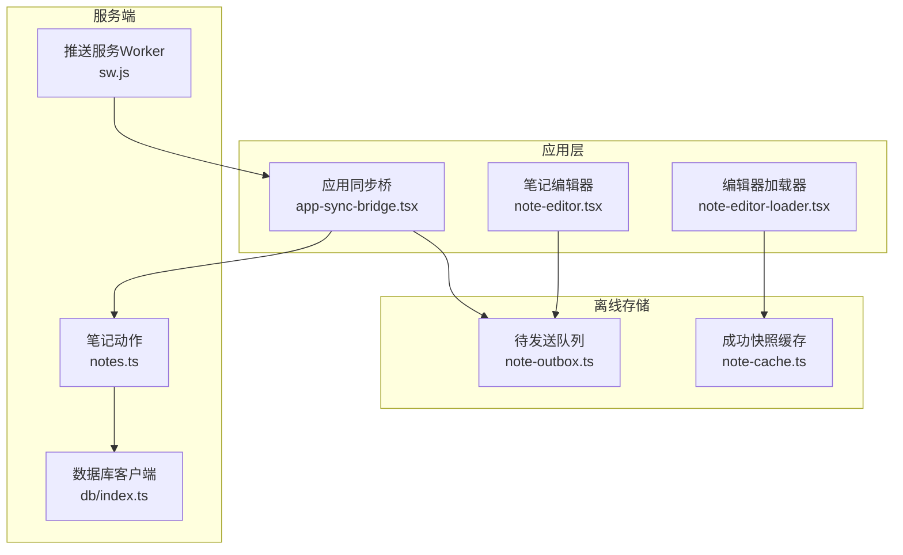
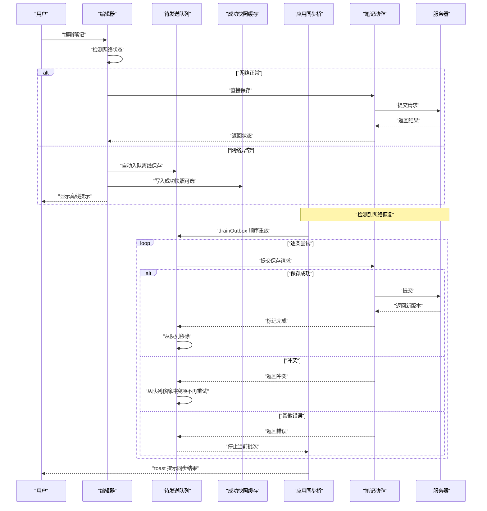
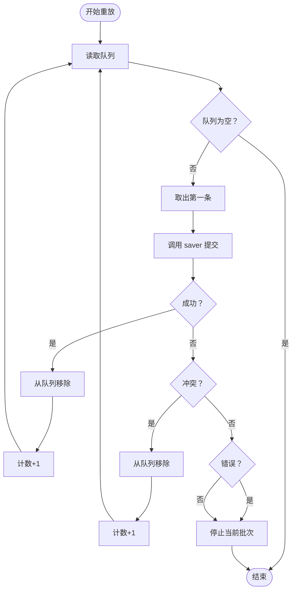
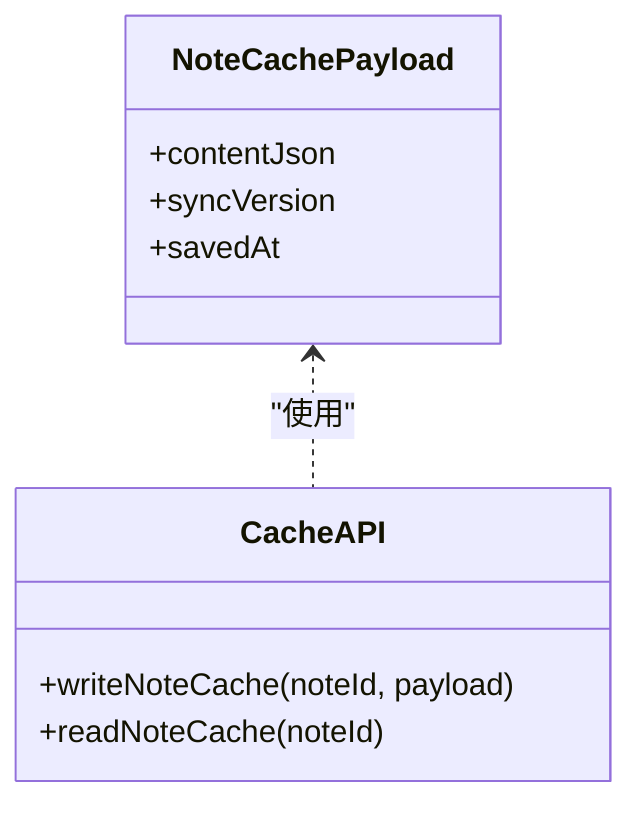
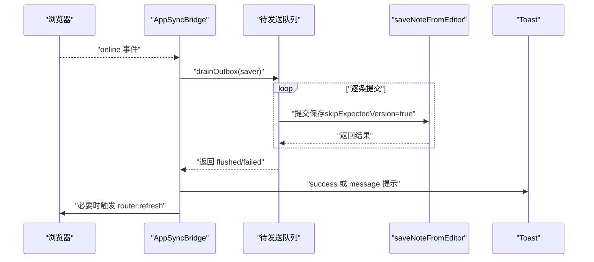
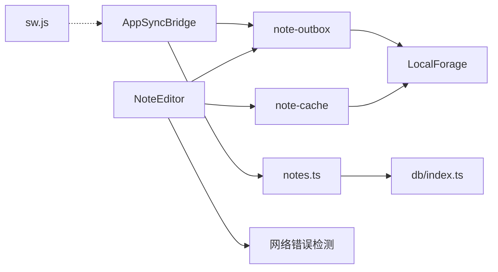

# 离线支持系统

<cite>
**本文引用的文件**
- [note-cache.ts](file://src/lib/offline/note-cache.ts)
- [note-outbox.ts](file://src/lib/offline/note-outbox.ts)
- [app-sync-bridge.tsx](file://src/components/app/app-sync-bridge.tsx)
- [sw.js](file://public/sw.js)
- [index.ts](file://src/lib/db/index.ts)
- [notes.ts](file://src/actions/notes.ts)
- [note-editor.tsx](file://src/components/editor/note-editor.tsx)
- [note-editor-loader.tsx](file://src/components/editor/note-editor-loader.tsx)
</cite>

## 更新摘要
**变更内容**
- 新增改进的离线保存机制，包含智能网络错误检测
- 增强错误处理逻辑，支持网络异常时的自动离线保存
- 改进并发控制和状态管理，避免自回声更新
- 优化用户体验，提供更清晰的错误提示和恢复机制

## 目录
1. [简介](#简介)
2. [项目结构](#项目结构)
3. [核心组件](#核心组件)
4. [架构总览](#架构总览)
5. [详细组件分析](#详细组件分析)
6. [依赖关系分析](#依赖关系分析)
7. [性能考量](#性能考量)
8. [故障排除指南](#故障排除指南)
9. [结论](#结论)
10. [附录](#附录)

## 简介
本文件系统性梳理 Smart-Todo 的离线支持体系，重点覆盖以下方面：
- IndexedDB/LocalForage 队列设计与实现：本地存储策略、数据序列化、索引优化
- 改进的离线保存机制：智能网络错误检测、自动离线保存、并发控制
- 离线保存机制：数据拦截、队列管理、状态跟踪
- 自动重试与冲突处理：重试策略、失败处理、用户反馈
- 成功快照缓存：数据一致性、冲突解决、性能优化
- 网络恢复后的批量同步：数据重放、状态更新、错误处理
- 离线模式下的用户体验：状态指示、操作限制、数据保护
- 监控、调试与故障排除方法

## 项目结构
离线相关代码主要分布在如下位置：
- 本地缓存与队列：src/lib/offline/
- 应用壳桥接与网络恢复处理：src/components/app/app-sync-bridge.tsx
- Service Worker 推送：public/sw.js
- 数据库客户端：src/lib/db/index.ts
- 笔记相关动作：src/actions/notes.ts
- 编辑器组件：src/components/editor/

**图表来源**
- [app-sync-bridge.tsx:1-118](file://src/components/app/app-sync-bridge.tsx#L1-L118)
- [note-outbox.ts:1-87](file://src/lib/offline/note-outbox.ts#L1-L87)
- [note-cache.ts:1-25](file://src/lib/offline/note-cache.ts#L1-L25)
- [notes.ts](file://src/actions/notes.ts)
- [index.ts:1-16](file://src/lib/db/index.ts#L1-L16)
- [sw.js:1-29](file://public/sw.js#L1-L29)

**章节来源**
- [app-sync-bridge.tsx:1-118](file://src/components/app/app-sync-bridge.tsx#L1-L118)
- [note-outbox.ts:1-87](file://src/lib/offline/note-outbox.ts#L1-L87)
- [note-cache.ts:1-25](file://src/lib/offline/note-cache.ts#L1-L25)
- [index.ts:1-16](file://src/lib/db/index.ts#L1-L16)
- [sw.js:1-29](file://public/sw.js#L1-L29)

## 核心组件
- 待发送队列（Outbox）：基于 LocalForage 的持久化队列，按 noteId 去重，保留最后一次内容；在网络恢复时顺序重放。
- 成功快照缓存（Cache）：记录已成功同步的笔记内容与版本号，用于一致性校验与冲突解决。
- 应用同步桥（AppSyncBridge）：监听在线事件，调用队列重放函数，执行批量同步，并通过 toast 提示结果。
- 笔记动作（Notes Actions）：封装保存接口，支持"跳过期望版本"参数以适配离线恢复场景。
- **改进的编辑器（Note Editor）**：新增智能网络错误检测，支持自动离线保存和并发控制。

**章节来源**
- [note-outbox.ts:1-87](file://src/lib/offline/note-outbox.ts#L1-L87)
- [note-cache.ts:1-25](file://src/lib/offline/note-cache.ts#L1-L25)
- [app-sync-bridge.tsx:1-118](file://src/components/app/app-sync-bridge.tsx#L1-L118)
- [notes.ts](file://src/actions/notes.ts)
- [note-editor.tsx:1-618](file://src/components/editor/note-editor.tsx#L1-L618)

## 架构总览
离线工作流概览：
- 编辑器侧：每次编辑变更入队（去重保留最新），同时写入成功快照缓存（若存在）。
- 网络状态：离线时仅入队；在线时由桥接组件触发 drainOutbox 顺序重放。
- 冲突处理：当服务器返回冲突时，移除该条目，避免重复提交；失败条目停止当前批次，等待后续重试。
- 用户反馈：通过 toast 展示已同步数量与剩余未上传条目提示。

**更新** 新增智能网络错误检测和自动离线保存机制

**图表来源**
- [app-sync-bridge.tsx:94-105](file://src/components/app/app-sync-bridge.tsx#L94-L105)
- [note-outbox.ts:48-86](file://src/lib/offline/note-outbox.ts#L48-L86)
- [notes.ts](file://src/actions/notes.ts)
- [note-editor.tsx:162-172](file://src/components/editor/note-editor.tsx#L162-L172)

## 详细组件分析

### 组件一：待发送队列（note-outbox.ts）
- 存储介质：LocalForage 实例，键空间为"smart-note"的"note_outbox"对象存储。
- 数据模型：OutboxEntry 包含 noteId、Tiptap JSON 文档、入队时间戳。
- 关键能力：
  - 入队：同一 noteId 只保留最后一次内容（去重策略），确保只重放最新变更。
  - 列表与删除：支持列出全部待发送项与按 noteId 删除。
  - 顺序重放：drainOutbox 按 FIFO 顺序调用 saver 回调，根据返回值分类处理：
    - 成功：从队列移除，计数+1
    - 冲突：从队列移除，计数+1
    - 错误：停止当前批次，等待后续重试
- 复杂度与优化：
  - 入队与删除均为 O(n)（n 为当前队列长度），但实际使用中队列规模较小，影响有限。
  - 可通过维护索引或分片减少过滤成本（建议项）。

**图表来源**
- [note-outbox.ts:48-86](file://src/lib/offline/note-outbox.ts#L48-L86)

**章节来源**
- [note-outbox.ts:1-87](file://src/lib/offline/note-outbox.ts#L1-L87)

### 组件二：成功快照缓存（note-cache.ts）
- 存储介质：LocalForage 实例，键空间为"smart-note"的"note_cache"对象存储。
- 数据模型：NoteCachePayload 包含 contentJson、syncVersion、savedAt。
- 关键能力：
  - 写入：按 noteId 生成键进行存储。
  - 读取：按 noteId 读取，不存在则返回空。
- 用途：
  - 作为一致性检查与冲突解决的基础，避免重复提交相同内容。
  - 在编辑器加载时用于快速回填，提升首屏体验。

**图表来源**
- [note-cache.ts:8-24](file://src/lib/offline/note-cache.ts#L8-L24)

**章节来源**
- [note-cache.ts:1-25](file://src/lib/offline/note-cache.ts#L1-L25)

### 组件三：应用同步桥（app-sync-bridge.tsx）
- 职责：
  - 订阅 Supabase Realtime 通道，对笔记/分组/任务变更进行防抖刷新。
  - 监听 window.online 事件，在网络恢复时调用 drainOutbox 执行批量同步。
  - 通过 toast 提示已同步条数与剩余未上传条目。
- 关键点：
  - 使用防抖定时器控制 router.refresh 触发频率，降低无效刷新。
  - 在 online 事件回调中，通过 saveNoteFromEditor 并设置 skipExpectedVersion 为 true，适配离线恢复场景。

**图表来源**
- [app-sync-bridge.tsx:94-105](file://src/components/app/app-sync-bridge.tsx#L94-L105)
- [note-outbox.ts:48-86](file://src/lib/offline/note-outbox.ts#L48-L86)
- [notes.ts](file://src/actions/notes.ts)

**章节来源**
- [app-sync-bridge.tsx:1-118](file://src/components/app/app-sync-bridge.tsx#L1-L118)

### 组件四：改进的编辑器（note-editor.tsx）
- **新增功能**：智能网络错误检测和自动离线保存
- **关键改进**：
  - 新增 `isLikelyNetworkError` 函数，准确识别网络异常
  - 在网络异常时自动将内容入队到离线队列
  - 改进的并发控制，防止重复保存和自回声更新
  - 更精确的状态管理，使用 ref 而非闭包状态
- **错误处理机制**：
  - 网络错误：自动离线保存并提示用户
  - 冲突错误：提示用户重新加载最新内容
  - 其他错误：显示保存失败提示
- **并发控制**：
  - `inFlightRef`：防止同时进行多次保存请求
  - `pendingJsonRef`：缓存用户在保存过程中产生的新编辑
  - `lastSavedSyncVersionRef`：避免自回声更新

**章节来源**
- [note-editor.tsx:1-618](file://src/components/editor/note-editor.tsx#L1-L618)

### 组件五：笔记动作（notes.ts）
- 功能：封装笔记保存逻辑，支持"跳过期望版本"参数，用于离线恢复时绕过版本校验。
- 与离线系统的关系：被 AppSyncBridge 的 drainOutbox 回调调用，作为统一的保存入口。

**章节来源**
- [notes.ts](file://src/actions/notes.ts)

### 组件六：编辑器与加载器（note-editor.tsx, note-editor-loader.tsx）
- 编辑器：负责将 Tiptap JSON 内容入队至 Outbox，并在需要时读取 Cache 进行回填。
- 加载器：在页面初始化时读取 Cache，优先展示最近一次成功同步的内容，提升加载速度与一致性。

**章节来源**
- [note-editor.tsx](file://src/components/editor/note-editor.tsx)
- [note-editor-loader.tsx](file://src/components/editor/note-editor-loader.tsx)

### 组件七：Service Worker（sw.js）
- 功能：处理 Web Push 通知显示与点击跳转，为离线场景下的消息提醒提供基础能力。
- 与离线系统的关系：间接增强离线用户的交互体验，便于在后台推送后引导用户回到应用。

**章节来源**
- [sw.js:1-29](file://public/sw.js#L1-L29)

## 依赖关系分析
- 组件耦合：
  - AppSyncBridge 依赖 note-outbox 的 drainOutbox 与 notes.ts 的保存接口。
  - note-outbox 与 note-cache 依赖 LocalForage 进行本地持久化。
  - **改进的 NoteEditor 依赖 isLikelyNetworkError 进行网络状态判断**。
- 外部依赖：
  - LocalForage：提供 IndexedDB 封装，简化异步存储。
  - Next.js Router.refresh：用于在实时订阅或同步后触发页面刷新。
  - Sonner：用于 toast 用户反馈。
- 潜在风险：
  - 队列顺序依赖导致单点瓶颈；若队列过大，可能阻塞后续提交。
  - 冲突处理策略为"移除冲突项"，需确保业务允许离线恢复以本地最新为准。
  - **新增的网络错误检测可能误判某些非网络异常**。

**图表来源**
- [app-sync-bridge.tsx:1-118](file://src/components/app/app-sync-bridge.tsx#L1-L118)
- [note-outbox.ts:1-87](file://src/lib/offline/note-outbox.ts#L1-L87)
- [note-cache.ts:1-25](file://src/lib/offline/note-cache.ts#L1-L25)
- [notes.ts](file://src/actions/notes.ts)
- [index.ts:1-16](file://src/lib/db/index.ts#L1-L16)
- [sw.js:1-29](file://public/sw.js#L1-L29)
- [note-editor.tsx:48-59](file://src/components/editor/note-editor.tsx#L48-L59)

**章节来源**
- [app-sync-bridge.tsx:1-118](file://src/components/app/app-sync-bridge.tsx#L1-L118)
- [note-outbox.ts:1-87](file://src/lib/offline/note-outbox.ts#L1-L87)
- [note-cache.ts:1-25](file://src/lib/offline/note-cache.ts#L1-L25)
- [index.ts:1-16](file://src/lib/db/index.ts#L1-L16)
- [sw.js:1-29](file://public/sw.js#L1-L29)
- [note-editor.tsx:48-59](file://src/components/editor/note-editor.tsx#L48-L59)

## 性能考量
- 队列规模控制：建议限制 Outbox 最大队列长度，超过阈值时主动触发一次 drainOutbox，避免内存与 IndexedDB 压力过大。
- 防抖刷新：AppSyncBridge 已采用防抖刷新，避免频繁 router.refresh 导致的渲染压力。
- 序列化开销：Tiptap JSON 体积较大，建议在入队前进行必要的压缩或增量对比，仅在内容真正变化时入队。
- I/O 批次：将多个小变更合并为一次入队，减少 LocalForage 写入次数。
- 缓存命中：利用 note-cache 快速回填，减少首次渲染等待时间。
- **并发控制优化**：通过 inFlightRef 和 pendingJsonRef 避免重复保存，提高系统响应性。

## 故障排除指南
- 症状：离线保存后无法恢复同步
  - 检查 AppSyncBridge 是否监听到 online 事件并调用 drainOutbox。
  - 查看 notes.ts 的保存接口是否正确处理 skipExpectedVersion 参数。
  - 确认 LocalForage 是否可用，IndexedDB 是否被清理或限额。
- 症状：同步后出现冲突提示
  - 系统会自动移除冲突项；如需保留服务器端内容，请在业务层增加版本比对与合并逻辑。
- 症状：编辑器加载缓慢
  - 检查 note-cache 是否存在且未过期；确认 note-editor-loader 正确读取缓存。
- 症状：Toast 未弹出
  - 确认 Sonner 已正确引入并在全局布局中可用。
- 症状：Service Worker 无法显示通知
  - 检查 sw.js 的 push 与 notificationclick 事件处理是否生效，以及权限与图标资源路径。
- **新增症状：网络异常但未自动离线保存**
  - 检查 isLikelyNetworkError 函数是否正确识别网络错误类型。
  - 确认 enqueueNoteSave 函数是否被正确调用。
  - 验证 LocalForage 是否正常工作。
- **新增症状：保存过于频繁或丢失编辑**
  - 检查 inFlightRef 和 pendingJsonRef 的并发控制逻辑。
  - 确认 flushSave 函数的防抖机制是否正常工作。

**章节来源**
- [app-sync-bridge.tsx:94-105](file://src/components/app/app-sync-bridge.tsx#L94-L105)
- [note-outbox.ts:48-86](file://src/lib/offline/note-outbox.ts#L48-L86)
- [note-cache.ts:1-25](file://src/lib/offline/note-cache.ts#L1-L25)
- [sw.js:1-29](file://public/sw.js#L1-L29)
- [note-editor.tsx:48-59](file://src/components/editor/note-editor.tsx#L48-L59)

## 结论
Smart-Todo 的离线系统以 LocalForage 为基础，构建了简洁可靠的待发送队列与成功快照缓存，配合应用壳桥接在在线时进行批量同步。**最新的改进包括智能网络错误检测、自动离线保存、并发控制优化等，显著提升了系统的稳定性和用户体验**。其设计遵循"离线优先、在线即用"的原则，通过防抖刷新与用户反馈提升体验。未来可在网络错误检测准确性、队列去重策略、序列化优化与冲突合并等方面进一步完善，以支撑更大规模的离线场景。

## 附录
- 术语
  - Outbox：待发送队列
  - Cache：成功快照缓存
  - drainOutbox：批量重放队列
  - skipExpectedVersion：跳过期望版本校验
  - **isLikelyNetworkError：智能网络错误检测**
  - **inFlightRef：并发控制引用**
  - **pendingJsonRef：待处理JSON引用**
- 相关文件路径
  - [note-outbox.ts](file://src/lib/offline/note-outbox.ts)
  - [note-cache.ts](file://src/lib/offline/note-cache.ts)
  - [app-sync-bridge.tsx](file://src/components/app/app-sync-bridge.tsx)
  - [notes.ts](file://src/actions/notes.ts)
  - [index.ts](file://src/lib/db/index.ts)
  - [sw.js](file://public/sw.js)
  - [note-editor.tsx](file://src/components/editor/note-editor.tsx)