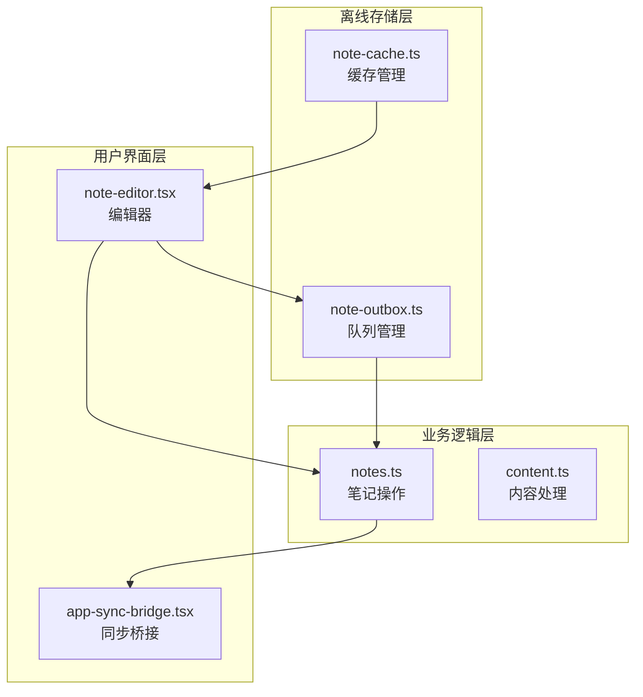
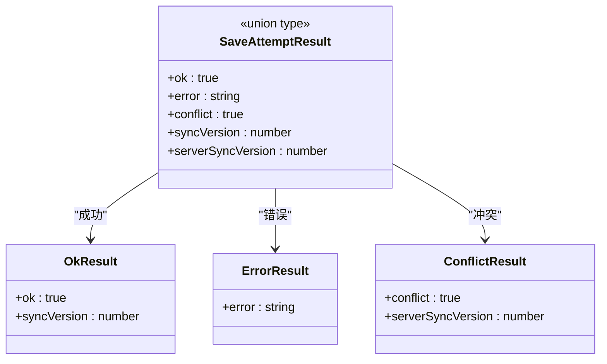
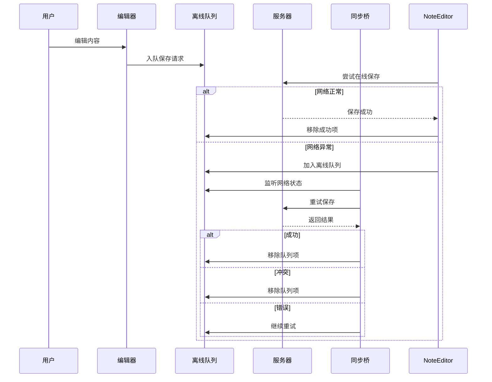
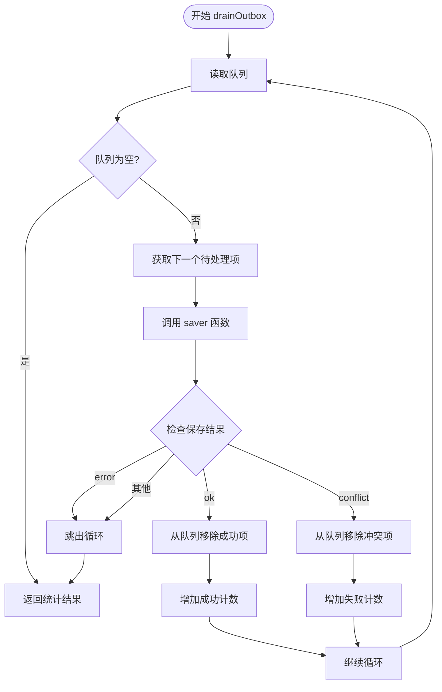
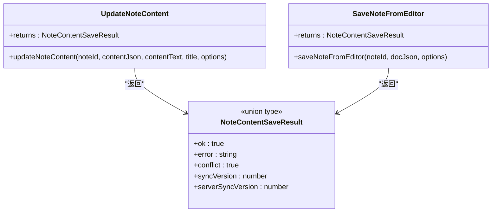
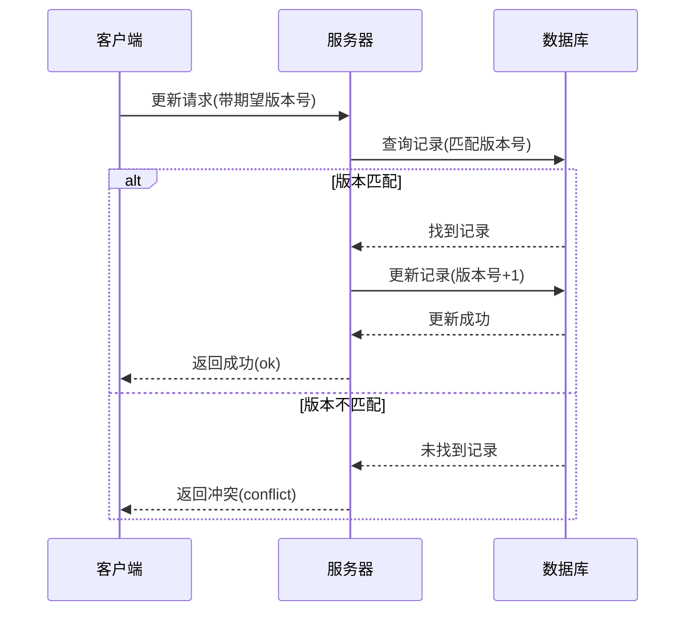
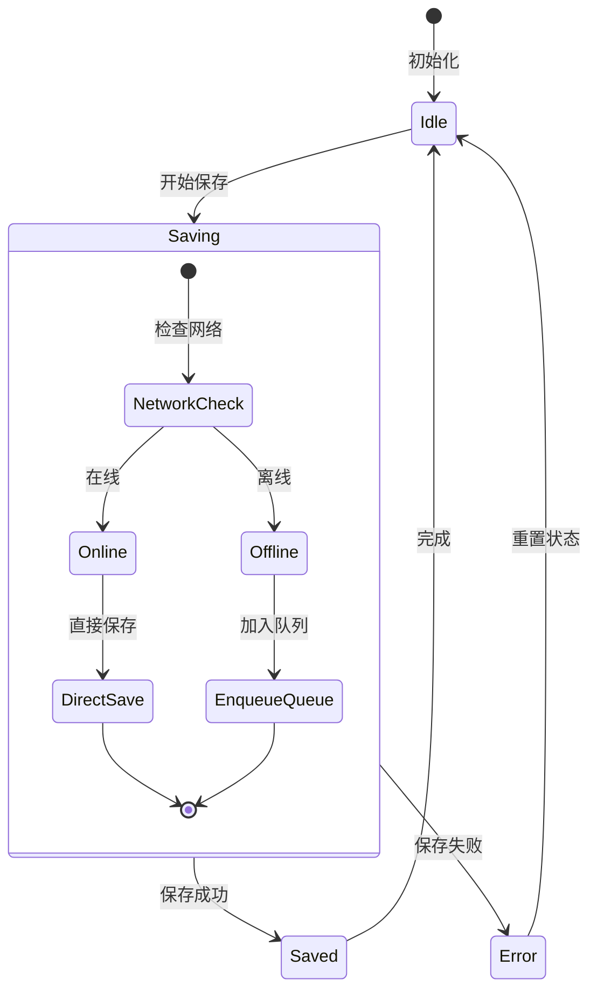
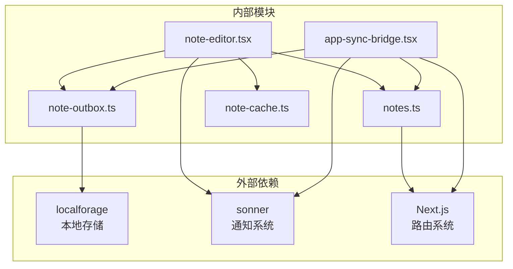

# 自动重试逻辑

<cite>
**本文档引用的文件**
- [note-outbox.ts](file://src/lib/offline/note-outbox.ts)
- [notes.ts](file://src/actions/notes.ts)
- [app-sync-bridge.tsx](file://src/components/app/app-sync-bridge.tsx)
- [note-editor.tsx](file://src/components/editor/note-editor.tsx)
- [content.ts](file://src/lib/tiptap/content.ts)
- [note-cache.ts](file://src/lib/offline/note-cache.ts)
</cite>

## 目录
1. [简介](#简介)
2. [项目结构](#项目结构)
3. [核心组件](#核心组件)
4. [架构概览](#架构概览)
5. [详细组件分析](#详细组件分析)
6. [依赖关系分析](#依赖关系分析)
7. [性能考虑](#性能考虑)
8. [故障排除指南](#故障排除指南)
9. [结论](#结论)

## 简介

Smart-Todo 的自动重试逻辑是一个完整的离线同步解决方案，旨在确保用户在弱网或离线环境下也能正常编辑和保存内容。该系统通过本地队列管理、智能重试机制和冲突解决策略，为用户提供无缝的跨设备同步体验。

系统的核心是 `drainOutbox` 函数，它实现了顺序重放队列机制，能够自动处理网络异常、服务器冲突等各种重试场景。配合乐观并发控制和 LWW（最后写入获胜）策略，确保数据一致性的同时最大化用户体验。

## 项目结构

Smart-Todo 的重试逻辑分布在以下关键文件中：



**图表来源**
- [note-outbox.ts:1-86](file://src/lib/offline/note-outbox.ts#L1-L86)
- [notes.ts:1-230](file://src/actions/notes.ts#L1-L230)
- [app-sync-bridge.tsx:1-118](file://src/components/app/app-sync-bridge.tsx#L1-L118)
- [note-editor.tsx:1-586](file://src/components/editor/note-editor.tsx#L1-L586)

**章节来源**
- [note-outbox.ts:1-86](file://src/lib/offline/note-outbox.ts#L1-L86)
- [notes.ts:1-230](file://src/actions/notes.ts#L1-L230)

## 核心组件

### 1. 保存尝试结果类型 (SaveAttemptResult)

`SaveAttemptResult` 是重试逻辑的核心数据结构，定义了三种不同的保存结果：



**图表来源**
- [note-outbox.ts:43-46](file://src/lib/offline/note-outbox.ts#L43-L46)

### 2. 离线队列管理

系统使用 LocalForage 实现持久化的离线队列，支持以下核心操作：

- **入队 (enqueue)**：同一笔记 ID 只保留最后一次内容，避免重复提交
- **出队 (drain)**：按顺序处理队列中的所有待保存项
- **查询 (list)**：查看当前队列状态
- **移除 (remove)**：成功或冲突后从队列中移除

**章节来源**
- [note-outbox.ts:17-41](file://src/lib/offline/note-outbox.ts#L17-L41)

## 架构概览

Smart-Todo 的重试架构采用分层设计，确保各层职责清晰且松耦合：



**图表来源**
- [note-editor.tsx:138-189](file://src/components/editor/note-editor.tsx#L138-L189)
- [app-sync-bridge.tsx:93-114](file://src/components/app/app-sync-bridge.tsx#L93-L114)

## 详细组件分析

### drainOutbox 函数详解

`drainOutbox` 是整个重试系统的核心函数，实现了智能的顺序重放机制：

#### 核心逻辑流程



**图表来源**
- [note-outbox.ts:49-86](file://src/lib/offline/note-outbox.ts#L49-L86)

#### 错误处理策略

系统实现了多层次的错误处理机制：

1. **网络异常检测**：通过 `isLikelyNetworkError` 函数识别网络相关错误
2. **队列持久化**：网络异常时自动将内容保存到本地队列
3. **重试终止条件**：遇到不可恢复错误时停止重试
4. **冲突处理**：服务器返回冲突时立即移除队列项

**章节来源**
- [note-outbox.ts:49-86](file://src/lib/offline/note-outbox.ts#L49-L86)
- [note-editor.tsx:48-59](file://src/components/editor/note-editor.tsx#L48-L59)

### SaveAttemptResult 类型设计

#### 类型定义与用途



**图表来源**
- [notes.ts:12-15](file://src/actions/notes.ts#L12-L15)
- [notes.ts:59-138](file://src/actions/notes.ts#L59-L138)

#### 结果类型处理

| 结果类型 | 处理逻辑 | 用户反馈 |
|---------|---------|---------|
| `ok` | 从队列移除项，增加成功计数 | 无特殊提示 |
| `conflict` | 从队列移除项，增加失败计数 | 显示冲突警告 |
| `error` | 增加失败计数，停止重试 | 显示错误提示 |

**章节来源**
- [notes.ts:122-137](file://src/actions/notes.ts#L122-L137)

### 冲突解决机制

#### 乐观并发控制

系统采用乐观并发控制策略，通过 `expectedSyncVersion` 参数实现：



**图表来源**
- [notes.ts:79-138](file://src/actions/notes.ts#L79-L138)

#### LWW 策略

在网络重放时采用 LWW（最后写入获胜）策略：

- **离线重放**：使用 `skipExpectedVersion: true` 跳过版本校验
- **本地优先**：离线期间的本地修改优先于服务器版本
- **冲突检测**：通过 `serverSyncVersion` 字段检测服务器端更新

**章节来源**
- [notes.ts:64-69](file://src/actions/notes.ts#L64-L69)
- [app-sync-bridge.tsx:95-96](file://src/components/app/app-sync-bridge.tsx#L95-L96)

### 用户体验设计

#### 实时状态反馈

系统提供了多层次的状态反馈机制：



#### 用户界面交互

| 状态 | UI 行为 | 提示信息 |
|------|--------|---------|
| `idle` | 正常编辑 | 无特殊显示 |
| `saving` | 显示加载指示器 | "保存中…" |
| `saved` | 显示成功图标 | "已保存" |
| `error` | 显示错误状态 | "保存失败" |

**章节来源**
- [note-editor.tsx:98](file://src/components/editor/note-editor.tsx#L98)
- [note-editor.tsx:513-518](file://src/components/editor/note-editor.tsx#L513-L518)

## 依赖关系分析

### 组件间依赖关系



**图表来源**
- [app-sync-bridge.tsx:7](file://src/components/app/app-sync-bridge.tsx#L7)
- [note-editor.tsx:41](file://src/components/editor/note-editor.tsx#L41)

### 数据流分析

系统遵循单向数据流原则：

1. **编辑器层**：负责用户输入和状态管理
2. **队列层**：负责离线数据持久化
3. **业务层**：负责与服务器通信
4. **桥接层**：负责网络状态监听和重试调度

**章节来源**
- [note-outbox.ts:1-86](file://src/lib/offline/note-outbox.ts#L1-L86)
- [notes.ts:1-230](file://src/actions/notes.ts#L1-L230)

## 性能考虑

### 重试策略优化

#### 防抖机制

编辑器实现了 650ms 的防抖延迟，有效减少不必要的网络请求：

```typescript
const DEBOUNCE_MS = 650;
```

#### 队列处理效率

- **顺序处理**：确保数据一致性，避免并发冲突
- **批量移除**：成功后立即从队列中移除，减少后续处理时间
- **内存优化**：只保留必要的队列状态信息

### 存储性能

#### IndexedDB 优化

- **异步操作**：所有存储操作都是异步的，不影响主线程
- **批量写入**：队列更新采用批量写入模式
- **错误隔离**：存储错误不会影响主业务流程

**章节来源**
- [note-outbox.ts:17-24](file://src/lib/offline/note-outbox.ts#L17-L24)
- [note-editor.tsx:195-200](file://src/components/editor/note-editor.tsx#L195-L200)

## 故障排除指南

### 常见问题诊断

#### 网络连接问题

**症状**：编辑器显示"网络不可用"提示

**诊断步骤**：
1. 检查浏览器网络状态
2. 验证 `navigator.onLine` 属性
3. 查看控制台网络错误

**解决方案**：
- 确保网络连接稳定
- 检查防火墙设置
- 验证服务器可达性

#### 冲突处理问题

**症状**：保存冲突警告持续出现

**诊断步骤**：
1. 检查 `serverSyncVersion` 是否正确更新
2. 验证乐观锁机制是否正常工作
3. 查看服务器端日志

**解决方案**：
- 引导用户重新加载页面
- 提供"载入最新"选项
- 清理本地缓存

#### 队列积压问题

**症状**：离线队列长时间无法清空

**诊断步骤**：
1. 检查队列长度和内容
2. 分析失败原因
3. 监控网络状态变化

**解决方案**：
- 手动清理无效队列项
- 调整重试策略
- 优化网络连接

### 日志记录建议

建议在以下位置添加日志记录：

```typescript
// 队列操作日志
console.log('队列状态:', { length, items });

// 保存结果日志  
console.log('保存结果:', { noteId, result, timestamp });

// 错误处理日志
console.error('重试失败:', { noteId, error, attempt });
```

**章节来源**
- [app-sync-bridge.tsx:98-104](file://src/components/app/app-sync-bridge.tsx#L98-L104)
- [note-editor.tsx:157-165](file://src/components/editor/note-editor.tsx#L157-L165)

## 结论

Smart-Todo 的自动重试逻辑通过精心设计的架构和完善的错误处理机制，为用户提供了可靠的离线同步体验。系统的主要优势包括：

1. **可靠性**：通过队列持久化确保数据不会丢失
2. **一致性**：采用乐观并发控制和 LWW 策略保证数据一致性
3. **用户体验**：实时状态反馈和智能重试提升用户满意度
4. **可维护性**：模块化设计便于代码维护和功能扩展

该系统为类似的应用程序提供了优秀的参考实现，特别是在需要处理复杂离线场景和多设备同步的场景中。