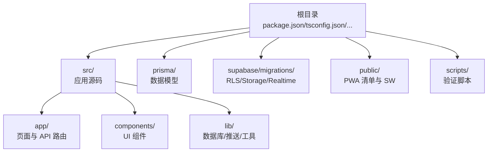
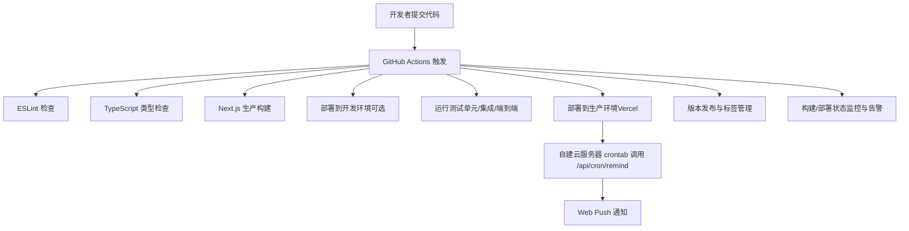
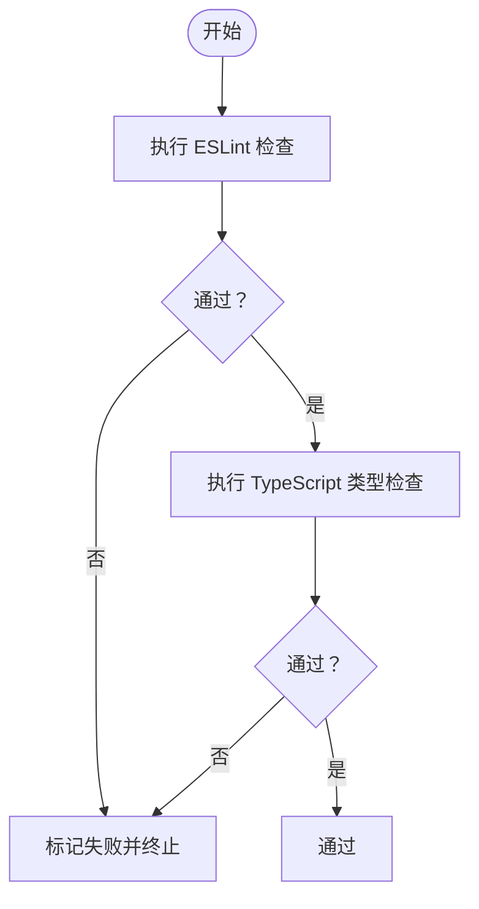
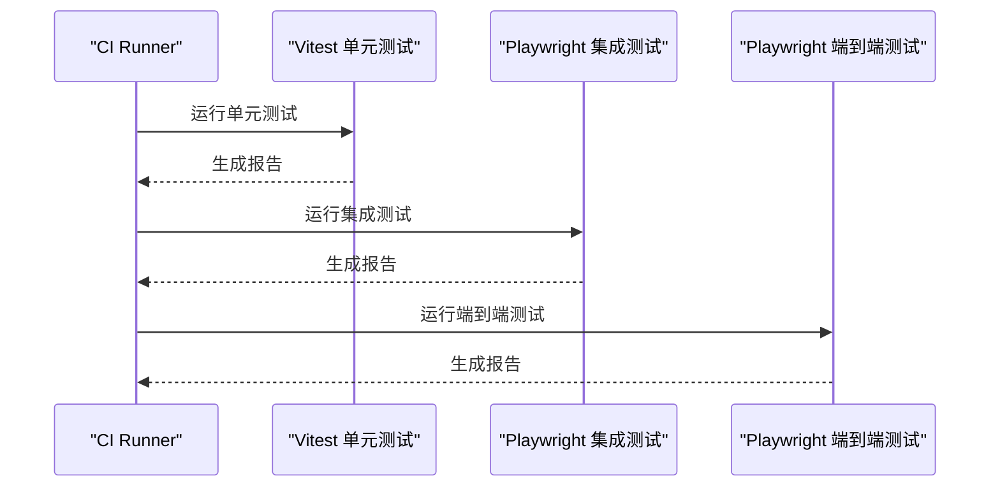
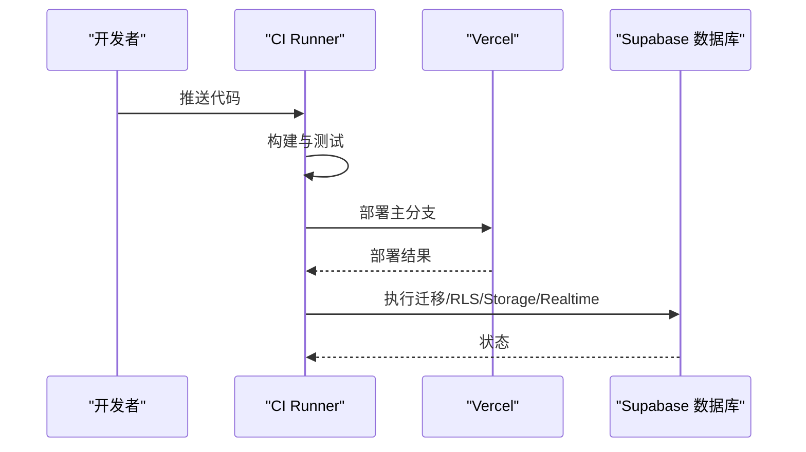
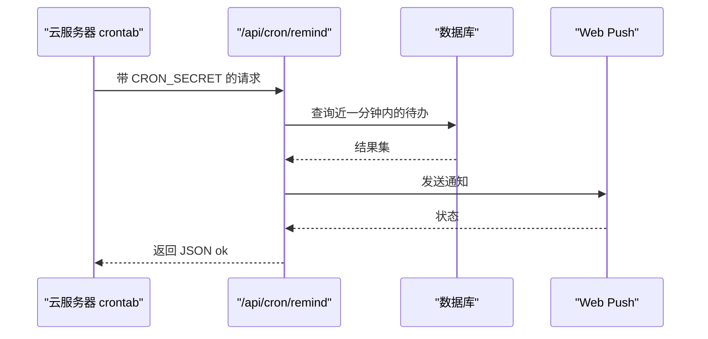
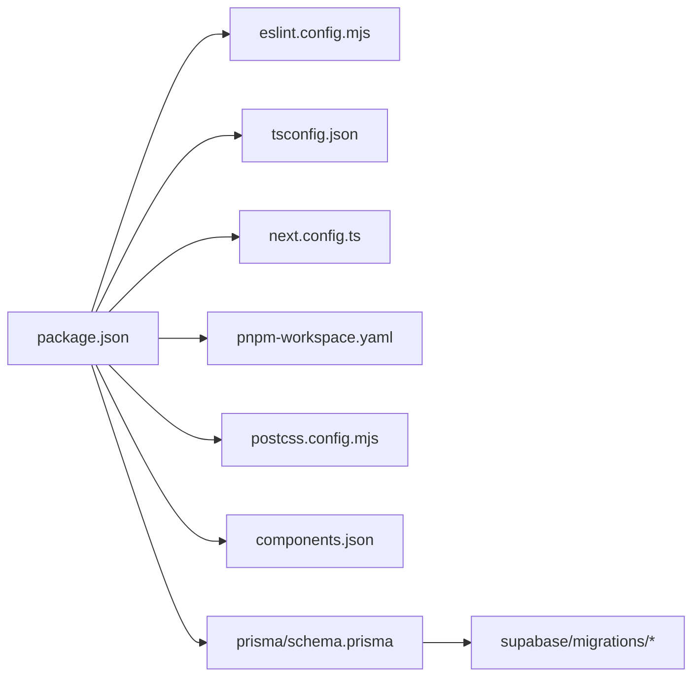

# CI/CD 流水线

<cite>
**本文引用的文件**   
- [package.json](file://package.json)
- [eslint.config.mjs](file://eslint.config.mjs)
- [tsconfig.json](file://tsconfig.json)
- [next.config.ts](file://next.config.ts)
- [pnpm-workspace.yaml](file://pnpm-workspace.yaml)
- [postcss.config.mjs](file://postcss.config.mjs)
- [components.json](file://components.json)
- [README.md](file://README.md)
- [scripts/verify-m4-cron.mjs](file://scripts/verify-m4-cron.mjs)
- [src/lib/db/index.ts](file://src/lib/db/index.ts)
- [src/app/api/cron/remind/route.ts](file://src/app/api/cron/remind/route.ts)
- [prisma/schema.prisma](file://prisma/schema.prisma)
- [supabase/migrations/20260513000000_enable_rls_policies.sql](file://supabase/migrations/20260513000000_enable_rls_policies.sql)
- [supabase/migrations/20260513120000_storage_note_images.sql](file://supabase/migrations/20260513120000_storage_note_images.sql)
- [supabase/migrations/20260513140000_realtime_publication.sql](file://supabase/migrations/20260513140000_realtime_publication.sql)
</cite>

## 目录
1. [简介](#简介)
2. [项目结构](#项目结构)
3. [核心组件](#核心组件)
4. [架构总览](#架构总览)
5. [详细组件分析](#详细组件分析)
6. [依赖关系分析](#依赖关系分析)
7. [性能考量](#性能考量)
8. [故障排除指南](#故障排除指南)
9. [结论](#结论)
10. [附录](#附录)

## 简介
本文件面向 Smart-Todo 项目的 CI/CD 流水线设计与实施，覆盖自动化测试、代码质量检查、构建与部署、版本发布与回滚、监控与故障排除等环节。项目采用 Next.js 16 App Router + TypeScript + Prisma + Supabase，结合 Vercel 部署与自建云服务器定时任务实现 M4 推送提醒功能。本文提供基于 GitHub Actions 的流水线配置思路与最佳实践，帮助团队建立稳定、可追溯、可扩展的持续交付体系。

## 项目结构
Smart-Todo 为前端单体应用，核心目录与文件如下：
- 根目录包含包管理与构建配置、工具链配置、项目说明与常用脚本
- src 目录为应用源码，包含页面路由、API 路由、组件、状态与工具库
- prisma 与 supabase/migrations 提供数据库模型与迁移脚本
- public 包含 PWA 清单与 Service Worker，scripts 提供辅助验证脚本

**图表来源**
- [package.json:1-86](file://package.json#L1-L86)
- [tsconfig.json:1-35](file://tsconfig.json#L1-L35)
- [prisma/schema.prisma](file://prisma/schema.prisma)
- [supabase/migrations/20260513000000_enable_rls_policies.sql](file://supabase/migrations/20260513000000_enable_rls_policies.sql)
- [supabase/migrations/20260513120000_storage_note_images.sql](file://supabase/migrations/20260513120000_storage_note_images.sql)
- [supabase/migrations/20260513140000_realtime_publication.sql](file://supabase/migrations/20260513140000_realtime_publication.sql)
- [public/manifest.json](file://public/manifest.json)
- [public/sw.js](file://public/sw.js)
- [scripts/verify-m4-cron.mjs:1-40](file://scripts/verify-m4-cron.mjs#L1-L40)

**章节来源**
- [README.md:161-202](file://README.md#L161-L202)
- [package.json:1-86](file://package.json#L1-L86)
- [tsconfig.json:1-35](file://tsconfig.json#L1-L35)

## 核心组件
- 构建与打包：Next.js 16（默认 Turbopack），生产构建与启动命令
- 代码质量：ESLint（Next.js 规则 + TypeScript）、TypeScript 类型检查
- 数据层：Prisma Client 与 Supabase 数据库（RLS、Storage、Realtime）
- 推送与定时：VAPID Web Push + /api/cron/remind + 自建云服务器 crontab
- PWA：Service Worker 与清单文件

**章节来源**
- [package.json:6-21](file://package.json#L6-L21)
- [eslint.config.mjs:1-19](file://eslint.config.mjs#L1-L19)
- [tsconfig.json:1-35](file://tsconfig.json#L1-L35)
- [src/lib/db/index.ts:1-15](file://src/lib/db/index.ts#L1-L15)
- [src/app/api/cron/remind/route.ts:1-47](file://src/app/api/cron/remind/route.ts#L1-L47)
- [README.md:115-141](file://README.md#L115-L141)

## 架构总览
下图展示从代码提交到部署与监控的端到端流水线：

**图表来源**
- [package.json:6-21](file://package.json#L6-L21)
- [eslint.config.mjs:1-19](file://eslint.config.mjs#L1-L19)
- [tsconfig.json:1-35](file://tsconfig.json#L1-L35)
- [src/app/api/cron/remind/route.ts:1-47](file://src/app/api/cron/remind/route.ts#L1-L47)
- [README.md:115-141](file://README.md#L115-L141)

## 详细组件分析

### 代码质量检查（ESLint + TypeScript）
- ESLint 配置采用 Next.js 官方规则组合，覆盖 Core Web Vitals 与 TypeScript，同时覆盖默认忽略项，确保全量检查。
- TypeScript 配置启用严格模式、禁止 emit、模块解析为 bundler，路径别名 @/* 指向 src/*。
- 建议在 CI 中执行：
  - npm run lint（ESLint）
  - npm run typecheck（TypeScript）

**图表来源**
- [eslint.config.mjs:1-19](file://eslint.config.mjs#L1-L19)
- [tsconfig.json:1-35](file://tsconfig.json#L1-L35)
- [package.json:10-11](file://package.json#L10-L11)

**章节来源**
- [eslint.config.mjs:1-19](file://eslint.config.mjs#L1-L19)
- [tsconfig.json:1-35](file://tsconfig.json#L1-L35)
- [package.json:10-11](file://package.json#L10-L11)

### 自动化测试配置
- 单元测试：建议使用 Vitest（与 Next.js 测试文档兼容），覆盖业务逻辑与工具函数。
- 集成测试：使用 Playwright 或 Next 实验性测试模式，验证页面交互与 API 路由行为。
- 端到端测试：建议在 Playwright 中配置跨浏览器与移动端场景，重点验证登录、便签 CRUD、待办聚合、推送订阅与提醒流程。
- 报告与覆盖率：建议生成 JUnit XML 与 Cobertura/Coverage 报告，便于 CI 平台展示与归档。

**图表来源**
- [package.json:6-21](file://package.json#L6-L21)
- [README.md:142-160](file://README.md#L142-L160)

**章节来源**
- [package.json:6-21](file://package.json#L6-L21)
- [README.md:142-160](file://README.md#L142-L160)

### 构建与部署
- 构建：使用 npm run build 生成生产包；next.config.ts 为空配置，遵循 Next.js 默认行为。
- 开发环境部署：可选将构建产物部署至临时环境（如 Vercel Preview Deployment），便于联调与评审。
- 生产环境部署：推荐使用 Vercel，自动监听主分支并部署；生产环境需配置以下环境变量：
  - NEXT_PUBLIC_APP_URL：用于通知点击链接
  - CRON_SECRET：/api/cron/remind 授权密钥
  - NEXT_PUBLIC_VAPID_PUBLIC_KEY / VAPID_PRIVATE_KEY / VAPID_SUBJECT：Web Push VAPID
- 数据库与迁移：在 CI 中可执行数据库准备脚本（如 db:generate、db:push、RLS/Storage/Realtime 初始化），确保测试环境一致性。

**图表来源**
- [package.json:12-20](file://package.json#L12-L20)
- [src/app/api/cron/remind/route.ts:1-47](file://src/app/api/cron/remind/route.ts#L1-L47)
- [README.md:115-141](file://README.md#L115-L141)

**章节来源**
- [next.config.ts:1-8](file://next.config.ts#L1-L8)
- [package.json:12-20](file://package.json#L12-L20)
- [README.md:115-141](file://README.md#L115-L141)

### 版本发布与回滚
- 语义化版本控制：建议以 feat/fix/docs/chore 等前缀配合版本号（如 0.1.0、0.1.1、0.2.0），并生成变更日志。
- 发布标签：在合并主分支后打标签（如 v0.1.0），CI 自动触发发布流程。
- 回滚策略：Vercel 支持快速回滚至上一个版本；数据库层面可通过迁移回滚或备份恢复。
- 发布检查清单：
  - 代码通过 Lint 与类型检查
  - 测试全部通过
  - 数据库迁移成功
  - 关键环境变量已配置
  - 推送提醒功能自检通过

**章节来源**
- [README.md:115-141](file://README.md#L115-L141)
- [scripts/verify-m4-cron.mjs:1-40](file://scripts/verify-m4-cron.mjs#L1-L40)

### 推送与定时任务（M4）
- /api/cron/remind 路由需要 Authorization: Bearer <CRON_SECRET>，扫描待办提醒并发送 Web Push 通知。
- 生产环境使用自建云服务器 crontab 每分钟调用该接口；本地可使用 curl 或 npm run verify:m4-cron 进行自检。
- 建议在 CI 中增加“推送自检”步骤，确保生产环境配置正确。

**图表来源**
- [src/app/api/cron/remind/route.ts:1-47](file://src/app/api/cron/remind/route.ts#L1-L47)
- [scripts/verify-m4-cron.mjs:1-40](file://scripts/verify-m4-cron.mjs#L1-L40)

**章节来源**
- [src/app/api/cron/remind/route.ts:1-47](file://src/app/api/cron/remind/route.ts#L1-L47)
- [scripts/verify-m4-cron.mjs:1-40](file://scripts/verify-m4-cron.mjs#L1-L40)
- [README.md:115-141](file://README.md#L115-L141)

## 依赖关系分析
- 包管理与工作区：pnpm-workspace.yaml 允许对特定依赖进行构建控制，确保 Prisma 与 MSW 等依赖在 CI 中可正常构建。
- 样式与工具链：Tailwind CSS v4 与 PostCSS 配置，组件库使用 shadcn/ui。
- 数据库与迁移：Prisma schema 定义数据模型；Supabase 迁移脚本用于启用 RLS、Storage 与 Realtime publication。

**图表来源**
- [package.json:1-86](file://package.json#L1-L86)
- [pnpm-workspace.yaml:1-8](file://pnpm-workspace.yaml#L1-L8)
- [postcss.config.mjs:1-8](file://postcss.config.mjs#L1-L8)
- [components.json:1-26](file://components.json#L1-L26)
- [prisma/schema.prisma](file://prisma/schema.prisma)
- [supabase/migrations/20260513000000_enable_rls_policies.sql](file://supabase/migrations/20260513000000_enable_rls_policies.sql)
- [supabase/migrations/20260513120000_storage_note_images.sql](file://supabase/migrations/20260513120000_storage_note_images.sql)
- [supabase/migrations/20260513140000_realtime_publication.sql](file://supabase/migrations/20260513140000_realtime_publication.sql)

**章节来源**
- [pnpm-workspace.yaml:1-8](file://pnpm-workspace.yaml#L1-L8)
- [postcss.config.mjs:1-8](file://postcss.config.mjs#L1-L8)
- [components.json:1-26](file://components.json#L1-L26)
- [prisma/schema.prisma](file://prisma/schema.prisma)

## 性能考量
- 构建性能：优先使用 pnpm 与缓存，合理拆分构建步骤，避免重复安装依赖。
- 测试性能：并行运行单元测试，集成与端到端测试按需选择浏览器与设备矩阵。
- 部署性能：Vercel 自动缓存静态资源，建议开启压缩与 CDN；数据库迁移尽量幂等，减少停机时间。
- 监控指标：关注构建时长、测试通过率、部署成功率、推送到达率与用户反馈。

## 故障排除指南
- 构建失败
  - 检查 Node.js 版本是否满足 Next.js 16 最低要求（20.9+）
  - 确认 pnpm 缓存与工作区配置正确
- 代码质量检查失败
  - 修复 ESLint 报错与 TypeScript 错误
  - 确保 tsconfig 严格模式与路径别名配置一致
- 数据库问题
  - 在 CI 中执行 db:generate、db:push、RLS/Storage/Realtime 初始化
  - 确认 DATABASE_URL/DIRECT_URL 与 Supabase 凭据正确
- 推送与定时任务
  - 使用 npm run verify:m4-cron 校验环境变量与 /api/cron/remind
  - 自建云服务器 crontab 需与 Vercel 环境变量 CRON_SECRET 保持一致
- 部署状态跟踪
  - 在 Vercel 查看部署日志与预览链接
  - 使用健康检查端点（/api/health）验证服务可用性

**章节来源**
- [README.md:142-160](file://README.md#L142-L160)
- [scripts/verify-m4-cron.mjs:1-40](file://scripts/verify-m4-cron.mjs#L1-L40)
- [src/app/api/cron/remind/route.ts:1-47](file://src/app/api/cron/remind/route.ts#L1-L47)

## 结论
通过将 ESLint、TypeScript、测试与构建统一纳入 CI，结合 Vercel 的自动化部署与自建云服务器的定时任务，Smart-Todo 可形成稳定高效的流水线。建议在 CI 中增加推送自检、数据库迁移验证与发布检查清单，以提升交付质量与可追溯性。

## 附录
- 常用脚本参考
  - npm run lint：ESLint 检查
  - npm run typecheck：TypeScript 类型检查
  - npm run build：生产构建
  - npm run db:generate / db:push / db:rls / db:storage / db:realtime：数据库准备
  - npm run verify:m4-cron：推送自检
- 环境变量建议
  - NEXT_PUBLIC_APP_URL、CRON_SECRET、NEXT_PUBLIC_VAPID_PUBLIC_KEY、VAPID_PRIVATE_KEY、VAPID_SUBJECT、DATABASE_URL、DIRECT_URL

**章节来源**
- [package.json:6-21](file://package.json#L6-L21)
- [README.md:115-141](file://README.md#L115-L141)