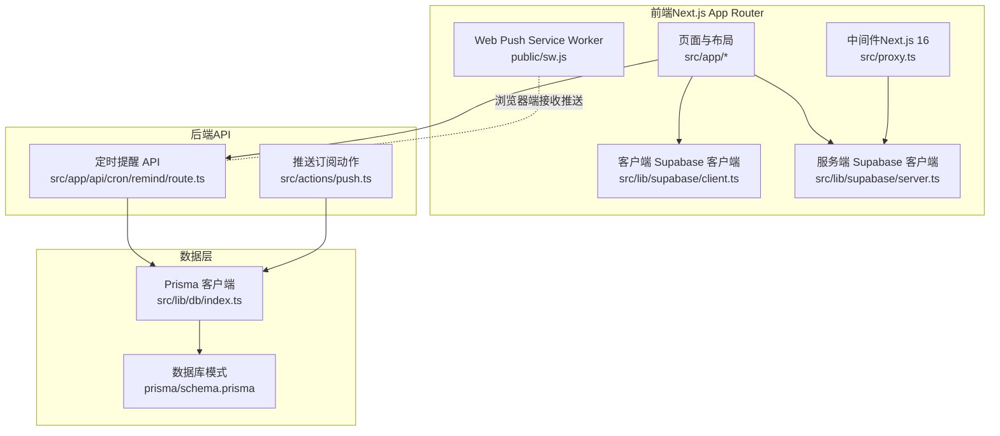
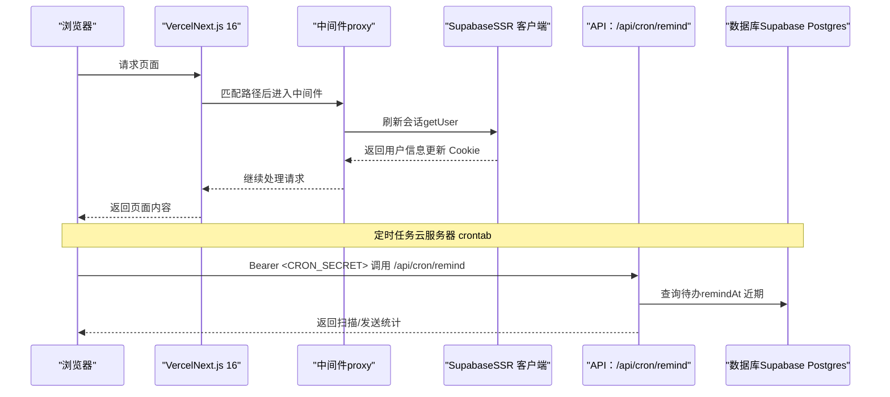
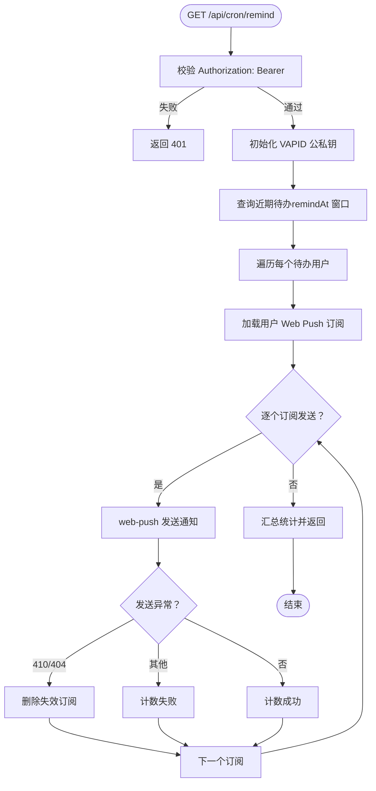
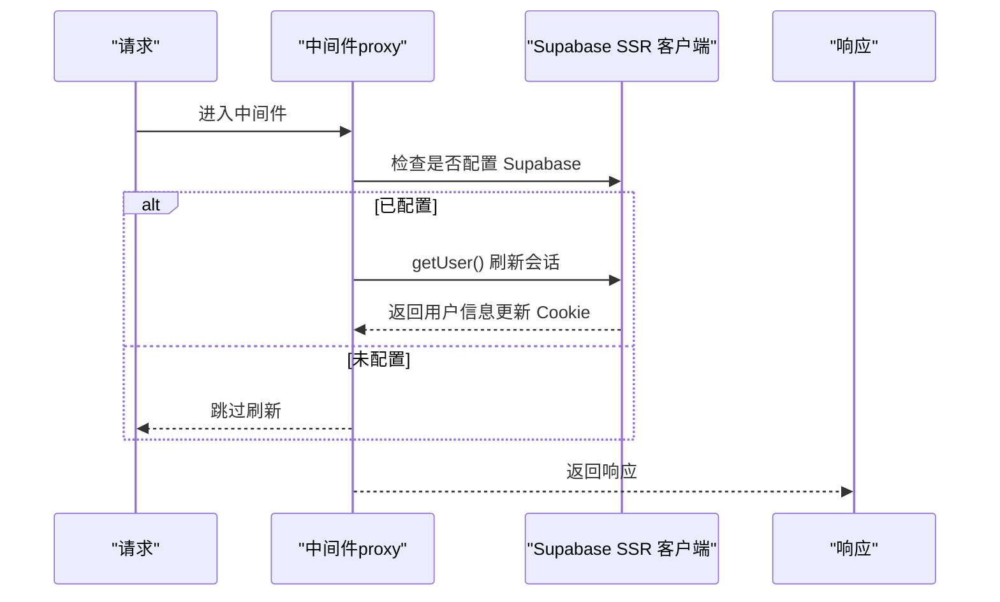
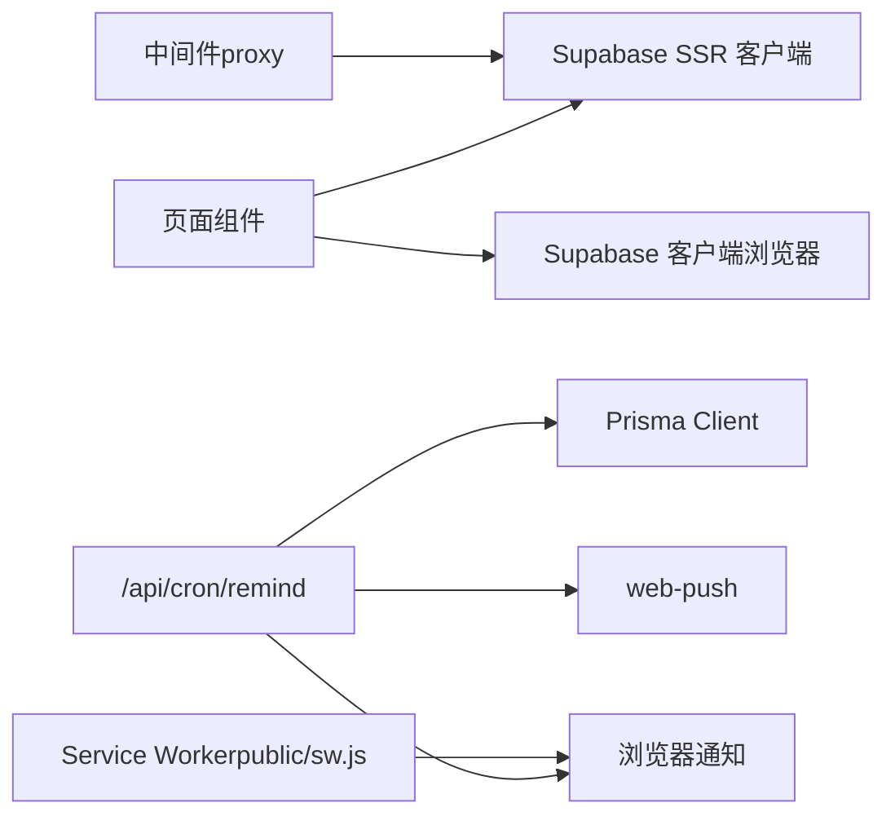

# Vercel 部署

<cite>
**本文引用的文件**
- [package.json](file://package.json)
- [next.config.ts](file://next.config.ts)
- [README.md](file://README.md)
- [src/lib/supabase/client.ts](file://src/lib/supabase/client.ts)
- [src/lib/supabase/server.ts](file://src/lib/supabase/server.ts)
- [src/lib/supabase/proxy.ts](file://src/lib/supabase/proxy.ts)
- [src/proxy.ts](file://src/proxy.ts)
- [src/app/api/cron/remind/route.ts](file://src/app/api/cron/remind/route.ts)
- [src/actions/push.ts](file://src/actions/push.ts)
- [public/sw.js](file://public/sw.js)
- [scripts/verify-m4-cron.mjs](file://scripts/verify-m4-cron.mjs)
- [src/lib/db/index.ts](file://src/lib/db/index.ts)
- [prisma/schema.prisma](file://prisma/schema.prisma)
</cite>

## 目录
1. [简介](#简介)
2. [项目结构](#项目结构)
3. [核心组件](#核心组件)
4. [架构总览](#架构总览)
5. [详细组件分析](#详细组件分析)
6. [依赖关系分析](#依赖关系分析)
7. [性能考量](#性能考量)
8. [故障排查指南](#故障排查指南)
9. [结论](#结论)
10. [附录](#附录)

## 简介
本文件面向在 Vercel 平台上部署 Smart-Todo（Next.js 16 App Router 应用）的工程团队，提供从项目创建、环境变量配置、构建设置到运行时行为的完整指南。重点覆盖以下方面：
- 如何在 Vercel 上正确配置 Supabase 相关环境变量（含 NEXT_PUBLIC_SUPABASE_URL、NEXT_PUBLIC_SUPABASE_ANON_KEY、DATABASE_URL 等）
- Next.js 16 特殊配置在 Vercel 上的适配（中间件导出名、Turbopack 打包器、Node.js 版本要求）
- Web Push 与 Cron 任务在 Vercel 上的限制与替代方案
- 面向生产的部署步骤与常见问题排查

## 项目结构
Smart-Todo 是一个基于 Next.js 16 App Router 的全栈应用，前端使用 Supabase SSR 客户端与 Prisma ORM，后端提供定时提醒 API 与健康检查 API。项目采用 App Router 目录组织，公共资源位于 public 目录，数据库模式定义于 prisma/schema.prisma。

图表来源
- [src/app/layout.tsx:1-54](file://src/app/layout.tsx#L1-L54)
- [src/lib/supabase/client.ts:1-9](file://src/lib/supabase/client.ts#L1-L9)
- [src/lib/supabase/server.ts:1-29](file://src/lib/supabase/server.ts#L1-L29)
- [src/proxy.ts:1-23](file://src/proxy.ts#L1-L23)
- [public/sw.js:1-29](file://public/sw.js#L1-L29)
- [src/app/api/cron/remind/route.ts:1-115](file://src/app/api/cron/remind/route.ts#L1-L115)
- [src/actions/push.ts:1-62](file://src/actions/push.ts#L1-L62)
- [src/lib/db/index.ts:1-16](file://src/lib/db/index.ts#L1-L16)
- [prisma/schema.prisma:1-117](file://prisma/schema.prisma#L1-L117)

章节来源
- [README.md:161-202](file://README.md#L161-L202)

## 核心组件
- Supabase 客户端封装
  - 浏览器端：通过 NEXT_PUBLIC_SUPABASE_URL 与 NEXT_PUBLIC_SUPABASE_ANON_KEY 初始化
  - 服务端：通过 cookies() 读取与写入会话，刷新 access_token
- 中间件（Next.js 16）
  - 导出名为 proxy，对每个请求刷新 Supabase 会话
- 定时提醒 API
  - /api/cron/remind，受 CRON_SECRET 保护，扫描待办并发送 Web Push
- Web Push
  - Service Worker 处理 push 与 notificationclick 事件
- 数据层
  - Prisma Client 通过 DATABASE_URL 连接 Supabase Postgres

章节来源
- [src/lib/supabase/client.ts:1-9](file://src/lib/supabase/client.ts#L1-L9)
- [src/lib/supabase/server.ts:1-29](file://src/lib/supabase/server.ts#L1-L29)
- [src/proxy.ts:1-23](file://src/proxy.ts#L1-L23)
- [src/app/api/cron/remind/route.ts:1-115](file://src/app/api/cron/remind/route.ts#L1-L115)
- [public/sw.js:1-29](file://public/sw.js#L1-L29)
- [src/lib/db/index.ts:1-16](file://src/lib/db/index.ts#L1-L16)
- [prisma/schema.prisma:1-117](file://prisma/schema.prisma#L1-L117)

## 架构总览
下图展示 Vercel 部署后的典型交互：浏览器发起请求，Next.js 中间件刷新 Supabase 会话；页面与 API 通过 Supabase 客户端访问认证与数据；定时任务通过外部云服务器 crontab 调用 /api/cron/remind 发送 Web Push。

图表来源
- [src/proxy.ts:1-23](file://src/proxy.ts#L1-L23)
- [src/lib/supabase/server.ts:1-29](file://src/lib/supabase/server.ts#L1-L29)
- [src/app/api/cron/remind/route.ts:1-115](file://src/app/api/cron/remind/route.ts#L1-L115)
- [src/lib/db/index.ts:1-16](file://src/lib/db/index.ts#L1-L16)

## 详细组件分析

### Supabase 环境变量配置（Vercel）
- 必要变量
  - NEXT_PUBLIC_SUPABASE_URL：Supabase 项目 URL
  - NEXT_PUBLIC_SUPABASE_ANON_KEY：Supabase 匿名密钥（前端可见）
  - DATABASE_URL：Supabase Direct URL（Prisma 连接）
- 配置位置
  - Vercel 项目 Settings → Environment Variables
  - 前缀 NEXT_PUBLIC_ 开头的变量会在客户端可用
- 验证要点
  - 浏览器端与服务端均通过上述变量初始化客户端
  - 未配置时中间件会跳过会话刷新，不影响静态资源访问

章节来源
- [src/lib/supabase/client.ts:1-9](file://src/lib/supabase/client.ts#L1-L9)
- [src/lib/supabase/server.ts:1-29](file://src/lib/supabase/server.ts#L1-L29)
- [prisma/schema.prisma:9-13](file://prisma/schema.prisma#L9-L13)

### Next.js 16 特殊配置在 Vercel 上的适配
- 中间件导出名
  - Next.js 16 使用 proxy 作为中间件导出名，而非 middleware
  - Vercel 会自动识别并应用
- 异步 API
  - cookies()/headers()/params/searchParams 必须 await
  - 代码中已遵循此规范
- 打包器
  - 默认使用 Turbopack；Vercel 会自动选择合适运行时
- Node.js 版本
  - 项目要求 Node.js 20.9+；Vercel 需在构建与运行时满足该版本

章节来源
- [README.md:204-212](file://README.md#L204-L212)
- [src/proxy.ts:1-23](file://src/proxy.ts#L1-L23)
- [src/lib/supabase/proxy.ts:1-52](file://src/lib/supabase/proxy.ts#L1-L52)

### Web Push 与 Service Worker（Vercel 限制与方案）
- VAPID 密钥
  - NEXT_PUBLIC_VAPID_PUBLIC_KEY（前端显示）、VAPID_PRIVATE_KEY（后端发送）
  - VAPID_SUBJECT（如 mailto:）用于 web-push
- Service Worker
  - public/sw.js 处理 push 与 notificationclick 事件
- Cron 任务限制
  - Vercel Hobby 不支持分钟级 Cron；项目建议使用云服务器 crontab 每分钟调用 /api/cron/remind
  - Vercel Pro 可使用 Vercel Cron（每日上限一次），如需更频繁可升级
- 配置步骤
  - 在 Vercel 环境变量中设置 CRON_SECRET、VAPID_*、NEXT_PUBLIC_APP_URL
  - 在云服务器配置 crontab 每分钟 curl 带 Bearer 的 /api/cron/remind
  - 本地验证：npm run verify:m4-cron 或 curl 带 Authorization

章节来源
- [README.md:115-141](file://README.md#L115-L141)
- [src/app/api/cron/remind/route.ts:1-115](file://src/app/api/cron/remind/route.ts#L1-L115)
- [public/sw.js:1-29](file://public/sw.js#L1-L29)
- [scripts/verify-m4-cron.mjs:1-83](file://scripts/verify-m4-cron.mjs#L1-L83)

### 数据库连接与 Prisma（Vercel）
- 数据源
  - datasource db 使用 DATABASE_URL 与 DIRECT_URL（schema 中声明）
- 运行时
  - 生产环境通过 Prisma Client 连接 Supabase Postgres
- 建议
  - 在 Vercel 环境变量中配置 DATABASE_URL/DIRECT_URL
  - 如需迁移，优先使用 Supabase Dashboard 或 Prisma CLI；Vercel 构建时可执行数据库准备脚本（如项目脚本所示）

章节来源
- [prisma/schema.prisma:9-13](file://prisma/schema.prisma#L9-L13)
- [src/lib/db/index.ts:1-16](file://src/lib/db/index.ts#L1-L16)

### API：/api/cron/remind（定时扫描与发送）
- 动态与超时
  - dynamic = force-dynamic；maxDuration = 60 秒（适合 Vercel Edge Runtime）
- 授权
  - 通过 Authorization: Bearer <CRON_SECRET> 保护
- 逻辑概要
  - 读取近期待办（remindAt ± 窗口）
  - 遍历用户 Web Push 订阅，发送通知
  - 处理 410/404 订阅失效并清理
- 返回
  - 返回扫描数量、发送数量与失败数

图表来源
- [src/app/api/cron/remind/route.ts:1-115](file://src/app/api/cron/remind/route.ts#L1-L115)

章节来源
- [src/app/api/cron/remind/route.ts:1-115](file://src/app/api/cron/remind/route.ts#L1-L115)

### 中间件（Next.js 16）：会话刷新
- 作用
  - 在每个请求上刷新 Supabase 会话，确保 access_token 有效
- 行为
  - 若未配置 Supabase，则跳过刷新
  - 使用 getUser() 主动触发 token 刷新
- 匹配规则
  - 除静态资源与图标外的所有路径

图表来源
- [src/proxy.ts:1-23](file://src/proxy.ts#L1-L23)
- [src/lib/supabase/proxy.ts:1-52](file://src/lib/supabase/proxy.ts#L1-L52)

章节来源
- [src/proxy.ts:1-23](file://src/proxy.ts#L1-L23)
- [src/lib/supabase/proxy.ts:1-52](file://src/lib/supabase/proxy.ts#L1-L52)

## 依赖关系分析
- 组件耦合
  - 中间件依赖 Supabase SSR 客户端刷新会话
  - 页面与 API 通过 Supabase 客户端访问认证与数据
  - /api/cron/remind 依赖 Prisma 与 web-push
- 外部依赖
  - Vercel（平台、环境变量、运行时）
  - Supabase（Auth/Postgres/Storage/Realtime）
  - web-push（VAPID 推送）

图表来源
- [src/proxy.ts:1-23](file://src/proxy.ts#L1-L23)
- [src/lib/supabase/client.ts:1-9](file://src/lib/supabase/client.ts#L1-L9)
- [src/lib/supabase/server.ts:1-29](file://src/lib/supabase/server.ts#L1-L29)
- [src/app/api/cron/remind/route.ts:1-115](file://src/app/api/cron/remind/route.ts#L1-L115)
- [public/sw.js:1-29](file://public/sw.js#L1-L29)

章节来源
- [src/lib/supabase/client.ts:1-9](file://src/lib/supabase/client.ts#L1-L9)
- [src/lib/supabase/server.ts:1-29](file://src/lib/supabase/server.ts#L1-L29)
- [src/app/api/cron/remind/route.ts:1-115](file://src/app/api/cron/remind/route.ts#L1-L115)
- [public/sw.js:1-29](file://public/sw.js#L1-L29)

## 性能考量
- 中间件刷新会话
  - 每个请求都会调用 getUser()，建议在未配置 Supabase 时保持跳过逻辑，减少不必要开销
- API 超时与动态
  - /api/cron/remind 使用 force-dynamic 与 maxDuration=60，适合边缘运行时
- 打包器
  - Turbopack 默认启用，提升开发体验；生产构建使用 Next.js 16 的稳定打包器
- 数据库连接
  - Prisma Client 在开发环境开启日志，在生产环境关闭，降低日志噪声

章节来源
- [src/lib/supabase/proxy.ts:1-52](file://src/lib/supabase/proxy.ts#L1-L52)
- [src/app/api/cron/remind/route.ts:1-115](file://src/app/api/cron/remind/route.ts#L1-L115)
- [src/lib/db/index.ts:1-16](file://src/lib/db/index.ts#L1-L16)

## 故障排查指南
- 构建失败
  - 确认 Node.js 版本满足 20.9+
  - 检查 package.json 中的依赖与脚本
  - 若使用 pnpm，确认 Vercel 使用 pnpm 并安装了所需依赖
- 运行时错误
  - Supabase 未配置：中间件会跳过刷新；检查 NEXT_PUBLIC_SUPABASE_URL/NEXT_PUBLIC_SUPABASE_ANON_KEY
  - 数据库连接：检查 DATABASE_URL/DIRECT_URL 是否正确
  - Web Push：检查 VAPID_PUBLIC_KEY/VAPID_PRIVATE_KEY/VAPID_SUBJECT 与 CRON_SECRET
  - Cron 任务：Vercel Hobby 不支持分钟级；使用云服务器 crontab 每分钟调用 /api/cron/remind
- 常见症状与定位
  - /api/cron/remind 返回 500：检查 Prisma/数据库连接与 VAPID 配置
  - 通知未送达：检查订阅是否有效（410/404 会被清理）、浏览器是否允许通知
  - 本地自检：使用 npm run verify:m4-cron 或 curl 带 Authorization

章节来源
- [README.md:115-141](file://README.md#L115-L141)
- [scripts/verify-m4-cron.mjs:1-83](file://scripts/verify-m4-cron.mjs#L1-L83)
- [src/app/api/cron/remind/route.ts:1-115](file://src/app/api/cron/remind/route.ts#L1-L115)

## 结论
在 Vercel 上部署 Smart-Todo 的关键在于：
- 正确配置 Supabase 与数据库相关环境变量
- 遵循 Next.js 16 的中间件与运行时要求
- 采用云服务器 crontab 替代 Vercel 的分钟级 Cron 限制
- 通过 verify 脚本与 curl 快速验证定时任务与推送链路

## 附录

### Vercel 部署步骤（摘要）
- 在 Vercel 创建项目并关联 Git 仓库
- 配置环境变量
  - NEXT_PUBLIC_SUPABASE_URL、NEXT_PUBLIC_SUPABASE_ANON_KEY、DATABASE_URL、DIRECT_URL
  - CRON_SECRET、NEXT_PUBLIC_VAPID_PUBLIC_KEY、VAPID_PRIVATE_KEY、VAPID_SUBJECT、NEXT_PUBLIC_APP_URL
- 构建与预览
  - 使用 npm run build 进行生产构建
  - 在 Vercel 预览环境中验证功能
- 生产发布
  - 将主分支推送到 Vercel，等待构建完成
  - 配置云服务器 crontab 每分钟调用 /api/cron/remind

章节来源
- [README.md:115-141](file://README.md#L115-L141)
- [package.json:1-86](file://package.json#L1-L86)