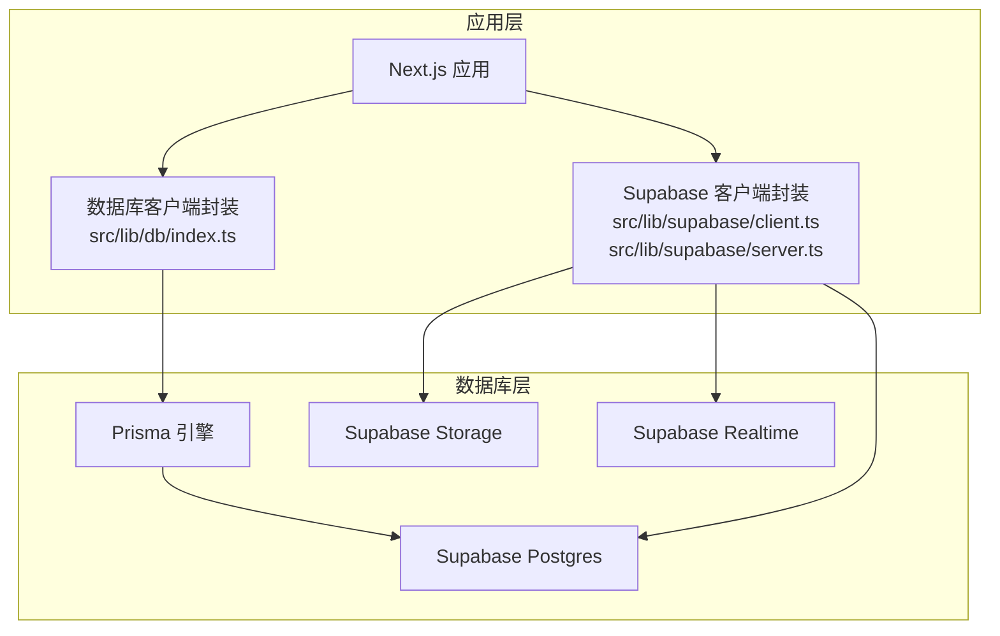
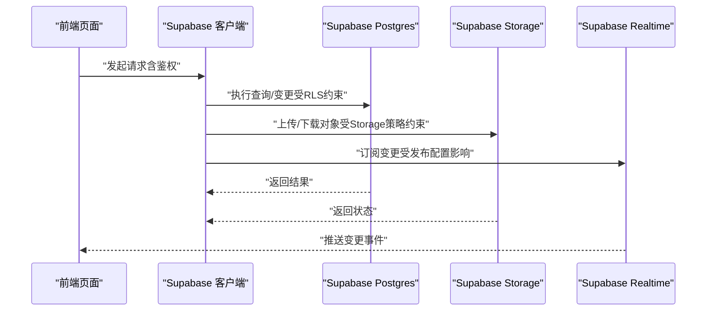
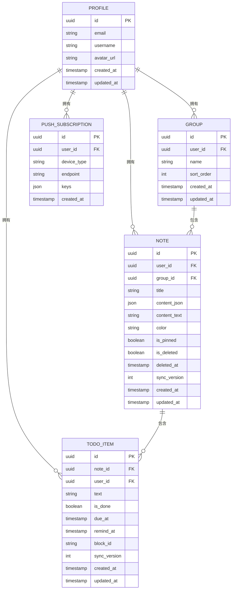
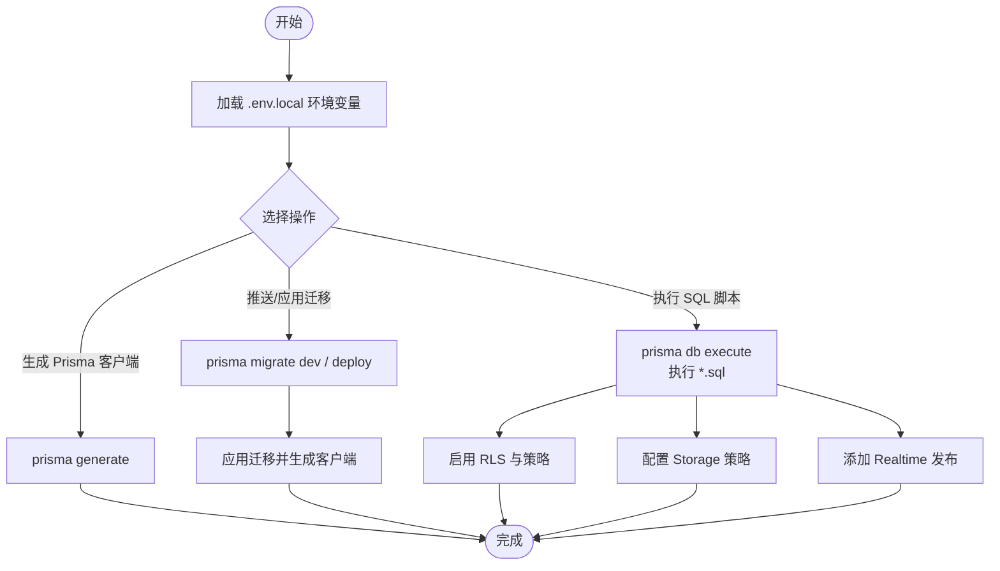
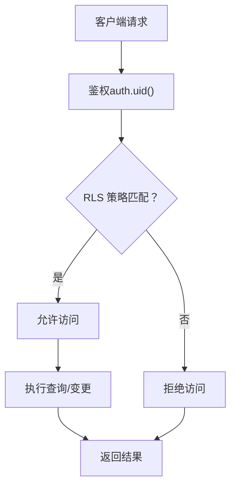
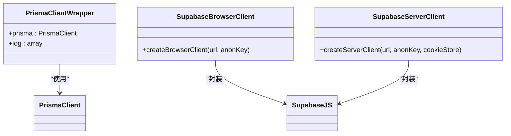
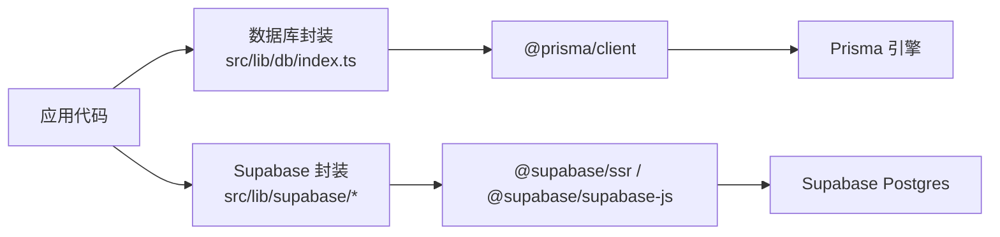

# 数据库配置

<cite>
**本文引用的文件**
- [prisma/schema.prisma](file://prisma/schema.prisma)
- [supabase/migrations/20260513000000_enable_rls_policies.sql](file://supabase/migrations/20260513000000_enable_rls_policies.sql)
- [supabase/migrations/20260513120000_storage_note_images.sql](file://supabase/migrations/20260513120000_storage_note_images.sql)
- [supabase/migrations/20260513140000_realtime_publication.sql](file://supabase/migrations/20260513140000_realtime_publication.sql)
- [src/lib/db/index.ts](file://src/lib/db/index.ts)
- [src/lib/supabase/client.ts](file://src/lib/supabase/client.ts)
- [src/lib/supabase/server.ts](file://src/lib/supabase/server.ts)
- [package.json](file://package.json)
</cite>

## 目录
1. [简介](#简介)
2. [项目结构](#项目结构)
3. [核心组件](#核心组件)
4. [架构总览](#架构总览)
5. [详细组件分析](#详细组件分析)
6. [依赖分析](#依赖分析)
7. [性能考虑](#性能考虑)
8. [故障排除指南](#故障排除指南)
9. [结论](#结论)
10. [附录](#附录)

## 简介
本文件面向 Smart-Todo 的数据库配置与运维，聚焦以下方面：
- Supabase 初始化与连接配置
- Prisma 模型、关系与索引设计
- 迁移与版本管理策略
- 行级安全（RLS）策略与权限控制
- 数据库监控与性能优化建议
- 维护与故障排除实践

## 项目结构
Smart-Todo 的数据库相关配置主要分布在以下位置：
- Prisma 模型与数据源配置：prisma/schema.prisma
- Supabase 迁移脚本：supabase/migrations/*.sql
- 应用侧数据库客户端封装：src/lib/db/index.ts、src/lib/supabase/client.ts、src/lib/supabase/server.ts
- 数据库相关脚本与环境变量：package.json（包含数据库命令）

**图表来源**
- [src/lib/db/index.ts:1-16](file://src/lib/db/index.ts#L1-L16)
- [src/lib/supabase/client.ts:1-9](file://src/lib/supabase/client.ts#L1-L9)
- [src/lib/supabase/server.ts:1-29](file://src/lib/supabase/server.ts#L1-L29)

**章节来源**
- [prisma/schema.prisma:1-117](file://prisma/schema.prisma#L1-L117)
- [package.json:1-86](file://package.json#L1-L86)

## 核心组件
- 数据库客户端（Prisma）
  - 通过全局单例避免重复实例化，开发模式下启用查询日志。
  - 数据源通过环境变量 DATABASE_URL 与 DIRECT_URL 配置。
- Supabase 客户端
  - 浏览器端与服务端分别封装，读取 NEXT_PUBLIC_SUPABASE_URL 与 NEXT_PUBLIC_SUPABASE_ANON_KEY。
- 迁移与策略
  - 通过独立 SQL 脚本实现 RLS、Storage 策略与 Realtime 发布配置。

**章节来源**
- [src/lib/db/index.ts:1-16](file://src/lib/db/index.ts#L1-L16)
- [src/lib/supabase/client.ts:1-9](file://src/lib/supabase/client.ts#L1-L9)
- [src/lib/supabase/server.ts:1-29](file://src/lib/supabase/server.ts#L1-L29)
- [prisma/schema.prisma:9-13](file://prisma/schema.prisma#L9-L13)

## 架构总览
Smart-Todo 的数据库访问路径如下：
- 前端页面或 API Route 通过 Supabase 客户端进行用户认证与数据读写。
- 服务端逻辑可直接使用 Prisma 客户端进行数据库操作（不受 RLS 限制）。
- RLS 策略确保用户仅能访问自身数据；Storage 与 Realtime 通过策略与发布配置保障资源访问与实时订阅。

**图表来源**
- [src/lib/supabase/client.ts:1-9](file://src/lib/supabase/client.ts#L1-L9)
- [src/lib/supabase/server.ts:1-29](file://src/lib/supabase/server.ts#L1-L29)
- [supabase/migrations/20260513000000_enable_rls_policies.sql:1-203](file://supabase/migrations/20260513000000_enable_rls_policies.sql#L1-L203)
- [supabase/migrations/20260513120000_storage_note_images.sql:1-51](file://supabase/migrations/20260513120000_storage_note_images.sql#L1-L51)
- [supabase/migrations/20260513140000_realtime_publication.sql:1-7](file://supabase/migrations/20260513140000_realtime_publication.sql#L1-L7)

## 详细组件分析

### Prisma 模型与关系设计
- 数据模型概览
  - Profile：用户资料，与 auth.users 通过 UUID 一对一关联。
  - Group：自定义分组，属于某用户。
  - Note：便签，可选归属分组；包含 JSON 文档与文本快照字段。
  - TodoItem：从 Note 的 JSON 文档中抽取的待办项，支持到期与提醒时间。
  - PushSubscription：推送订阅信息（FCM/Web Push）。
- 关系映射
  - Profile 与 Group/Note/TodoItem/PushSubscription 为一对多关系。
  - Group 与 Note 为一对多关系。
  - Note 与 TodoItem 为一对多关系。
  - 外键删除策略：Cascade，保证数据一致性。
- 索引配置
  - Profile：无显式索引（主键为 UUID）。
  - Group：按 user_id 建立索引。
  - Note：复合索引覆盖用户、删除状态、置顶、更新时间；按 group_id 建立索引。
  - TodoItem：唯一索引（noteId, blockId）；复合索引覆盖用户+提醒时间、用户+完成+到期。
  - PushSubscription：唯一索引（userId, endpoint）；按 user_id 建立索引。
- 字段与类型
  - UUID 主键统一使用 @db.Uuid 映射。
  - JSON 字段 content_json 与 push 订阅 keys 使用 Json 类型。
  - 时间戳字段统一使用 DateTime，并利用 Prisma 的 @createdAt/@updatedAt/@default(now()) 管理。

**图表来源**
- [prisma/schema.prisma:15-117](file://prisma/schema.prisma#L15-L117)

**章节来源**
- [prisma/schema.prisma:15-117](file://prisma/schema.prisma#L15-L117)

### 迁移与版本管理策略
- 迁移入口与脚本
  - Prisma 命令集中在 package.json 的 scripts 字段，包括 generate、push、migrate、studio、reset、execute 等。
  - 执行迁移时使用 dotenv -e .env.local 以加载本地环境变量。
- 迁移脚本清单
  - RLS 策略：启用 RLS 并为每个业务表创建“own”策略，确保用户只能访问自身数据。
  - Storage：创建 note-images 存储桶并配置 Storage RLS 策略，限定路径为 {auth.uid()}/{filename}。
  - Realtime：将业务表加入 supabase_realtime 发布，以便客户端订阅变更。
- 版本管理建议
  - 采用时间戳前缀命名迁移文件，保持顺序与可追溯性。
  - 对生产环境使用 prisma migrate deploy 或 prisma db execute，避免自动应用未审查的迁移。
  - 重要变更前先在测试环境验证 RLS 与索引策略。

**图表来源**
- [package.json:6-21](file://package.json#L6-L21)
- [supabase/migrations/20260513000000_enable_rls_policies.sql:1-203](file://supabase/migrations/20260513000000_enable_rls_policies.sql#L1-L203)
- [supabase/migrations/20260513120000_storage_note_images.sql:1-51](file://supabase/migrations/20260513120000_storage_note_images.sql#L1-L51)
- [supabase/migrations/20260513140000_realtime_publication.sql:1-7](file://supabase/migrations/20260513140000_realtime_publication.sql#L1-L7)

**章节来源**
- [package.json:6-21](file://package.json#L6-L21)
- [supabase/migrations/20260513000000_enable_rls_policies.sql:1-203](file://supabase/migrations/20260513000000_enable_rls_policies.sql#L1-L203)
- [supabase/migrations/20260513120000_storage_note_images.sql:1-51](file://supabase/migrations/20260513120000_storage_note_images.sql#L1-L51)
- [supabase/migrations/20260513140000_realtime_publication.sql:1-7](file://supabase/migrations/20260513140000_realtime_publication.sql#L1-L7)

### 行级安全（RLS）策略与权限控制
- 策略范围
  - profiles、groups、notes、todo_items、push_subscriptions 均启用 RLS。
  - 每个表均提供 select/insert/update/delete 的“own”策略，基于 user_id 或 auth.uid() 判断。
- 策略要点
  - notes 插入/更新时，若 group_id 非空，需校验该分组属于当前用户。
  - todo_items 插入/更新/删除时，需同时校验所属 note 属于当前用户。
  - Storage note-images 限定路径为 {auth.uid()}/{filename}，确保用户仅能操作自身目录。
- 生效机制
  - 客户端通过 Supabase 客户端携带 JWT（匿名密钥或用户会话）访问数据库。
  - 服务端使用 Prisma 直连角色（directUrl）绕过 RLS，适合后台任务与内部处理。

**图表来源**
- [supabase/migrations/20260513000000_enable_rls_policies.sql:34-203](file://supabase/migrations/20260513000000_enable_rls_policies.sql#L34-L203)

**章节来源**
- [supabase/migrations/20260513000000_enable_rls_policies.sql:1-203](file://supabase/migrations/20260513000000_enable_rls_policies.sql#L1-L203)
- [prisma/schema.prisma:9-13](file://prisma/schema.prisma#L9-L13)

### 数据库连接与客户端封装
- Prisma 客户端
  - 单例模式避免重复实例化；开发模式开启查询日志，便于调试。
  - 数据源通过 DATABASE_URL 与 DIRECT_URL 注入，DIRECT_URL 用于服务端直连。
- Supabase 客户端
  - 浏览器端：createBrowserClient 读取 NEXT_PUBLIC_SUPABASE_URL 与 NEXT_PUBLIC_SUPABASE_ANON_KEY。
  - 服务端：createServerClient 通过 Next.js cookies 管理会话，适配 Server Component 场景。

**图表来源**
- [src/lib/db/index.ts:1-16](file://src/lib/db/index.ts#L1-L16)
- [src/lib/supabase/client.ts:1-9](file://src/lib/supabase/client.ts#L1-L9)
- [src/lib/supabase/server.ts:1-29](file://src/lib/supabase/server.ts#L1-L29)

**章节来源**
- [src/lib/db/index.ts:1-16](file://src/lib/db/index.ts#L1-L16)
- [src/lib/supabase/client.ts:1-9](file://src/lib/supabase/client.ts#L1-L9)
- [src/lib/supabase/server.ts:1-29](file://src/lib/supabase/server.ts#L1-L29)

## 依赖分析
- 外部依赖
  - @prisma/client：Prisma 客户端
  - @supabase/ssr 与 @supabase/supabase-js：Supabase 客户端
  - prisma：数据库工具链
- 内部耦合
  - 应用通过封装的客户端访问数据库，Prisma 与 Supabase 分工明确：前者用于服务端直连与复杂查询，后者用于前端与鉴权场景。

**图表来源**
- [package.json:22-61](file://package.json#L22-L61)
- [src/lib/db/index.ts:1-16](file://src/lib/db/index.ts#L1-L16)
- [src/lib/supabase/client.ts:1-9](file://src/lib/supabase/client.ts#L1-L9)
- [src/lib/supabase/server.ts:1-29](file://src/lib/supabase/server.ts#L1-L29)

**章节来源**
- [package.json:22-61](file://package.json#L22-L61)

## 性能考虑
- 查询优化
  - 利用现有索引：Notes 的复合索引覆盖用户+删除+置顶+更新时间；TodoItem 的复合索引覆盖用户+提醒时间与用户+完成+到期。
  - 避免全表扫描：优先使用带条件的查询，结合索引列构建过滤条件。
- 索引策略
  - Group/Note/TodoItem/PushSubscription 已建立必要索引；如出现新查询模式，可按需新增复合索引。
- 备份与恢复
  - 使用 Supabase Dashboard 的备份功能定期导出数据，验证恢复流程。
- 实时订阅
  - 确保业务表已加入 supabase_realtime 发布，减少客户端轮询成本。

[本节为通用指导，无需特定文件引用]

## 故障排除指南
- RLS 导致的访问被拒
  - 确认当前会话的 auth.uid() 与记录的 user_id 匹配。
  - 检查 notes 的 group_id 是否属于当前用户。
- Storage 权限问题
  - 确认对象路径为 {auth.uid()}/{filename}，且 bucket 名称为 note-images。
- Realtime 订阅失败
  - 确认业务表已加入 supabase_realtime 发布，且 Realtime 已启用。
- 开发调试
  - 开启 Prisma 查询日志（开发模式），定位慢查询与异常 SQL。
- 命令执行
  - 使用 package.json 中的数据库脚本执行迁移与策略，确保 .env.local 正确加载。

**章节来源**
- [supabase/migrations/20260513000000_enable_rls_policies.sql:1-203](file://supabase/migrations/20260513000000_enable_rls_policies.sql#L1-L203)
- [supabase/migrations/20260513120000_storage_note_images.sql:1-51](file://supabase/migrations/20260513120000_storage_note_images.sql#L1-L51)
- [supabase/migrations/20260513140000_realtime_publication.sql:1-7](file://supabase/migrations/20260513140000_realtime_publication.sql#L1-L7)
- [src/lib/db/index.ts:10-11](file://src/lib/db/index.ts#L10-L11)

## 结论
Smart-Todo 的数据库配置以 Supabase 为核心，结合 Prisma 提供的服务端直连能力与 RLS 策略，实现了用户隔离与资源访问控制。通过规范化的迁移脚本与索引设计，兼顾了易维护性与性能。建议在生产环境中严格遵循迁移审批与备份恢复流程，并持续监控查询性能与实时订阅稳定性。

[本节为总结，无需特定文件引用]

## 附录
- 环境变量与脚本
  - DATABASE_URL/DIRECT_URL：Prisma 数据源
  - NEXT_PUBLIC_SUPABASE_URL/NEXT_PUBLIC_SUPABASE_ANON_KEY：Supabase 客户端
  - 数据库相关脚本：见 package.json 的 scripts 字段

**章节来源**
- [prisma/schema.prisma:9-13](file://prisma/schema.prisma#L9-L13)
- [src/lib/supabase/client.ts:4-7](file://src/lib/supabase/client.ts#L4-L7)
- [package.json:6-21](file://package.json#L6-L21)