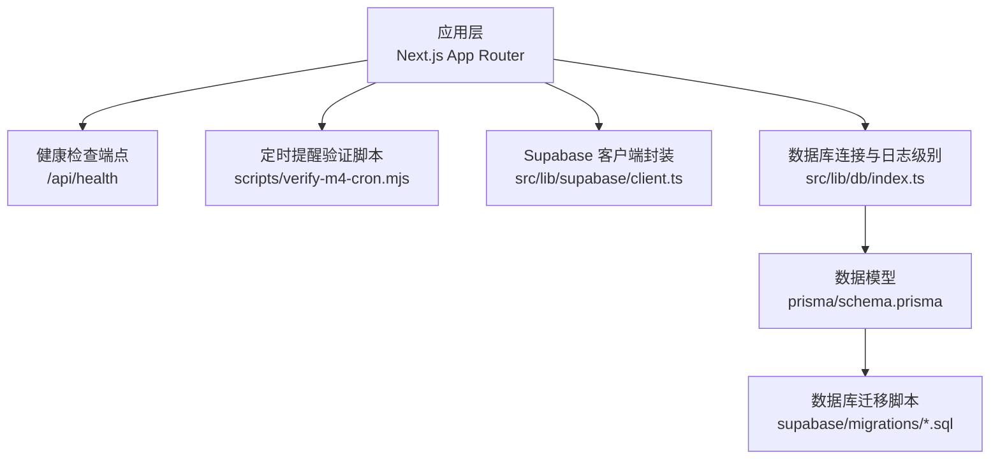
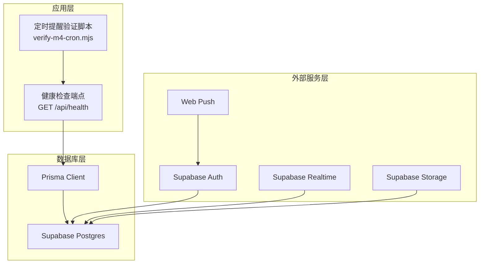
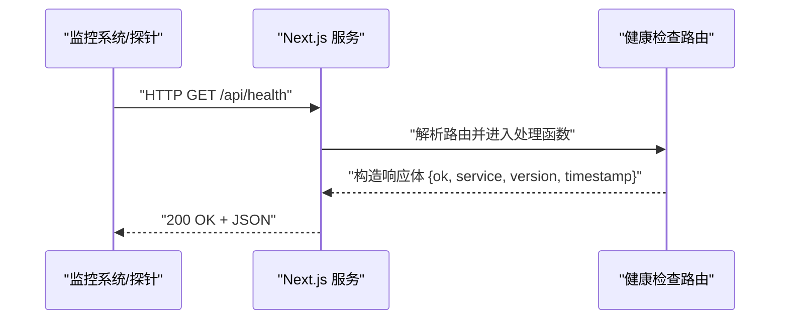
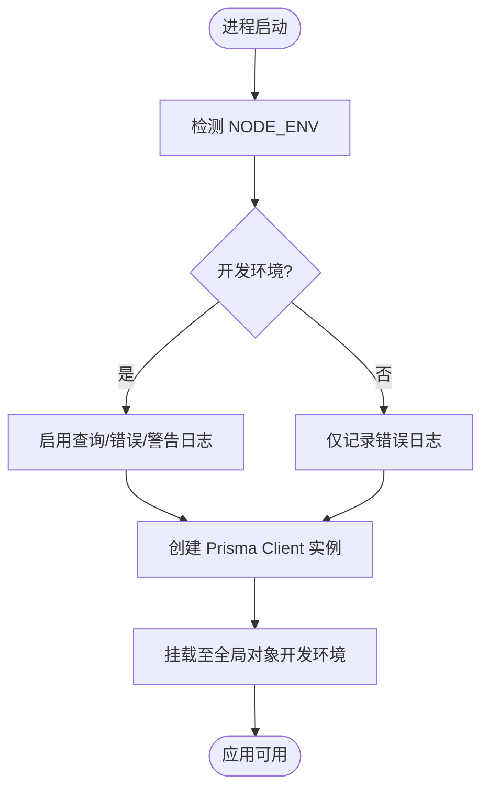
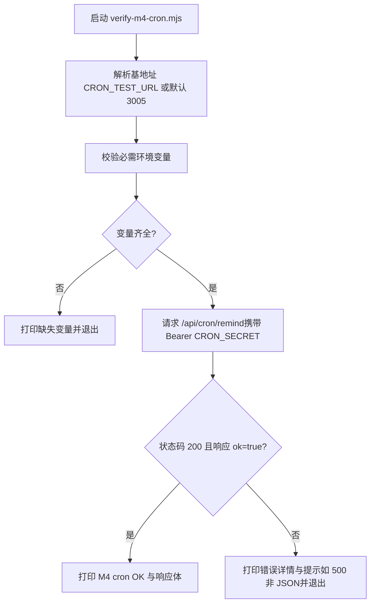
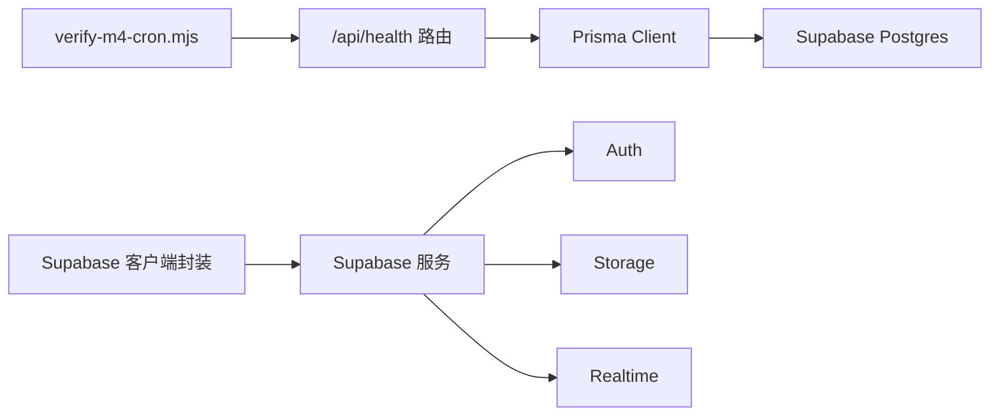

# 监控运维

<cite>
**本文引用的文件**
- [README.md](file://README.md)
- [package.json](file://package.json)
- [next.config.ts](file://next.config.ts)
- [src/app/api/health/route.ts](file://src/app/api/health/route.ts)
- [scripts/verify-m4-cron.mjs](file://scripts/verify-m4-cron.mjs)
- [prisma/schema.prisma](file://prisma/schema.prisma)
- [src/lib/db/index.ts](file://src/lib/db/index.ts)
- [supabase/migrations/20260513000000_enable_rls_policies.sql](file://supabase/migrations/20260513000000_enable_rls_policies.sql)
- [supabase/migrations/20260513140000_realtime_publication.sql](file://supabase/migrations/20260513140000_realtime_publication.sql)
- [src/lib/supabase/client.ts](file://src/lib/supabase/client.ts)
- [src/app/(auth)/login/page.tsx](file://src/app/(auth)/login/page.tsx)
</cite>

## 目录
1. [简介](#简介)
2. [项目结构](#项目结构)
3. [核心组件](#核心组件)
4. [架构总览](#架构总览)
5. [详细组件分析](#详细组件分析)
6. [依赖关系分析](#依赖关系分析)
7. [性能考量](#性能考量)
8. [故障排除指南](#故障排除指南)
9. [结论](#结论)
10. [附录](#附录)

## 简介
本文件面向 Smart-Todo 项目的监控与运维，围绕以下目标展开：
- 应用健康检查：端点使用、动态响应与可观测性建议
- 日志收集与分析：应用日志、数据库日志、系统日志的采集与存储
- 性能监控：响应时间、吞吐量、错误率等关键指标
- 错误追踪与告警：错误日志、异常告警、故障恢复机制
- 运维自动化：部署、滚动更新、蓝绿部署实践
- 故障排除与应急响应：常见问题诊断与处置流程

Smart-Todo 基于 Next.js App Router、TypeScript、Prisma ORM、Supabase（Postgres + Auth + Storage + Realtime）与 Web Push，具备定时提醒能力与健康检查端点。

## 项目结构
项目采用 Next.js App Router 的功能域组织方式，核心路径如下：
- 健康检查端点位于 src/app/api/health/route.ts
- 定时提醒验证脚本位于 scripts/verify-m4-cron.mjs
- 数据模型与数据库连接位于 prisma/schema.prisma 与 src/lib/db/index.ts
- Supabase 客户端封装位于 src/lib/supabase/client.ts
- 数据库迁移脚本位于 supabase/migrations/*.sql
- 应用配置位于 next.config.ts 与 package.json

图表来源
- [src/app/api/health/route.ts:1-13](file://src/app/api/health/route.ts#L1-L13)
- [scripts/verify-m4-cron.mjs:1-83](file://scripts/verify-m4-cron.mjs#L1-L83)
- [src/lib/supabase/client.ts:1-8](file://src/lib/supabase/client.ts#L1-L8)
- [src/lib/db/index.ts:1-15](file://src/lib/db/index.ts#L1-L15)
- [prisma/schema.prisma:1-117](file://prisma/schema.prisma#L1-L117)
- [supabase/migrations/20260513000000_enable_rls_policies.sql:1-51](file://supabase/migrations/20260513000000_enable_rls_policies.sql#L1-L51)
- [supabase/migrations/20260513140000_realtime_publication.sql:1-6](file://supabase/migrations/20260513140000_realtime_publication.sql#L1-L6)

章节来源
- [README.md:161-202](file://README.md#L161-L202)
- [package.json:1-86](file://package.json#L1-L86)
- [next.config.ts:1-8](file://next.config.ts#L1-L8)

## 核心组件
- 健康检查端点：提供动态响应，包含服务名、版本与时间戳，便于容器编排与平台健康探测
- 数据库连接与日志：基于 Prisma Client，开发环境开启查询/错误/警告日志，生产环境仅记录错误
- Supabase 客户端：封装浏览器端 Supabase 客户端初始化，统一读取环境变量
- 定时提醒验证：校验 CRON_SECRET、VAPID 密钥与应用 URL 等必要环境变量，并请求 /api/cron/remind

章节来源
- [src/app/api/health/route.ts:1-13](file://src/app/api/health/route.ts#L1-L13)
- [src/lib/db/index.ts:1-15](file://src/lib/db/index.ts#L1-L15)
- [src/lib/supabase/client.ts:1-8](file://src/lib/supabase/client.ts#L1-L8)
- [scripts/verify-m4-cron.mjs:1-83](file://scripts/verify-m4-cron.mjs#L1-L83)

## 架构总览
Smart-Todo 的运行时架构由“应用层”“数据库层”“外部服务层”三部分组成。应用层通过 Next.js 路由暴露健康检查与定时任务端点；数据库层通过 Prisma 连接 Supabase Postgres；外部服务层包括 Supabase Auth/Storage/Realtime 与 Web Push。

图表来源
- [src/app/api/health/route.ts:1-13](file://src/app/api/health/route.ts#L1-L13)
- [scripts/verify-m4-cron.mjs:1-83](file://scripts/verify-m4-cron.mjs#L1-L83)
- [src/lib/db/index.ts:1-15](file://src/lib/db/index.ts#L1-L15)
- [src/lib/supabase/client.ts:1-8](file://src/lib/supabase/client.ts#L1-L8)
- [prisma/schema.prisma:1-117](file://prisma/schema.prisma#L1-L117)

## 详细组件分析

### 健康检查端点
- 端点路径：/api/health
- 方法：GET
- 响应：动态生成，包含服务名、版本与时间戳
- 动态策略：强制动态路由，确保每次请求都实时计算
- 使用场景：容器编排健康探测、平台监控面板展示

图表来源
- [src/app/api/health/route.ts:1-13](file://src/app/api/health/route.ts#L1-L13)

章节来源
- [src/app/api/health/route.ts:1-13](file://src/app/api/health/route.ts#L1-L13)
- [README.md](file://README.md#L59)

### 数据库连接与日志策略
- Prisma Client 初始化：开发环境开启查询/错误/警告日志，生产环境仅记录错误
- 全局单例：避免重复实例化，减少资源消耗
- 数据源配置：通过 DATABASE_URL 与 DIRECT_URL 连接 Supabase Postgres

图表来源
- [src/lib/db/index.ts:1-15](file://src/lib/db/index.ts#L1-L15)

章节来源
- [src/lib/db/index.ts:1-15](file://src/lib/db/index.ts#L1-L15)
- [prisma/schema.prisma:9-13](file://prisma/schema.prisma#L9-L13)

### Supabase 客户端封装
- 统一读取 NEXT_PUBLIC_SUPABASE_URL 与 NEXT_PUBLIC_SUPABASE_ANON_KEY
- 用于浏览器端初始化 Supabase 客户端，支撑鉴权、存储与实时订阅

章节来源
- [src/lib/supabase/client.ts:1-8](file://src/lib/supabase/client.ts#L1-L8)

### 定时提醒验证脚本
- 校验必要环境变量：CRON_SECRET、NEXT_PUBLIC_VAPID_PUBLIC_KEY、VAPID_PRIVATE_KEY
- 可选 NEXT_PUBLIC_APP_URL 提示
- 请求 /api/cron/remind 并解析响应，失败时输出详细错误信息与排查提示

图表来源
- [scripts/verify-m4-cron.mjs:1-83](file://scripts/verify-m4-cron.mjs#L1-L83)

章节来源
- [scripts/verify-m4-cron.mjs:1-83](file://scripts/verify-m4-cron.mjs#L1-L83)
- [README.md:115-140](file://README.md#L115-L140)

### 数据库迁移与 RLS 策略
- RLS 启用与策略：为 profiles/groups/notes/todo_items/push_subscriptions 启用行级安全并创建选择/插入/更新/删除策略
- Realtime 发布：将 notes/groups/todo_items 注册到 supabase_realtime 发布，支持客户端订阅

章节来源
- [supabase/migrations/20260513000000_enable_rls_policies.sql:1-51](file://supabase/migrations/20260513000000_enable_rls_policies.sql#L1-L51)
- [supabase/migrations/20260513140000_realtime_publication.sql:1-6](file://supabase/migrations/20260513140000_realtime_publication.sql#L1-L6)

## 依赖关系分析
- 应用层依赖 Next.js 路由与中间件（代理文件名/导出为 proxy）
- 数据库层依赖 Prisma Client 与 Supabase Postgres
- 外部服务依赖 Supabase Auth/Storage/Realtime 与 Web Push
- 配置层面依赖环境变量（DATABASE_URL、DIRECT_URL、CRON_SECRET、VAPID_*、NEXT_PUBLIC_APP_URL 等）

图表来源
- [src/app/api/health/route.ts:1-13](file://src/app/api/health/route.ts#L1-L13)
- [scripts/verify-m4-cron.mjs:1-83](file://scripts/verify-m4-cron.mjs#L1-L83)
- [src/lib/db/index.ts:1-15](file://src/lib/db/index.ts#L1-L15)
- [src/lib/supabase/client.ts:1-8](file://src/lib/supabase/client.ts#L1-L8)

章节来源
- [README.md:204-212](file://README.md#L204-L212)
- [package.json:1-86](file://package.json#L1-L86)

## 性能考量
- 健康检查端点为轻量级 JSON 返回，适合高频探测
- 数据库日志在开发环境更细粒度，有助于定位慢查询与异常；生产环境仅记录错误，降低 I/O 开销
- 定时任务建议使用独立的云服务器 crontab，避免平台限制导致的调度不准确
- 建议结合平台指标（CPU、内存、网络、连接数）与应用指标（QPS、P95/P99 延迟、错误率）进行综合评估

## 故障排除指南
- 健康检查 500 或非 JSON 响应
  - 现象：/api/health 返回 500 且非 JSON
  - 排查：查看应用日志与数据库日志，确认 Prisma/DB 连接正常
  - 参考：verify-m4-cron.mjs 对非 JSON 500 的提示
- 定时提醒失败
  - 现象：verify-m4-cron.mjs 输出错误，状态码非 200 或响应体不包含 ok=true
  - 排查：确认 CRON_SECRET 一致、VAPID 密钥配置正确、NEXT_PUBLIC_APP_URL 正确
  - 参考：verify-m4-cron.mjs 的校验逻辑与错误输出
- 数据库连接问题
  - 现象：开发环境出现大量查询日志或生产环境静默失败
  - 排查：核对 DATABASE_URL/DIRECT_URL，确认 Prisma Client 初始化与全局单例
- 登录与回调问题
  - 现象：OAuth 回调失败或端口不匹配
  - 排查：确认 Supabase Redirect URLs 包含开发端口（3005）与生产域名

章节来源
- [scripts/verify-m4-cron.mjs:66-80](file://scripts/verify-m4-cron.mjs#L66-L80)
- [src/lib/db/index.ts:10-11](file://src/lib/db/index.ts#L10-L11)
- [src/app/(auth)/login/page.tsx](file://src/app/(auth)/login/page.tsx#L20-L23)

## 结论
Smart-Todo 已具备基础的健康检查与定时任务验证能力，配合 Prisma 的日志策略与 Supabase 的基础设施，能够满足日常监控与运维需求。建议在此基础上补充平台指标采集、错误追踪与告警、日志集中化存储与检索，以及自动化部署与蓝绿/滚动发布流程，以进一步提升系统的可观测性与可靠性。

## 附录
- 健康检查端点：/api/health（GET）
- 定时提醒验证：verify-m4-cron.mjs（校验 CRON_SECRET、VAPID、NEXT_PUBLIC_APP_URL 并请求 /api/cron/remind）
- 数据库日志：开发环境开启查询/错误/警告日志，生产环境仅错误日志
- Supabase 配置：NEXT_PUBLIC_SUPABASE_URL 与 NEXT_PUBLIC_SUPABASE_ANON_KEY
- 运行时注意：Next.js 16 的代理文件名为 proxy，Cookies/Headers/Params/SearchParams 必须 await

章节来源
- [README.md](file://README.md#L59)
- [scripts/verify-m4-cron.mjs:1-83](file://scripts/verify-m4-cron.mjs#L1-L83)
- [src/lib/db/index.ts:10-11](file://src/lib/db/index.ts#L10-L11)
- [src/lib/supabase/client.ts:1-8](file://src/lib/supabase/client.ts#L1-L8)
- [README.md:204-212](file://README.md#L204-L212)