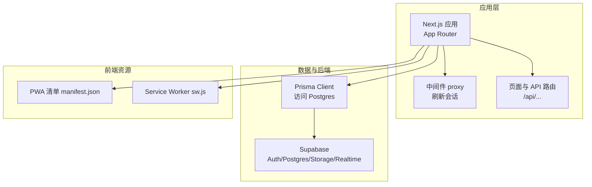
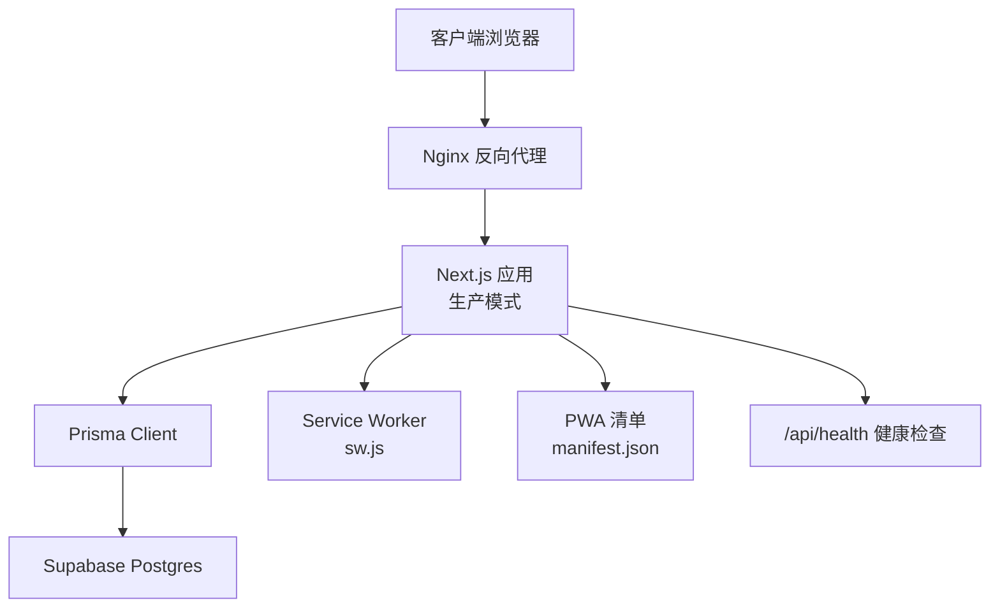
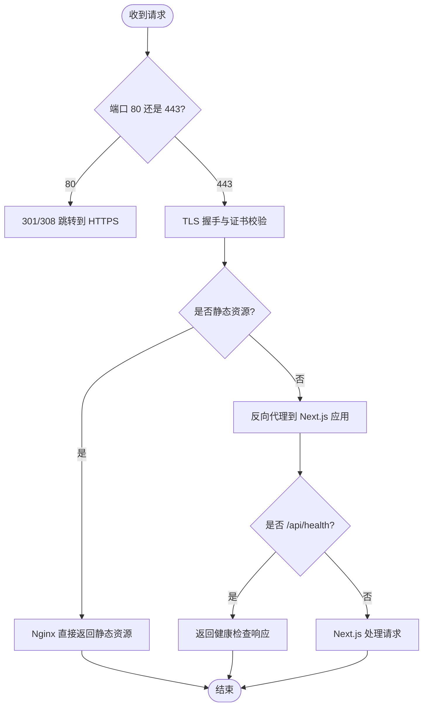
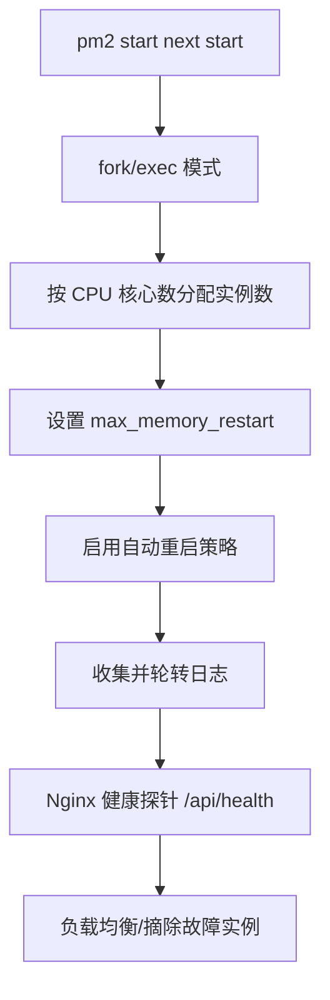
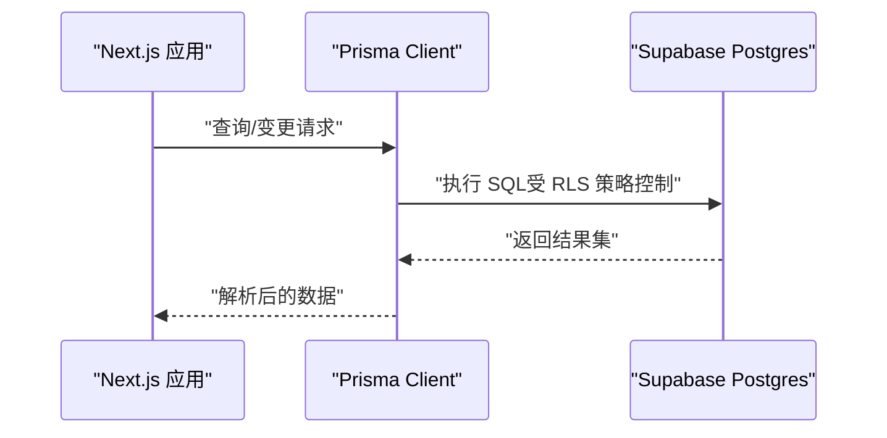
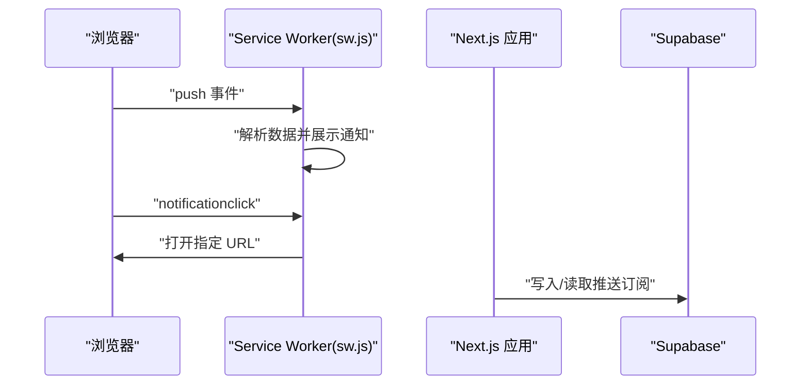
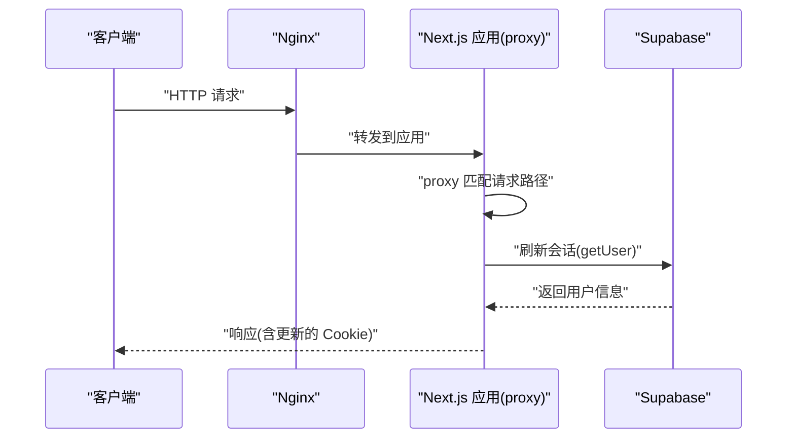
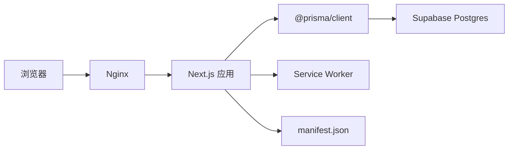

# 自建服务器部署

<cite>
**本文引用的文件**
- [package.json](file://package.json)
- [next.config.ts](file://next.config.ts)
- [prisma/schema.prisma](file://prisma/schema.prisma)
- [public/manifest.json](file://public/manifest.json)
- [public/sw.js](file://public/sw.js)
- [src/app/layout.tsx](file://src/app/layout.tsx)
- [src/lib/db/index.ts](file://src/lib/db/index.ts)
- [src/lib/supabase/proxy.ts](file://src/lib/supabase/proxy.ts)
- [src/lib/supabase/server.ts](file://src/lib/supabase/server.ts)
- [src/lib/supabase/client.ts](file://src/lib/supabase/client.ts)
- [src/proxy.ts](file://src/proxy.ts)
- [README.md](file://README.md)
</cite>

## 目录
1. [简介](#简介)
2. [项目结构](#项目结构)
3. [核心组件](#核心组件)
4. [架构总览](#架构总览)
5. [详细组件分析](#详细组件分析)
6. [依赖关系分析](#依赖关系分析)
7. [性能考虑](#性能考虑)
8. [故障排查指南](#故障排查指南)
9. [结论](#结论)
10. [附录](#附录)

## 简介
本文件面向在自建服务器上部署 Smart-Todo 的工程师，提供从 Nginx 反向代理、SSL 证书、域名绑定、HTTPS 强制跳转，到 PM2 进程管理、Supabase 数据库连接、Prisma 配置、PWA（Service Worker 与 manifest.json）部署与验证，再到完整自动化部署脚本与流程、性能优化与安全加固的全流程指导。

## 项目结构
Smart-Todo 是基于 Next.js 16 App Router 的前端应用，结合 Supabase 提供的认证、数据库、实时订阅与存储能力，并通过 Prisma 访问 Supabase Postgres。PWA 相关资源位于 public 目录，中间件采用 Next.js 16 的 proxy 入口，负责刷新 Supabase 会话 Cookie。

**图表来源**
- [src/proxy.ts:1-24](file://src/proxy.ts#L1-L24)
- [src/lib/db/index.ts:1-16](file://src/lib/db/index.ts#L1-L16)
- [prisma/schema.prisma:1-117](file://prisma/schema.prisma#L1-L117)
- [public/manifest.json:1-27](file://public/manifest.json#L1-L27)
- [public/sw.js:1-29](file://public/sw.js#L1-L29)

**章节来源**
- [README.md:161-202](file://README.md#L161-L202)

## 核心组件
- 反向代理与入口网关：Nginx
- 应用运行时：Next.js 16（生产模式）
- 进程管理：PM2
- 数据库：Supabase Postgres（Prisma Client）
- 认证与会话：Supabase SSR 客户端与中间件
- PWA：manifest.json 与 sw.js
- 健康检查：/api/health

**章节来源**
- [package.json:6-21](file://package.json#L6-L21)
- [src/app/layout.tsx:17-35](file://src/app/layout.tsx#L17-L35)
- [src/proxy.ts:1-24](file://src/proxy.ts#L1-L24)

## 架构总览
下图展示自建服务器部署的整体交互：客户端经 Nginx 反向代理访问 Next.js 应用；应用通过 Prisma 访问 Supabase Postgres；Supabase 提供认证、实时订阅与存储；PWA 资源由浏览器缓存与 Service Worker 管理。

**图表来源**
- [src/lib/db/index.ts:1-16](file://src/lib/db/index.ts#L1-L16)
- [prisma/schema.prisma:1-117](file://prisma/schema.prisma#L1-L117)
- [public/sw.js:1-29](file://public/sw.js#L1-L29)
- [public/manifest.json:1-27](file://public/manifest.json#L1-L27)
- [src/app/layout.tsx:17-35](file://src/app/layout.tsx#L17-L35)

## 详细组件分析

### Nginx 反向代理与 HTTPS 配置
- 绑定域名与监听端口：在 Nginx 中配置 server 块，监听 80 与 443 端口，域名指向应用所在主机 IP。
- SSL 证书：使用 Let’s Encrypt 获取免费证书，或自行签发证书并放置于安全目录，配置 ssl_certificate 与 ssl_certificate_key。
- HTTPS 强制跳转：在 80 端口 server 块中，将所有请求 301/308 跳转至 https://$host$request_uri。
- 反向代理：将 /api/* 与静态资源路径交由上游 Next.js（默认 3000 或自定义端口）处理；对 /api/health 做健康检查路由。
- 缓存与压缩：对静态资源启用 gzip/HTTP/2/HTTP/3，合理设置缓存头；对动态 API 请求禁用缓存。
- 安全头：建议设置 HSTS、X-Frame-Options、X-Content-Type-Options、Referrer-Policy 等。

[此图为概念性流程图，不直接映射具体源码文件]

### PM2 进程管理配置
- 启动命令：使用 pm2 start 启动 next start（生产模式），指定工作目录与环境变量文件。
- 进程数量：根据 CPU 核心数设置 --instances，通常为 1~2×CPU 核心，结合负载测试确定。
- 内存限制：设置 max_memory_restart 以防止内存泄漏导致 OOM。
- 自动重启：开启 restartDelay、expBackoff、maxRestarts 等策略；配合 ecosystem.config.js 的 watch 与 exec_mode。
- 日志：集中输出 stdout/stderr 日志，结合 pm2 logs 与日志轮转。
- 健康检查：在 Nginx 层面定期探测 /api/health，失败时自动摘除实例。

[此图为概念性流程图，不直接映射具体源码文件]

### 数据库连接配置（Supabase + Prisma）
- 连接字符串：在 .env.local 中配置 DATABASE_URL 与 DIRECT_URL（Supabase Dashboard → Project Settings → Database → Connection string）。
- Prisma 配置：schema.prisma 指定 datasource db 的 provider 为 postgresql，并读取 DATABASE_URL 与 DIRECT_URL。
- 初始化与迁移：开发环境可用 db:push 快速同步 schema；生产环境建议使用 db:migrate 生成迁移文件并应用。
- 连接池与超时：在 Supabase Pooler 中配置连接池参数；应用侧注意 Prisma 查询超时与重试策略。
- RLS 与策略：执行 db:rls 与 db:storage，确保业务表具备行级安全策略与 Storage 策略。

**图表来源**
- [prisma/schema.prisma:9-13](file://prisma/schema.prisma#L9-L13)
- [src/lib/db/index.ts:1-16](file://src/lib/db/index.ts#L1-L16)

**章节来源**
- [prisma/schema.prisma:9-13](file://prisma/schema.prisma#L9-L13)
- [src/lib/db/index.ts:1-16](file://src/lib/db/index.ts#L1-L16)
- [README.md:63-114](file://README.md#L63-L114)

### PWA 配置（Service Worker 与 manifest.json）
- manifest.json：定义应用名称、图标、启动路径、显示模式等；应用根布局已声明 manifest 路径。
- sw.js：最小化 Service Worker，处理 push 通知与 notificationclick，打开指定 URL。
- 部署要求：确保静态资源 public 下的 manifest.json 与 sw.js 可被 Nginx 正常返回；浏览器缓存策略与更新机制需在生产中验证。
- 功能验证：登录后注册 Web Push 订阅，后台定时扫描提醒并通过 sw.js 展示通知。

**图表来源**
- [public/manifest.json:1-27](file://public/manifest.json#L1-L27)
- [public/sw.js:1-29](file://public/sw.js#L1-L29)
- [src/app/layout.tsx:17-35](file://src/app/layout.tsx#L17-L35)

**章节来源**
- [public/manifest.json:1-27](file://public/manifest.json#L1-L27)
- [public/sw.js:1-29](file://public/sw.js#L1-L29)
- [src/app/layout.tsx:17-35](file://src/app/layout.tsx#L17-L35)

### Supabase 会话刷新与中间件
- Next.js 16 中间件入口为 proxy，对每个请求刷新 Supabase 会话 Cookie，避免 access_token 过期导致的鉴权失效。
- 环境变量：NEXT_PUBLIC_SUPABASE_URL 与 NEXT_PUBLIC_SUPABASE_ANON_KEY 用于创建 SSR 客户端；若未配置则跳过刷新。
- 会话刷新逻辑：通过 createServerClient 读取/设置 Cookie，并调用 getUser() 触发 token 刷新。

**图表来源**
- [src/proxy.ts:1-24](file://src/proxy.ts#L1-L24)
- [src/lib/supabase/proxy.ts:1-52](file://src/lib/supabase/proxy.ts#L1-L52)

**章节来源**
- [src/proxy.ts:1-24](file://src/proxy.ts#L1-L24)
- [src/lib/supabase/proxy.ts:1-52](file://src/lib/supabase/proxy.ts#L1-L52)

### 健康检查与 API 路由
- /api/health：用于 Nginx 健康探针与 PM2 进程存活检测；建议返回简洁 JSON。
- /api/cron/remind：M4 Web Push 定时扫描提醒接口，需携带 Authorization: Bearer <CRON_SECRET>。

**章节来源**
- [src/app/layout.tsx:17-35](file://src/app/layout.tsx#L17-L35)
- [README.md:115-140](file://README.md#L115-L140)

## 依赖关系分析
- 应用依赖 Next.js 16、Prisma Client、Supabase SSR 客户端。
- 数据流：浏览器 → Nginx → Next.js → Prisma → Supabase Postgres。
- 中间件依赖 Supabase 会话刷新，确保访问受保护资源时的鉴权有效性。

**图表来源**
- [package.json:22-61](file://package.json#L22-L61)
- [src/lib/db/index.ts:1-16](file://src/lib/db/index.ts#L1-L16)
- [prisma/schema.prisma:1-117](file://prisma/schema.prisma#L1-L117)

**章节来源**
- [package.json:22-61](file://package.json#L22-L61)
- [src/lib/db/index.ts:1-16](file://src/lib/db/index.ts#L1-L16)

## 性能考虑
- 静态资源优化：Nginx 开启 gzip/br/压缩与缓存；对 sw.js 与 manifest.json 设置合理的缓存策略与更新机制。
- 应用层优化：生产模式运行 next start；合理设置 PM2 实例数与内存上限；对高频 API 做缓存与限流。
- 数据库优化：使用 DIRECT_URL 进行某些操作；为常用查询建立索引；控制查询复杂度与分页。
- 网络与安全：启用 HTTP/2/3、HSTS；限制请求体大小；对 /api/cron/remind 做鉴权与速率限制。

[本节提供通用指导，不直接分析具体文件]

## 故障排查指南
- 会话过期：确认中间件 proxy 是否生效，检查 NEXT_PUBLIC_SUPABASE_URL 与 NEXT_PUBLIC_SUPABASE_ANON_KEY 是否正确配置。
- 数据库连接失败：核对 DATABASE_URL/DIRECT_URL；确认 Supabase Pooler 与网络连通性；查看 Prisma 日志。
- PWA 无法注册：检查 manifest.json 与 sw.js 是否可被 Nginx 返回；浏览器控制台是否有跨域或缓存问题。
- 健康检查失败：确认 /api/health 路由可达；PM2 进程是否正常；Nginx 健康探针配置是否正确。
- Web Push 通知：确认 VAPID 公私钥与 SUBJECT；CRON_SECRET 一致性；/api/cron/remind 返回 JSON 含 ok；浏览器已注册订阅。

**章节来源**
- [src/lib/supabase/proxy.ts:1-52](file://src/lib/supabase/proxy.ts#L1-L52)
- [prisma/schema.prisma:9-13](file://prisma/schema.prisma#L9-L13)
- [public/manifest.json:1-27](file://public/manifest.json#L1-L27)
- [public/sw.js:1-29](file://public/sw.js#L1-L29)
- [README.md:115-140](file://README.md#L115-L140)

## 结论
通过 Nginx 反向代理与 HTTPS 强制跳转、PM2 进程管理、Supabase 与 Prisma 的稳健连接、以及 PWA 资源的正确部署，Smart-Todo 可在自建服务器上实现高可用、高性能与良好用户体验。建议结合监控与日志体系持续优化，并在发布前进行端到端冒烟测试。

[本节为总结性内容，不直接分析具体文件]

## 附录

### 自动化部署脚本与流程（建议）
以下为可参考的自动化部署流程（不含具体代码内容，仅流程说明）：
- 准备阶段：准备 .env.local（包含 DATABASE_URL/DIRECT_URL、NEXT_PUBLIC_SUPABASE_URL、NEXT_PUBLIC_SUPABASE_ANON_KEY、CRON_SECRET、NEXT_PUBLIC_VAPID_PUBLIC_KEY、VAPID_PRIVATE_KEY、VAPID_SUBJECT、NEXT_PUBLIC_APP_URL 等），确保与 README 的环境变量清单一致。
- 拉取代码：使用 git clone 或 rsync 方式将最新代码部署到目标服务器。
- 安装依赖：使用 pnpm 安装依赖（package.json 中已声明 pnpm 版本）。
- 数据库初始化：执行 db:generate 生成 Prisma Client；执行 db:migrate 应用迁移；必要时执行 db:rls 与 db:storage。
- 构建应用：执行 build 生成生产包。
- 启动应用：使用 PM2 启动 next start，配置进程数、内存上限与自动重启策略；确保 /api/health 可用。
- Nginx 配置：配置域名、SSL 证书、HTTPS 强制跳转、反向代理与健康检查探针。
- PWA 验证：访问站点，确认 manifest.json 与 sw.js 可用，注册 Web Push 并验证通知。
- 监控与日志：配置 PM2 日志轮转与 Nginx 访问/错误日志；设置健康探针与告警。

[本节为概念性流程说明，不直接分析具体文件]