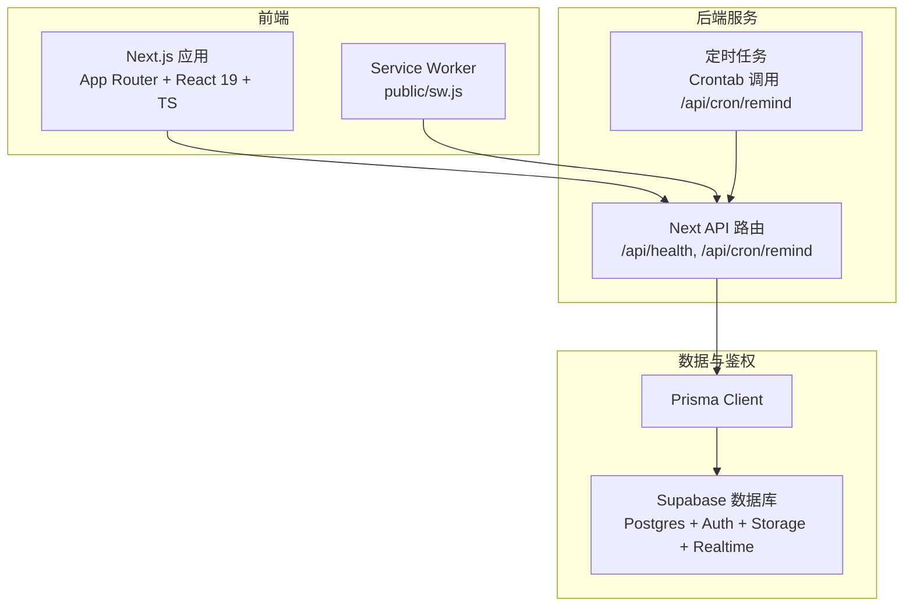
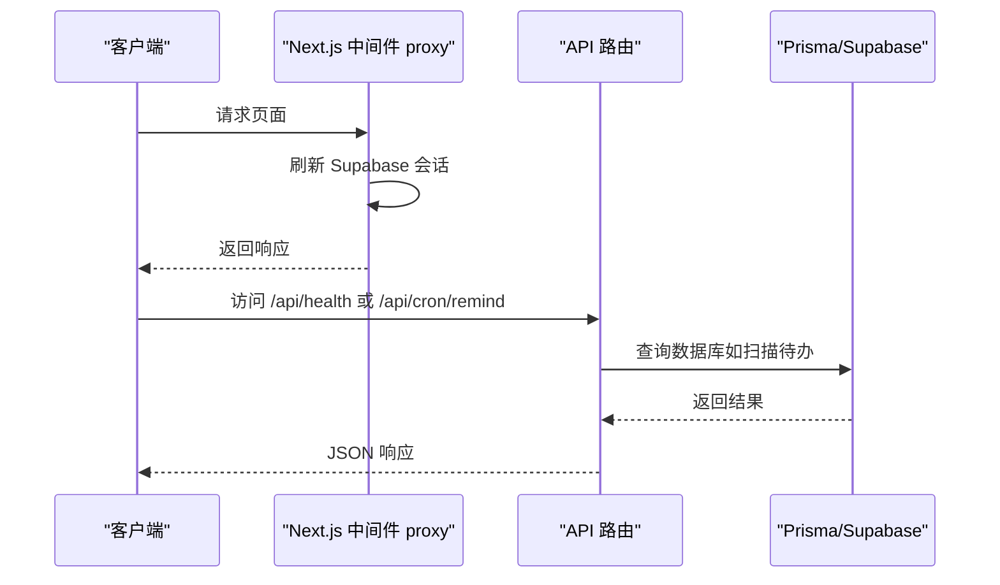
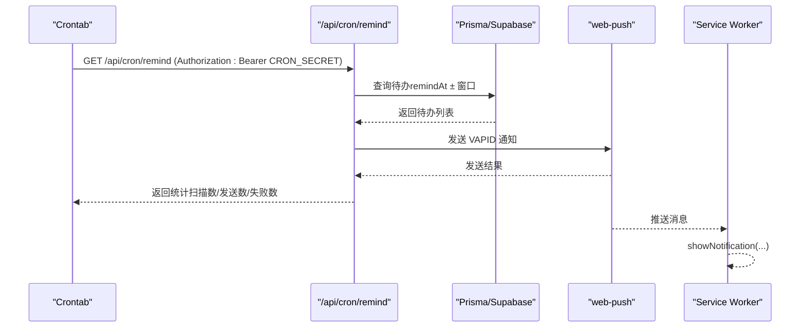
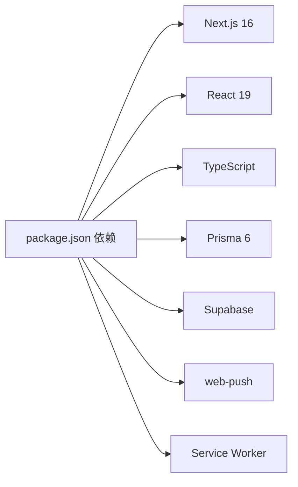
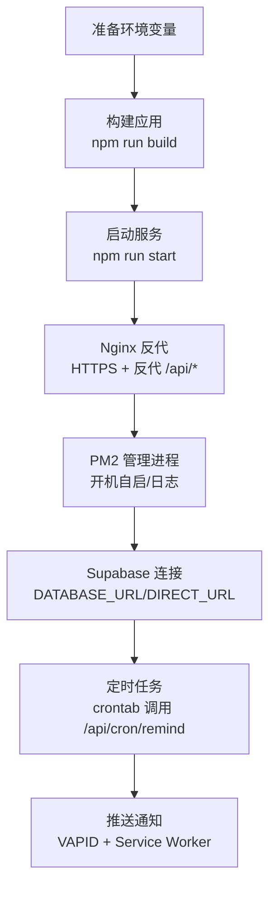

# 部署配置

<cite>
**本文引用的文件**
- [package.json](file://package.json)
- [next.config.ts](file://next.config.ts)
- [prisma/schema.prisma](file://prisma/schema.prisma)
- [supabase/migrations/20260513000000_enable_rls_policies.sql](file://supabase/migrations/20260513000000_enable_rls_policies.sql)
- [src/lib/supabase/client.ts](file://src/lib/supabase/client.ts)
- [src/app/api/cron/remind/route.ts](file://src/app/api/cron/remind/route.ts)
- [src/app/api/health/route.ts](file://src/app/api/health/route.ts)
- [src/lib/db/index.ts](file://src/lib/db/index.ts)
- [scripts/verify-m4-cron.mjs](file://scripts/verify-m4-cron.mjs)
- [.gitignore](file://.gitignore)
- [README.md](file://README.md)
- [public/sw.js](file://public/sw.js)
- [src/lib/push/url-base64.ts](file://src/lib/push/url-base64.ts)
- [src/proxy.ts](file://src/proxy.ts)
</cite>

## 目录
1. [简介](#简介)
2. [项目结构](#项目结构)
3. [核心组件](#核心组件)
4. [架构总览](#架构总览)
5. [详细组件分析](#详细组件分析)
6. [依赖关系分析](#依赖关系分析)
7. [性能考虑](#性能考虑)
8. [故障排除指南](#故障排除指南)
9. [结论](#结论)
10. [附录](#附录)

## 简介
本文件面向 Smart-Todo 的生产部署，覆盖以下方面：
- 生产环境配置要求：Node.js 版本、系统依赖、环境变量清单与作用域
- Vercel 部署：环境变量、构建设置、域名绑定与注意事项
- 自建服务器部署：Nginx 反向代理、PM2 进程管理、SSL 证书与域名配置
- 数据库部署与维护：Supabase 配置、RLS 策略、备份与监控建议
- CI/CD 流程：自动化测试、部署流水线与版本发布建议
- 运维与监控：日志收集、错误追踪、性能分析与安全加固
- 故障排除与应急响应：常见问题定位与快速恢复

## 项目结构
Smart-Todo 是基于 Next.js 16 App Router 的全栈应用，前端使用 React 19、TypeScript、Tailwind CSS v4，后端依赖 Supabase（Postgres/Auth/Storage/Realtime），数据层使用 Prisma 6。推送功能采用 Web Push（VAPID），并通过定时任务扫描待办提醒。

图表来源
- [src/app/api/health/route.ts:1-13](file://src/app/api/health/route.ts#L1-L13)
- [src/app/api/cron/remind/route.ts:1-115](file://src/app/api/cron/remind/route.ts#L1-L115)
- [src/lib/db/index.ts:1-16](file://src/lib/db/index.ts#L1-L16)
- [prisma/schema.prisma:1-117](file://prisma/schema.prisma#L1-L117)
- [public/sw.js:1-28](file://public/sw.js#L1-L28)

章节来源
- [README.md: 9-21:9-21](file://README.md#L9-L21)
- [package.json: 1-86:1-86](file://package.json#L1-L86)

## 核心组件
- Next.js 应用与中间件：使用 Next.js 16 的新中间件入口 proxy，负责刷新 Supabase 会话。
- API 路由：
  - 健康检查：/api/health
  - 定时提醒：/api/cron/remind（受 CRON_SECRET 保护）
- 数据层：Prisma Client 连接 Supabase Postgres，支持 DIRECT_URL 与 DATABASE_URL。
- 推送：Service Worker 处理 push 事件；VAPID 公钥/私钥用于 web-push；客户端工具将 URL-safe Base64 公钥转换为订阅所需的二进制格式。
- Supabase 客户端：在浏览器端通过 NEXT_PUBLIC_SUPABASE_URL 与 NEXT_PUBLIC_SUPABASE_ANON_KEY 初始化。

章节来源
- [src/proxy.ts: 1-23:1-23](file://src/proxy.ts#L1-L23)
- [src/app/api/health/route.ts: 1-13:1-13](file://src/app/api/health/route.ts#L1-L13)
- [src/app/api/cron/remind/route.ts: 1-115:1-115](file://src/app/api/cron/remind/route.ts#L1-L115)
- [src/lib/db/index.ts: 1-16:1-16](file://src/lib/db/index.ts#L1-L16)
- [src/lib/supabase/client.ts: 1-9:1-9](file://src/lib/supabase/client.ts#L1-L9)
- [public/sw.js: 1-28:1-28](file://public/sw.js#L1-L28)
- [src/lib/push/url-base64.ts: 1-13:1-13](file://src/lib/push/url-base64.ts#L1-L13)

## 架构总览
生产部署的关键点：
- 前端静态化与服务端路由结合，API 路由运行于 Node.js 环境
- 数据库与鉴权由 Supabase 提供，应用通过 Prisma 访问
- 推送提醒通过定时任务扫描数据库并使用 VAPID 发送通知
- 中间件在每次请求时刷新 Supabase 会话，确保鉴权上下文一致

图表来源
- [src/proxy.ts: 8-L23:8-23](file://src/proxy.ts#L8-L23)
- [src/app/api/health/route.ts: 5-L12:5-12](file://src/app/api/health/route.ts#L5-L12)
- [src/app/api/cron/remind/route.ts: 28-L114:28-114](file://src/app/api/cron/remind/route.ts#L28-L114)
- [src/lib/db/index.ts: 7-L16:7-16](file://src/lib/db/index.ts#L7-L16)

## 详细组件分析

### 环境变量与配置要求
- Node.js 版本：最小版本要求为 20.9+
- 包管理器：pnpm（版本在 package.json 中声明）
- 数据库连接：
  - DATABASE_URL：Supabase 连接字符串（Pooler）
  - DIRECT_URL：Supabase 直连 URL（用于 Prisma 直连操作）
- Supabase 前端密钥：
  - NEXT_PUBLIC_SUPABASE_URL：Supabase 项目 URL
  - NEXT_PUBLIC_SUPABASE_ANON_KEY：匿名密钥（前端可见）
- 推送与定时任务：
  - CRON_SECRET：保护 /api/cron/remind 的授权密钥
  - NEXT_PUBLIC_VAPID_PUBLIC_KEY / VAPID_PRIVATE_KEY：VAPID 密钥对
  - VAPID_SUBJECT：邮件主题（如 mailto:）
  - NEXT_PUBLIC_APP_URL：应用根地址（用于通知点击跳转）
- 其他：
  - NODE_ENV：生产环境建议设为 production
  - NEXT_PUBLIC_APP_URL：用于通知链接构造与健康检查版本字段

章节来源
- [README.md: 204-212:204-212](file://README.md#L204-L212)
- [package.json: 5-L8:5-8](file://package.json#L5-L8)
- [src/lib/supabase/client.ts: 3-L8:3-8](file://src/lib/supabase/client.ts#L3-L8)
- [src/app/api/cron/remind/route.ts: 8-L43:8-43](file://src/app/api/cron/remind/route.ts#L8-L43)
- [src/app/api/health/route.ts: 6-L11:6-11](file://src/app/api/health/route.ts#L6-L11)
- [scripts/verify-m4-cron.mjs: 6-L30:6-30](file://scripts/verify-m4-cron.mjs#L6-L30)

### Vercel 部署配置
- 构建与运行
  - 使用 npm run build 与 npm run start
  - 项目使用 Next.js 16，注意最小 Node.js 版本要求
- 环境变量
  - 在 Vercel 项目 Settings → Environment Variables 中配置：
    - DATABASE_URL、DIRECT_URL、NEXT_PUBLIC_SUPABASE_URL、NEXT_PUBLIC_SUPABASE_ANON_KEY
    - CRON_SECRET、NEXT_PUBLIC_VAPID_PUBLIC_KEY、VAPID_PRIVATE_KEY、VAPID_SUBJECT
    - NEXT_PUBLIC_APP_URL（生产 HTTPS 根地址）
- 域名绑定
  - 在 Vercel 域名设置中绑定生产域名
  - 若使用 VERCEL_URL，/api/cron/remind 会回退到该值（生产建议显式设置 NEXT_PUBLIC_APP_URL）
- 定时任务
  - Hobby 计划不支持分钟级 Cron，需在自建服务器配置 crontab 调用 /api/cron/remind
  - Pro 计划可使用 Vercel Cron（需升级）

章节来源
- [README.md: 115-134:115-134](file://README.md#L115-L134)
- [src/app/api/cron/remind/route.ts: 8-L17:8-17](file://src/app/api/cron/remind/route.ts#L8-L17)

### 自建服务器部署流程
- 前置准备
  - 安装 Node.js（≥20.9）、pnpm
  - 准备域名与 SSL 证书（建议 Let’s Encrypt）
- Nginx 反向代理
  - 将域名指向服务器，配置 HTTPS 与反代至应用进程（如 127.0.0.1:3000）
  - 反代路径：/api/* 转发到应用服务端口
- PM2 进程管理
  - 使用 pm2 start 启动 next start（指定端口）
  - 设置开机自启与日志轮转
- SSL 证书
  - 使用 certbot/acme.sh 获取并续期证书
  - 在 Nginx 中配置证书路径与 TLS 参数
- 环境变量
  - 在系统环境或 PM2 ecosystem 配置中注入所有必要变量
- 健康检查
  - 通过 /api/health 验证服务可用性

章节来源
- [src/app/api/health/route.ts: 5-L12:5-12](file://src/app/api/health/route.ts#L5-L12)
- [README.md: 204-212:204-212](file://README.md#L204-L212)

### 数据库部署与维护（Supabase）
- 连接配置
  - DATABASE_URL：使用 Pooler 连接
  - DIRECT_URL：用于 Prisma 直连（如执行 SQL）
- RLS 与策略
  - 执行 RLS 策略脚本，启用行级安全并为各表创建策略
  - 可在 Supabase SQL Editor 中直接执行
- 存储与实时
  - 创建 note-images 存储桶与策略
  - 将业务表加入 supabase_realtime publication，实现多端刷新
- 备份与监控
  - 使用 Supabase 的备份与监控能力
  - 建议定期导出数据库结构与敏感数据脱敏后备份

章节来源
- [README.md: 63-114:63-114](file://README.md#L63-L114)
- [supabase/migrations/20260513000000_enable_rls_policies.sql: 1-L203:1-203](file://supabase/migrations/20260513000000_enable_rls_policies.sql#L1-L203)
- [prisma/schema.prisma: 9-L13:9-13](file://prisma/schema.prisma#L9-L13)

### 推送与定时提醒（M4）
- VAPID 密钥生成与配置
  - 使用 web-push 生成 VAPID 密钥对，分别配置公钥与私钥
  - VAPID_SUBJECT 建议使用 mailto
- 定时任务
  - 自建服务器 crontab 每分钟调用 /api/cron/remind，携带 Authorization: Bearer CRON_SECRET
  - 建议重定向输出到日志文件以便排查
- 通知内容
  - 服务端根据 remindAt 时间窗口扫描待办，构造通知标题/正文与跳转 URL
  - Service Worker 接收 push 事件并展示通知，点击后跳转至对应便签块
- 客户端订阅
  - 客户端使用 urlBase64ToUint8Array 将 URL-safe Base64 公钥转换为订阅所需格式
  - 订阅信息写入 push_subscriptions 表

图表来源
- [src/app/api/cron/remind/route.ts: 28-L114:28-114](file://src/app/api/cron/remind/route.ts#L28-L114)
- [public/sw.js: 3-L28:3-28](file://public/sw.js#L3-L28)
- [src/lib/push/url-base64.ts: 4-L13:4-13](file://src/lib/push/url-base64.ts#L4-L13)

章节来源
- [README.md: 115-141:115-141](file://README.md#L115-L141)
- [src/app/api/cron/remind/route.ts: 1-L115:1-115](file://src/app/api/cron/remind/route.ts#L1-L115)
- [public/sw.js: 1-L28:1-28](file://public/sw.js#L1-L28)
- [src/lib/push/url-base64.ts: 1-L13:1-13](file://src/lib/push/url-base64.ts#L1-L13)

### 中间件与会话刷新
- Next.js 16 使用 proxy 作为中间件入口，在每个请求上刷新 Supabase 会话
- 匹配规则排除静态资源与公共资产，减少不必要的会话刷新

章节来源
- [src/proxy.ts: 8-L23:8-23](file://src/proxy.ts#L8-L23)

## 依赖关系分析
- 应用依赖 Next.js 16、React 19、TypeScript、Tailwind CSS v4
- 数据层依赖 Prisma 6 与 Supabase（Postgres/Auth/Storage/Realtime）
- 推送依赖 web-push 与 Service Worker
- 包管理器使用 pnpm，部分依赖仅在构建时使用

图表来源
- [package.json: 22-L61:22-61](file://package.json#L22-L61)

章节来源
- [package.json: 1-L86:1-86](file://package.json#L1-L86)

## 性能考虑
- 构建与运行
  - 使用 Turbopack（Next.js 16 默认）提升开发体验
  - 生产构建使用 npm run build，启动使用 npm run start
- 数据访问
  - 使用 DIRECT_URL 与 DATABASE_URL 分场景优化连接
  - Prisma 日志在开发环境开启，生产关闭
- API 延迟
  - /api/cron/remind 设置最大执行时间，扫描窗口控制在短时间范围内
- 推送
  - VAPID Subject 与密钥正确配置，避免无效订阅导致的失败重试

章节来源
- [README.md: 204-212:204-212](file://README.md#L204-L212)
- [src/lib/db/index.ts: 9-L11:9-11](file://src/lib/db/index.ts#L9-L11)
- [src/app/api/cron/remind/route.ts: 5-L6:5-6](file://src/app/api/cron/remind/route.ts#L5-L6)

## 故障排除指南
- 健康检查
  - 访问 /api/health 确认服务可用与版本信息
- 授权失败（/api/cron/remind）
  - 检查 CRON_SECRET 是否正确传递 Authorization: Bearer
  - 确认 VAPID 公私钥是否配置
- 通知未送达
  - 检查 push_subscriptions 表是否存在有效订阅
  - 查看定时任务日志，确认 curl 返回与 TTL 设置
- 环境变量缺失
  - 使用 scripts/verify-m4-cron.mjs 进行一键自检
  - .env.local 与系统环境变量优先级确认
- 开发端口与回调
  - 开发端口固定为 3005，Supabase Redirect URLs 需包含该端口
- 数据库连接
  - 确认 DATABASE_URL/DIRECT_URL 正确，RLS 策略已执行

章节来源
- [src/app/api/health/route.ts: 5-L12:5-12](file://src/app/api/health/route.ts#L5-L12)
- [src/app/api/cron/remind/route.ts: 19-L37:19-37](file://src/app/api/cron/remind/route.ts#L19-L37)
- [scripts/verify-m4-cron.mjs: 1-L40:1-40](file://scripts/verify-m4-cron.mjs#L1-L40)
- [README.md: 41-47:41-47](file://README.md#L41-L47)

## 结论
Smart-Todo 的生产部署围绕 Next.js 16、Supabase 与 Prisma 展开，强调严格的环境变量管理、安全的推送配置与可靠的定时任务调度。通过 Vercel 或自建服务器均可稳定运行，建议在生产环境中明确域名与 SSL、完善日志与监控，并将定时任务托管在自建服务器以满足更细粒度的调度需求。

## 附录

### 环境变量清单（按用途分类）
- 数据库连接
  - DATABASE_URL：Supabase 连接字符串（Pooler）
  - DIRECT_URL：Supabase 直连 URL
- Supabase 前端密钥
  - NEXT_PUBLIC_SUPABASE_URL：项目 URL
  - NEXT_PUBLIC_SUPABASE_ANON_KEY：匿名密钥
- 推送与定时任务
  - CRON_SECRET：保护 /api/cron/remind 的授权密钥
  - NEXT_PUBLIC_VAPID_PUBLIC_KEY：VAPID 公钥（URL-safe Base64）
  - VAPID_PRIVATE_KEY：VAPID 私钥
  - VAPID_SUBJECT：邮件主题（如 mailto:）
  - NEXT_PUBLIC_APP_URL：应用根地址（用于通知跳转）
- 运行时
  - NODE_ENV：production
  - NEXT_PUBLIC_APP_URL：用于健康检查版本字段

章节来源
- [src/lib/supabase/client.ts: 3-L8:3-8](file://src/lib/supabase/client.ts#L3-L8)
- [src/app/api/cron/remind/route.ts: 8-L43:8-43](file://src/app/api/cron/remind/route.ts#L8-L43)
- [src/app/api/health/route.ts: 6-L11:6-11](file://src/app/api/health/route.ts#L6-L11)
- [README.md: 115-134:115-134](file://README.md#L115-L134)

### 部署流程图（概念示意）

[此图为概念流程，无需图表来源]