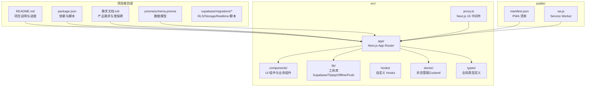
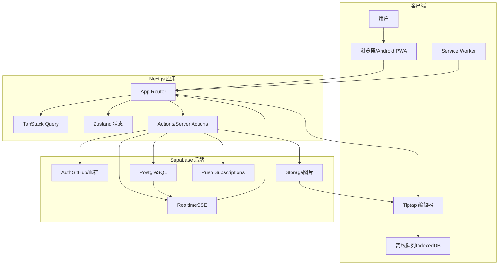
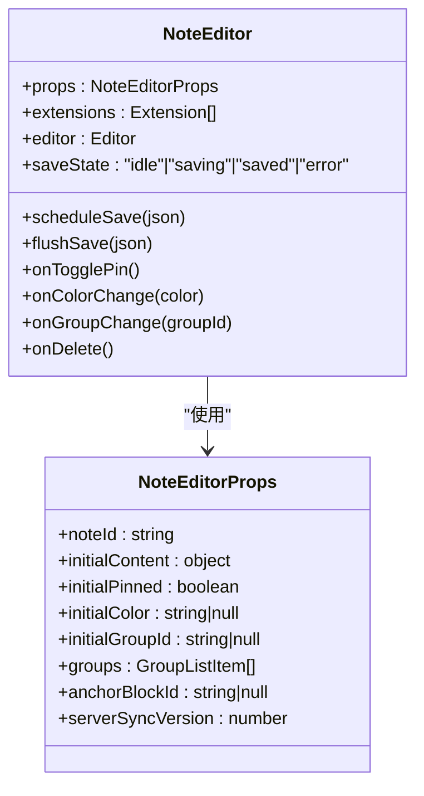
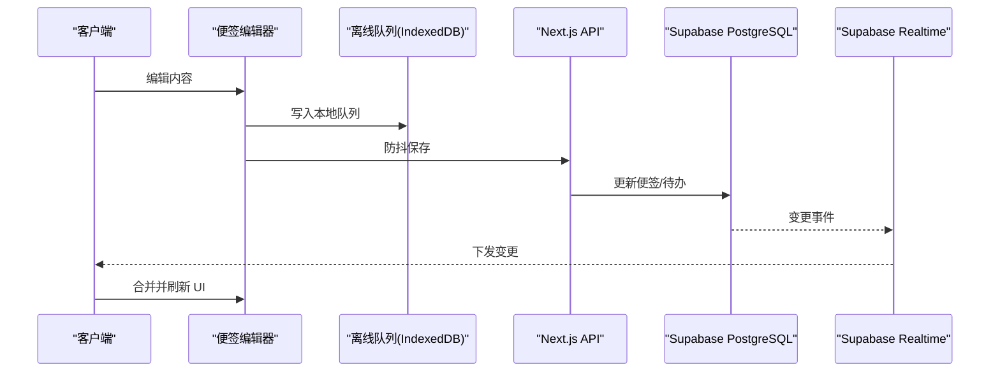
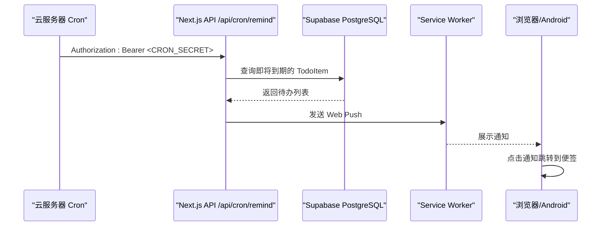
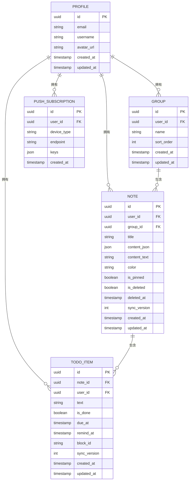
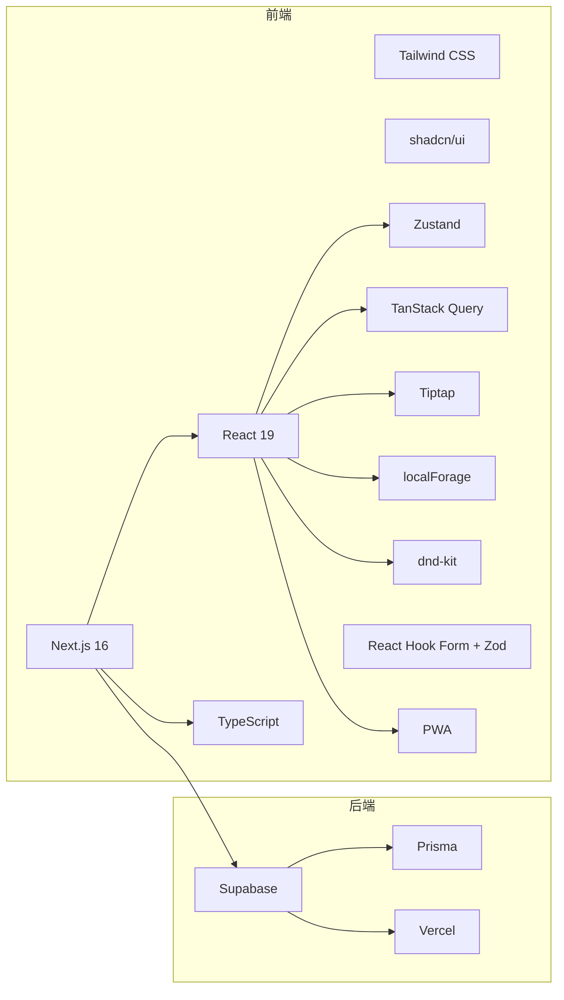

# 项目概述

<cite>
**本文档引用的文件**
- [README.md](file://README.md)
- [package.json](file://package.json)
- [需求文档.md](file://需求文档.md)
- [src/lib/constants.ts](file://src/lib/constants.ts)
- [src/app/layout.tsx](file://src/app/layout.tsx)
- [src/components/editor/note-editor.tsx](file://src/components/editor/note-editor.tsx)
- [src/lib/supabase/client.ts](file://src/lib/supabase/client.ts)
- [public/manifest.json](file://public/manifest.json)
- [public/sw.js](file://public/sw.js)
- [prisma/schema.prisma](file://prisma/schema.prisma)
- [supabase/migrations/20260513000000_enable_rls_policies.sql](file://supabase/migrations/20260513000000_enable_rls_policies.sql)
</cite>

## 目录
1. [引言](#引言)
2. [项目结构](#项目结构)
3. [核心组件](#核心组件)
4. [架构总览](#架构总览)
5. [详细组件分析](#详细组件分析)
6. [依赖关系分析](#依赖关系分析)
7. [性能考虑](#性能考虑)
8. [故障排除指南](#故障排除指南)
9. [结论](#结论)
10. [附录](#附录)

## 引言
Smart Note 是一款集便签与待办事项于一体的多端同步轻量笔记应用，旨在为个人用户提供「快速记录 + 待办管理 + 多端同步」的一体化解决方案。项目对标 WPS 便签，强调「轻量、好用、跨端同步」，并通过富文本编辑器、实时同步、离线优先、Web Push 推送等能力，打造比 WPS 便签更懂用户的个人效率工具。

项目定位为私有自用项目，专注于满足开发者本人的日常记录与任务管理需求，同时具备良好的扩展性，支持后续的智能化迭代（如智能分类、智能提醒、AI 辅助整理等）。

## 项目结构
项目采用 Next.js 16 App Router 架构，结合 Supabase 提供的认证、数据库、存储与实时能力，形成前后端一体化的解决方案。核心目录结构如下：

- 配置与脚本：`.windsurf/rules/`、`scripts/`、`.npmrc`、`pnpm-workspace.yaml`
- 数据模型：`prisma/schema.prisma`
- 公共资源：`public/`（包含 PWA 清单与 Service Worker）
- 源代码：`src/`（应用路由、组件、库、类型、代理中间件等）

**图表来源**
- [README.md:161-202](file://README.md#L161-L202)
- [package.json:1-86](file://package.json#L1-L86)
- [需求文档.md:161-202](file://需求文档.md#L161-L202)

**章节来源**
- [README.md:161-202](file://README.md#L161-L202)
- [需求文档.md:161-202](file://需求文档.md#L161-L202)

## 核心组件
- 便签编辑器（Tiptap）：提供富文本编辑、待办列表、图片插入、链接、占位符、撤销重做等能力，并集成防抖保存与离线队列。
- 实时同步与离线：通过 Supabase Realtime 订阅业务表变更，配合 IndexedDB 离线队列与成功快照，实现最终一致性与冲突提示。
- 推送系统：基于 Web Push（VAPID）与 Service Worker，支持桌面通知与点击跳转，结合定时任务扫描待办提醒。
- 认证与授权：Supabase Auth 提供 GitHub OAuth 与邮箱密码登录，配合行级安全策略（RLS）保障数据隔离。
- PWA 支持：通过 manifest.json 与 Service Worker，提供安装、离线访问与通知能力。

**章节来源**
- [src/components/editor/note-editor.tsx:1-586](file://src/components/editor/note-editor.tsx#L1-L586)
- [README.md:9-21](file://README.md#L9-L21)
- [需求文档.md:223-271](file://需求文档.md#L223-L271)

## 架构总览
Smart Note 采用「前端 Next.js + Supabase 后端」一体化架构，核心流程包括：

- 用户通过浏览器或 Android PWA 访问应用，使用 Supabase Auth 进行登录。
- 前端通过 Supabase Client 与数据库交互，同时订阅 Supabase Realtime 以接收其他设备的变更。
- 便签编辑器使用 Tiptap 实现富文本与待办块，编辑内容通过防抖保存到后端，并在离线状态下写入 IndexedDB 队列。
- 推送系统通过 Service Worker 接收 Web Push 通知，点击后跳转到对应便签。
- 数据模型通过 Prisma 管理，Supabase 提供数据库、认证、存储与实时能力。

**图表来源**
- [需求文档.md:223-271](file://需求文档.md#L223-L271)
- [README.md:9-21](file://README.md#L9-L21)
- [src/lib/supabase/client.ts:1-9](file://src/lib/supabase/client.ts#L1-L9)

## 详细组件分析

### 便签编辑器组件分析
便签编辑器基于 Tiptap（ProseMirror）实现，具备以下关键特性：
- 富文本与待办块：支持标题、列表、任务列表、链接、图片、占位符、排版等。
- 防抖保存：编辑过程中定期保存，网络异常时写入离线队列。
- 冲突处理：通过 syncVersion 实现乐观锁，检测远程更新并提示重新加载。
- 交互增强：支持粘贴图片、设置到期/提醒时间、置顶、颜色、分组与删除。

**图表来源**
- [src/components/editor/note-editor.tsx:73-95](file://src/components/editor/note-editor.tsx#L73-L95)

**章节来源**
- [src/components/editor/note-editor.tsx:1-586](file://src/components/editor/note-editor.tsx#L1-L586)

### 实时同步与离线机制
- 离线优先：所有写操作先落盘到 IndexedDB，加入同步队列，联网后自动重放。
- 实时订阅：通过 Supabase Realtime 订阅 notes/groups/todo_items，下推到其他在线设备。
- 冲突策略：采用「最后写入优先（LWW）」+ syncVersion 字段，冲突时提示重新加载。

**图表来源**
- [需求文档.md:302-308](file://需求文档.md#L302-L308)
- [需求文档.md:154-164](file://需求文档.md#L154-L164)

**章节来源**
- [需求文档.md:302-308](file://需求文档.md#L302-L308)
- [需求文档.md:154-164](file://需求文档.md#L154-L164)

### 推送与定时提醒
- Web Push：通过 VAPID 公钥/私钥配置，Service Worker 接收推送并展示通知。
- 定时扫描：云服务器 crontab 每分钟请求 /api/cron/remind，扫描即将到期的待办并发送通知。
- 点击跳转：通知点击后打开应用并定位到对应便签。

**图表来源**
- [README.md:115-134](file://README.md#L115-L134)
- [public/sw.js:1-29](file://public/sw.js#L1-L29)

**章节来源**
- [README.md:115-134](file://README.md#L115-L134)
- [public/sw.js:1-29](file://public/sw.js#L1-L29)

### 数据模型与权限控制
- 数据模型：通过 Prisma 定义 Profile、Group、Note、TodoItem、PushSubscription 等实体及其关系。
- 行级安全：启用 RLS 与策略，确保每个用户只能访问自己的数据，防止越权访问。

**图表来源**
- [prisma/schema.prisma:15-117](file://prisma/schema.prisma#L15-L117)

**章节来源**
- [prisma/schema.prisma:15-117](file://prisma/schema.prisma#L15-L117)
- [supabase/migrations/20260513000000_enable_rls_policies.sql:1-203](file://supabase/migrations/20260513000000_enable_rls_policies.sql#L1-L203)

## 依赖关系分析
- 前端技术栈：Next.js 16 + React 19 + TypeScript，Tailwind CSS + shadcn/ui，Zustand + TanStack Query，Tiptap（ProseMirror），localForage（IndexedDB），dnd-kit（拖拽），React Hook Form + Zod（表单），PWA（next-pwa + manifest.json + Service Worker）。
- 后端技术栈：Supabase（PostgreSQL + Auth + Storage + Realtime），Prisma（ORM），Vercel（部署）。
- 关键依赖说明：Tiptap 选型基于其扩展性强、社区活跃、开箱即用的 task list、image、placeholder、typography 等能力；localForage 抽象 IndexedDB API，便于实现离线优先；dnd-kit 适合移动端触屏拖拽。

**图表来源**
- [README.md:9-21](file://README.md#L9-L21)
- [需求文档.md:236-271](file://需求文档.md#L236-L271)

**章节来源**
- [README.md:9-21](file://README.md#L9-L21)
- [需求文档.md:236-271](file://需求文档.md#L236-L271)

## 性能考虑
- 启动与渲染：应用启动时间小于 1 秒，便签列表加载时间小于 500 毫秒，编辑器输入延迟无感。
- 离线优先：所有读写操作离线可用，联网后自动同步，减少网络抖动影响。
- 实时同步：通过 Supabase Realtime 实时下推变更，降低轮询成本。
- 缓存与冲突：IndexedDB 成功快照与 syncVersion 乐观锁，提升一致性与用户体验。

**章节来源**
- [需求文档.md:210-220](file://需求文档.md#L210-L220)
- [需求文档.md:154-164](file://需求文档.md#L154-L164)

## 故障排除指南
- 开发环境端口：固定使用 3005 端口，避免与其他 Next 项目冲突；若使用 npx next dev 等未带 -p 3005 的方式启动，需在 Supabase Redirect URLs 中补全对应端口的 /auth/callback。
- Supabase 配置：确保 URL/anon key/service_role key、连接字符串、OAuth Provider（GitHub/邮箱）、Redirect URLs、RLS 策略、Storage 图片桶、Realtime publication 均正确配置。
- M4 推送：生成 VAPID 公钥/私钥，设置 CRON_SECRET，配置生产环境 crontab 每分钟请求 /api/cron/remind，本地可用 npm run verify:m4-cron 自检。
- 健康检查：访问 http://localhost:3005/api/health 确认服务正常。

**章节来源**
- [README.md:33-62](file://README.md#L33-L62)
- [README.md:63-141](file://README.md#L63-L141)

## 结论
Smart Note 通过「便签 + 待办」的双形态设计，结合富文本编辑器、实时同步、离线优先与 Web Push 推送，为个人用户提供轻量、好用、跨端同步的笔记应用。项目采用 Next.js 16 + Supabase 的一体化技术栈，具备良好的扩展性与可维护性。随着 M5 的推进，PWA 体验与细节优化将进一步提升应用的易用性与稳定性。

## 附录
- 许可证：私有项目（自用）。
- 项目定位：专为开发者本人设计的个人效率工具，对标 WPS 便签，强调「轻量、好用、跨端同步」，并叠加个性化智能特性。

**章节来源**
- [README.md:213-216](file://README.md#L213-L216)
- [需求文档.md:31-50](file://需求文档.md#L31-L50)